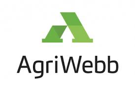
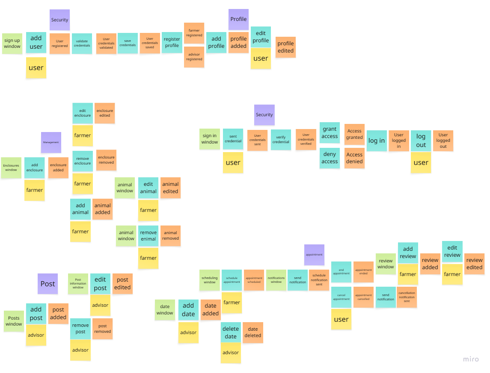
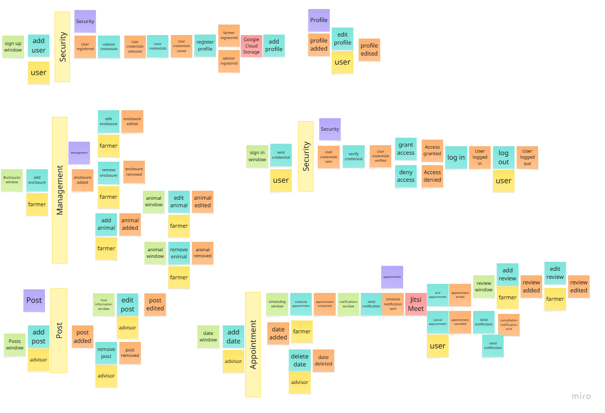
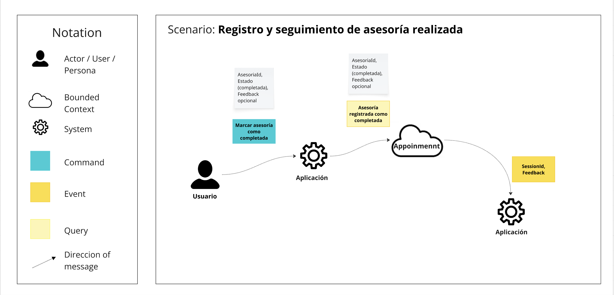
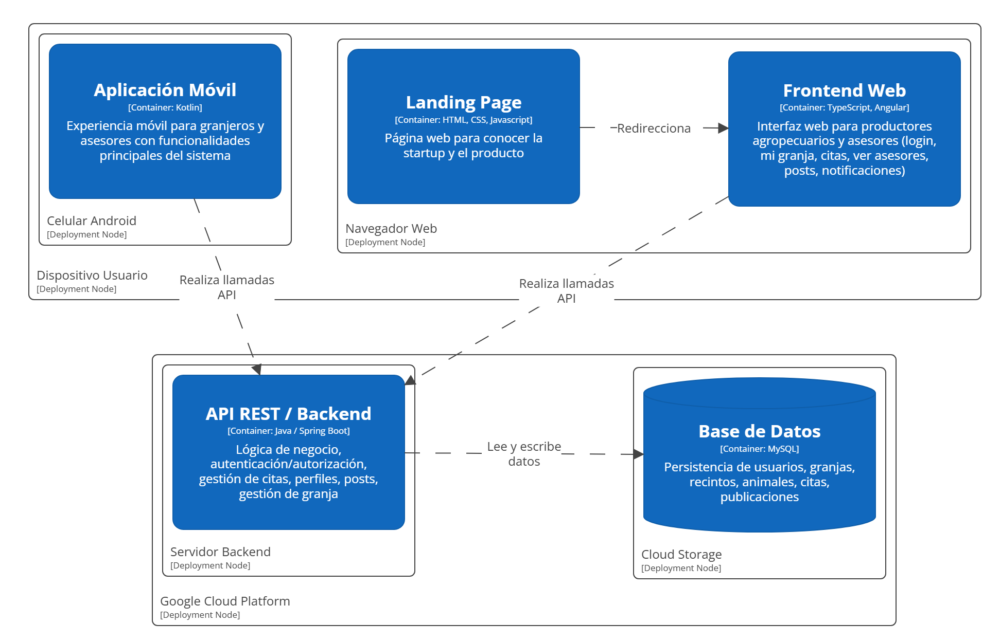
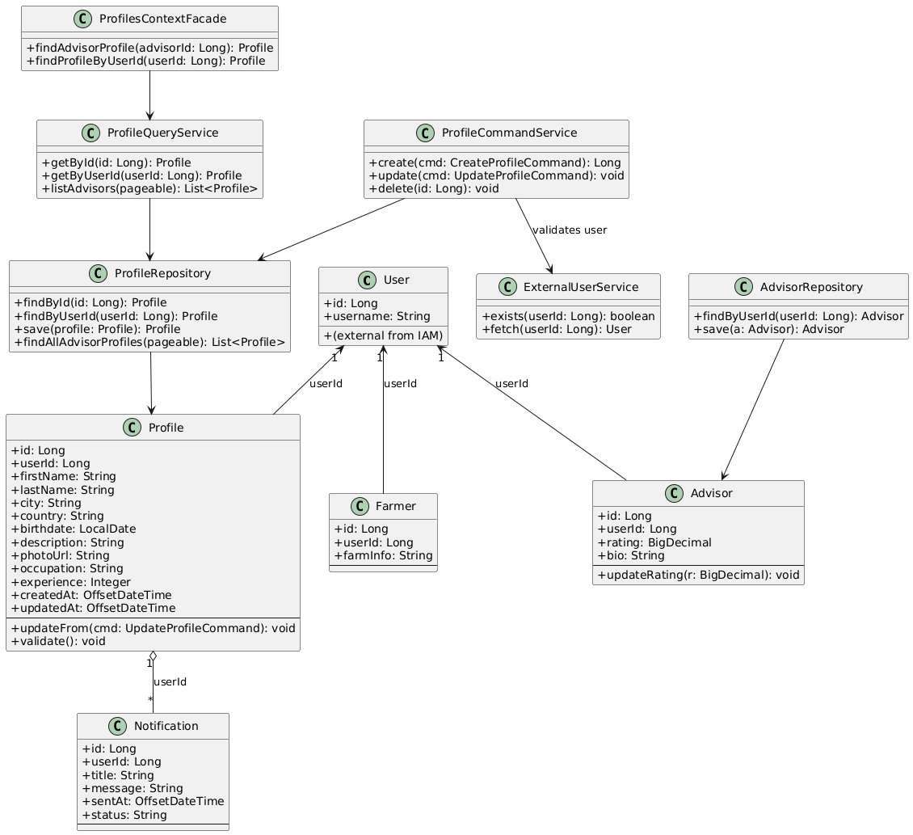
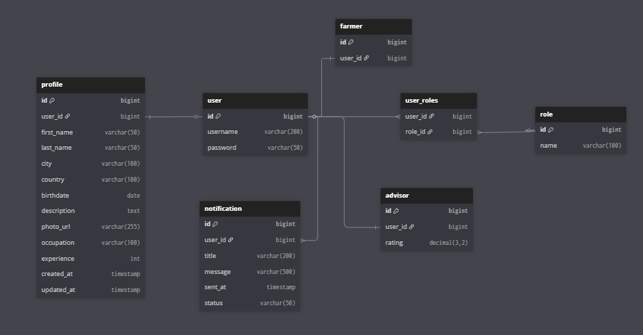
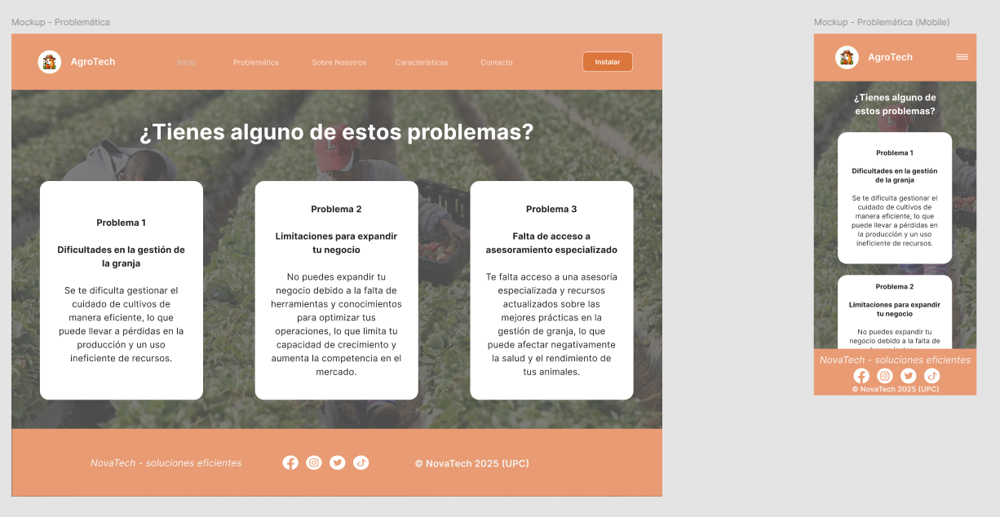

<p align="center">
  
</p>

<div align="center">
  <h1>Universidad Peruana de Ciencias Aplicadas</h1>
  <p><strong>Carrera:</strong> Ingeniería de Software</p>
  <p><strong>Ciclo:</strong> 2025 - 2</p>
  <p><strong>Curso:</strong> Arquitecturas De Software Emergentes</p>
  <p><strong>Sección:</strong> 7281</p>
  <p><strong>Profesor:</strong> Richard Leonardo Berrocal Navarro</p>
  <p><strong>"Informe de Trabajo Final"</strong></p>
  <p><strong>Startup:</strong> NovaTech</p>
  <p><strong>Producto:</strong> AgroTech</p>
</div>

<table align="center">
  <tr>
    <th>Integrantes</th>
    <th>Código</th>
  </tr>
  <tr>
    <td>Delgado Corrales, Piero Gonzalo</td>
    <td>U202210749</td>
  </tr>
  <tr>
    <td>Paredes Puente, Sebastián Roberto</td>
    <td>U202217239</td>
  </tr>
  <tr>
    <td>Salinas Torres, Salvador Antonio</td>
    <td>U20221B127</td>
  </tr>
  <tr>
    <td>Elias Sanchez, Harold Miguel</td>
    <td>U202212684</td>
  </tr>
  <tr>
    <td>Chinchihualpa Saldarriaga, Luis Sebastian</td>
    <td>U202212112</td>
  </tr>
</table>

<p align="center"><b>Octubre 2025</b></p>

<div style="page-break-after: always;"></div>

# Registro de versiones

<table>
  <thead>
    <tr>
        <th>Versión</th>
        <th>Fecha</th>
        <th>Autor</th>
        <th>Descripción de modificación</th>
    </tr>
  </thead>
  <tbody>
    <tr>
        <td><strong>TB1</strong></td>
        <td>05/09/25</td>
        <td>
          <ul>
            <li>Delgado Corrales, Piero Gonzalo</li>
            <li>Paredes Puente, Sebastian Roberto</li>
            <li>Salinas Torres, Salvador Antonio</li>
            <li>Elias Sanchez, Harold Miguel</li>
            <li>Chinchihualpa Saldarriaga, Luis Sebastian</li>
          </ul>
        </td>
        <td>
          Se realizaron los siguientes puntos:
          <ul>
            <li>Capítulo I: Introducción</li>
            <li>Capítulo II: Requirements Elicitation & Analysis</li>
            <li>Capítulo III: Requirements Specification</li>
            <li>Capítulo IV: Strategic-Level Software Design</li>
          </ul>
        </td>
    </tr>
    <tr>
        <td><strong>TP1</strong></td>
        <td>07/10/25</td>
        <td>
          <ul>
            <li>Delgado Corrales, Piero Gonzalo</li>
            <li>Paredes Puente, Sebastian Roberto</li>
            <li>Salinas Torres, Salvador Antonio</li>
            <li>Elias Sanchez, Harold Miguel</li>
            <li>Chinchihualpa Saldarriaga, Luis Sebastian</li>
          </ul>
        </td>
        <td>
          Se realizaron los siguientes puntos:
          <ul>
            <li>Capítulo V: Tactical-Level Software Design</li>
            <li>Avance de Capítulo VI: Product Design</li>
            <li>Mejoras a Capítulo I, II, III y IV</li>
          </ul>
        </td>
    </tr>
  </tbody>
</table>

<div style="page-break-after: always;"></div>

# Project Report Collaboration Insights
## TB1

<p align="center">
  
</p>

## TP1

<p align="center">
  
</p>

<div style="page-break-after: always;"></div>

# Tabla de Contenido

[Registro de Versiones](#registro-de-versiones)

[Student Outcome](#student-outcome)

[Capítulo I: Introducción](#Capítulo-I-Introducción)
  - [1.1. Startup Profile](#11-startup-profile)
    - [1.1.1. Descripción de la Startup](#111-descripción-de-la-startup)
    - [1.1.2. Perfiles de integrantes del equipo](#112-perfiles-de-integrantes-del-equipo)
  - [1.2. Solution Profile](#12-solution-profile)
    - [1.2.1. Antecedentes y problemática](#121-antecedentes-y-problemática)
    - [1.2.2. Lean UX Process](#122-lean-ux-process)
      - [1.2.2.1. Lean UX Problem Statements](#1221-lean-ux-problem-statements)
      - [1.2.2.2. Lean UX Assumptions](#1222-lean-ux-assumptions)
      - [1.2.2.3. Lean UX Hypothesis Statements](#1223-lean-ux-hypothesis-statements)
      - [1.2.2.4. Lean UX Canvas](#1224-lean-ux-canvas)
  - [1.3. Segmentos objetivo](#13-segmentos-objetivo)

[Capítulo II: Requirements Elicitation & Analysis](#Capítulo-II-Requirements-Elicitation--Analysis)
  - [2.1. Competidores](#21-competidores)
    - [2.1.1. Análisis competitivo](#211-análisis-competitivo)
    - [2.1.2. Estrategias y tácticas frente a competidores](#212-estrategias-y-tácticas-frente-a-competidores)
  - [2.2. Entrevistas](#22-entrevistas)
    - [2.2.1. Diseño de entrevistas](#221-diseño-de-entrevistas)
    - [2.2.2. Registro de entrevistas](#222-registro-de-entrevistas)
    - [2.2.3. Análisis de entrevistas](#223-análisis-de-entrevistas)
  - [2.3. Needfinding](#23-needfinding)
    - [2.3.1. User Personas](#231-user-personas)
    - [2.3.2. User Task Matrix](#232-user-task-matrix)
    - [2.3.3. User Journey Mapping](#233-user-journey-mapping)
    - [2.3.4. Empathy Mapping](#234-empathy-mapping)
    - [2.3.5. As-is Scenario Mapping](#235-as-is-scenario-mapping)
  - [2.4 Ubiquitous Language](#24-ubiquitous-language)

[Capítulo III: Requirements Specification](#Capítulo-III-Requirements-Specification)
  - [3.1. To-Be Scenario Mapping](#31-to-be-scenario-mapping)
  - [3.2. User Stories](#32-user-stories)
  - [3.3. Product Backlog](#33-product-backlog)
  - [3.4. Impact Mapping](#34-impact-mapping)

[Capítulo IV: Strategic-Level Software Design](#Capítulo-IV-Strategic-Level-Software-Design)
  - [4.1. Strategic-Level Attribute-Driven Design](#41-Strategic-Level-Attribute-Driven-Design)
    - [4.1.1. Design Purpose](#411-design-purpose)
    - [4.1.2. Attribute-Driven Design Inputs](#412-attribute-driven-design-inputs)
      - [4.1.2.1. Primary Functionality (Primary User Stories)](#4121-primary-functionality-primary-user-stories)
      - [4.1.2.2. Quality attribute Scenarios](#4122-quality-attribute-scenarios)
      - [4.1.2.3. Constraints](#4123-constraints)
    - [4.1.3. Architectural Drivers Backlog](#413-architectural-drivers-backlog)
    - [4.1.4. Architectural Design Decisions](#414-architectural-design-decisions)
    - [4.1.5. Quality Attribute Scenario Refinements](#415-quality-attribute-scenario-refinements)
  - [4.2. Strategic-Level Domain-Driven Design](#42-strategic-level-domain-driven-design)
    - [4.2.1. Event Storming](#421-event-storming)
    - [4.2.2. Candidate Context Discovery](#422-candidate-context-discovery)
    - [4.2.3. Domain Message Flows Modeling](#423-domain-message-flows-modeling)
    - [4.2.4. Bounded Context Canvases](#424-bounded-context-canvases)
    - [4.2.5. Context Mapping](#425-context-mapping)
  - [4.3. Software Architecture](#43-software-architecture)
    - [4.3.1. Software Architecture System Landscape Diagram](#431-software-architecture-system-landscape-diagram)
    - [4.3.1. Software Architecture Context Level Diagrams](#432-software-architecture-context-level-diagrams)
    - [4.3.2. Software Architecture Container Level Diagrams](#433-software-architecture-container-level-diagrams)
    - [4.3.3. Software Architecture Deployment Diagrams](#434-software-architecture-deployment-diagrams)

[Capítulo V: Tactical-Level Software Design](#Capítulo-V-Tactical-Level-Software-Design)
  - [5.1. Bounded Context: Appointment](#51-bounded-context-appointment)
    - [5.1.1. Domain Layer](#511-domain-layer)
    - [5.1.2. Interface Layer](#512-interface-layer)
    - [5.1.3. Application Layer](#513-application-layer)
    - [5.1.4. Infrastructure Layer](#514-infrastructure-layer)
    - [5.1.5. Bounded Context Software Architecture Component Level Diagrams](#515-bounded-context-software-architecture-component-level-diagrams)
    - [5.1.6. Bounded Context Software Architecture Code Level Diagrams](#516-bounded-context-software-architecture-code-level-diagrams)
      - [5.1.6.1. Bounded Context Domain Layer Class Diagrams](#5161-bounded-context-domain-layer-class-diagrams)
      - [5.1.6.2. Bounded Context Database Design Diagram](#5162-bounded-context-database-design-diagram)

  - [5.2. Bounded Context: Management](#52-bounded-context-management)
    - [5.2.1. Domain Layer](#521-domain-layer)
    - [5.2.2. Interface Layer](#522-interface-layer)
    - [5.2.3. Application Layer](#523-application-layer)
    - [5.2.4. Infrastructure Layer](#524-infrastructure-layer)
    - [5.2.5. Bounded Context Software Architecture Component Level Diagrams](#525-bounded-context-software-architecture-component-level-diagrams)
    - [5.2.6. Bounded Context Software Architecture Code Level Diagrams](#526-bounded-context-software-architecture-code-level-diagrams)
      - [5.2.6.1. Bounded Context Domain Layer Class Diagrams](#5261-bounded-context-domain-layer-class-diagrams)
      - [5.2.6.2. Bounded Context Database Design Diagram](#5262-bounded-context-database-design-diagram)

  - [5.3. Bounded Context: Post](#53-bounded-context-post)
    - [5.3.1. Domain Layer](#531-domain-layer)
    - [5.3.2. Interface Layer](#532-interface-layer)
    - [5.3.3. Application Layer](#533-application-layer)
    - [5.3.4. Infrastructure Layer](#534-infrastructure-layer)
    - [5.3.5. Bounded Context Software Architecture Component Level Diagrams](#535-bounded-context-software-architecture-component-level-diagrams)
    - [5.3.6. Bounded Context Software Architecture Code Level Diagrams](#536-bounded-context-software-architecture-code-level-diagrams)
      - [5.3.6.1. Bounded Context Domain Layer Class Diagrams](#5361-bounded-context-domain-layer-class-diagrams)
      - [5.3.6.2. Bounded Context Database Design Diagram](#5362-bounded-context-database-design-diagram)

  - [5.4. Bounded Context: Profile](#54-bounded-context-profile)
    - [5.4.1. Domain Layer](#541-domain-layer)
    - [5.4.2. Interface Layer](#542-interface-layer)
    - [5.4.3. Application Layer](#543-application-layer)
    - [5.4.4. Infrastructure Layer](#544-infrastructure-layer)
    - [5.4.5. Bounded Context Software Architecture Component Level Diagrams](#545-bounded-context-software-architecture-component-level-diagrams)
    - [5.4.6. Bounded Context Software Architecture Code Level Diagrams](#546-bounded-context-software-architecture-code-level-diagrams)
      - [5.4.6.1. Bounded Context Domain Layer Class Diagrams](#5461-bounded-context-domain-layer-class-diagrams)
      - [5.4.6.2. Bounded Context Database Design Diagram](#5462-bounded-context-database-design-diagram)

  - [5.5. Bounded Context: Security](#55-bounded-context-security)
    - [5.5.1. Domain Layer](#551-domain-layer)
    - [5.5.2. Interface Layer](#552-interface-layer)
    - [5.5.3. Application Layer](#553-application-layer)
    - [5.5.4. Infrastructure Layer](#554-infrastructure-layer)
    - [5.5.5. Bounded Context Software Architecture Component Level Diagrams](#555-bounded-context-software-architecture-component-level-diagrams)
    - [5.5.6. Bounded Context Software Architecture Code Level Diagrams](#556-bounded-context-software-architecture-code-level-diagrams)
      - [5.5.6.1. Bounded Context Domain Layer Class Diagrams](#5561-bounded-context-domain-layer-class-diagrams)
      - [5.5.6.2. Bounded Context Database Design Diagram](#5562-bounded-context-database-design-diagram)

[Capítulo VI: Product Design](#Capítulo-VI-Product-Design)
  - [6.1. Style Guidelines](#61-style-guidelines)
    - [6.1.1. General Style Guidelines](#611-general-style-guidelines)
    - [6.1.2. Web, Mobile & Devices Style Guidelines](#612-web-mobile--devices-style-guidelines)
  - [6.2. Information Architecture](#62-information-architecture)
    - [6.2.1. Labeling Systems](#621-labeling-systems)
    - [6.2.2. Searching Systems](#622-searching-systems)
    - [6.2.3. SEO Tags and Meta Tags](#623-seo-tags-and-meta-tags)
    - [6.2.4. Navigation Systems](#624-navigation-systems)
  - [6.3. Landing Page UI Design](#63-landing-page-ui-design)
    - [6.3.1. Landing Page Wireframe](#631-landing-page-wireframe)
    - [6.3.2. Landing Page Mock-up](#632-landing-page-mock-up)
  - [6.4. Applications UX/UI Design](#64-applications-uxui-design)
    - [6.4.1. Applications Wireframes](#641-applications-wireframes)
    - [6.4.2. Applications Wireflow Diagrams](#642-applications-wireflow-diagrams)
    - [6.4.3. Applications Mock-ups](#643-applications-mock-ups)
    - [6.4.4. Applications User Flow Diagrams](#644-applications-user-flow-diagrams)
  - [6.5. Applications Prototyping](#65-applications-prototyping)

[Capítulo VII: Product Implementation, Validation & Deployment](#capítulo-vii-product-implementation-validation--deployment)
  - [7.1. Software Configuration Management](#71-software-configuration-management)
    - [7.1.1. Software Development Environment Configuration](#711-software-development-environment-configuration)
    - [7.1.2. Source Code Management](#712-source-code-management)
    - [7.1.3. Source Code Style Guide & Conventions](#713-source-code-style-guide--conventions)
    - [7.1.4. Software Deployment Configuration](#714-software-deployment-configuration)
  - [7.2. Solution Implementation](#72-solution-implementation)
    - [7.2.1. Sprint 1](#721-sprint-1)
      - [7.2.1.1. Sprint Planning](#7211-sprint-planning)
      - [7.2.1.2. Sprint Backlog 1](#7212-sprint-backlog-1)
      - [7.2.1.3. Development Evidence for Sprint Review](#7213-development-evidence-for-sprint-review)
      - [7.2.1.4. Testing Suite Evidence for Sprint Review](#7214-testing-suite-evidence-for-sprint-review)
      - [7.2.1.5. Execution Evidence for Sprint Review](#7215-execution-evidence-for-sprint-review)
      - [7.2.1.6. Services Documentation Evidence for Sprint Review](#7216-services-documentation-evidence-for-sprint-review)
      - [7.2.1.7. Software Deployment Evidence for Sprint Review](#7217-software-deployment-evidence-for-sprint-review)
      - [7.2.1.8. Team Collaboration Insights during Sprint](#7218-team-collaboration-insights-during-sprint)
  - [7.3. Validation Interviews](#73-validation-interviews)
    - [7.3.1. Diseño de Entrevistas](#731-diseño-de-entrevistas)
    - [7.3.2. Registro de Entrevistas](#732-registro-de-entrevistas)
    - [7.3.3. Evaluaciones según heurísticas](#733-evaluaciones-según-heurísticas)
  - [7.4. Video About-the-Product](#74-video-about-the-product)
    
[Conclusiones](#conclusiones)
  - [Conclusiones y Recomendaciones](#conclusiones-y-recomendaciones)
  - [Video About the Team](#video-about-the-team)

[Bibliografía](#bibliografía)

[Anexos](#anexos)

<div style="page-break-after: always;"></div>

# Student Outcome

**ABET – EAC - Student Outcome 3: Capacidad de comunicarse efectivamente con un rango de audiencias**

**Criterio:** Capacidad de comunicarse efectivamente con un rango de audiencias. En el siguiente cuadro se describe las acciones realizadas y enunciados de conclusiones por parte del grupo, que permiten sustentar el haber alcanzado el logro del ABET – EAC - Student Outcome 3.

<table style="border-collapse: collapse; width: 100%;">
  <thead style="background-color: #f2f2f2;">
    <tr>
      <th style="border: 1px solid #000; padding: 8px;"><strong>Criterio específico</strong></th>
      <th style="border: 1px solid #000; padding: 8px;"><strong>Acciones realizadas</strong></th>
      <th style="border: 1px solid #000; padding: 8px;"><strong>Conclusiones</strong></th>
    </tr>
  </thead>
  <tbody>
    <tr style="page-break-inside: avoid;">
      <td style="border: 1px solid #000; padding: 8px;">Comunica oralmente sus ideas y/o resultados con objetividad a público de diferentes especialidades y niveles jerarquicos, en el marco del desarrollo de un proyecto en ingeniería.</td>
      <td style="border: 1px solid #000; padding: 8px;">
        <p><strong>Delgado Corrales, Piero Gonzalo</strong></p>
        <p><strong>TB1:</strong> Para esta entrega, en el video de exposición expuse de manera clara los requerimientos a través de las User Stories y Atributos de Calidad.</p>
        <p><strong>TP1:</strong> En el video de exposición, presenté el bounded context de Appointment, explicando sus componentes, cómo se relacionan entre sí, y su importancia en el desarrollo de la solución.</p>
        <p><strong>Chinchihualpa Saldarriaga, Luis Sebastian</strong></p>
        <p><strong>TB1:</strong> Para esta entrega, en el video de exposición presenté la problemática del sector agropecuario de manera objetiva, resaltando las cifras y limitaciones actuales como base para justificar el desarrollo de la solución.</p>
        <p><strong>TP1:</strong>  En esta entrega, elaboré y presenté el video explicativo del bounded context de Security, detallando sus componentes principales, su estructura interna y las interacciones entre sus módulos. Además, expuse los diagramas de componentes, clases y base de datos, explicando su función dentro de la arquitectura general del sistema y su relevancia para garantizar la autenticación y autorización segura de los usuarios.</p>
        <p><strong>Salinas Torres, Salvador Antonio</strong></p>
        <p><strong>TB1:</strong> En este primer entregable, logré comunicar de forma oral los descubrimientos de la investigación de mercado, destacando el análisis competitivo, las necesidades y expectativas de los usuarios finales.</p>
        <p><strong>TP1:</strong> Para la entrega parcial, participé en el video de exposición, presentando cómo se trabajó el bounded context de Management. Así, expuse sus componentes clave y su importancia en la solución propuesta.</p>
        <p><strong>Elias Sanchez, Harold Miguel</strong></p>
        <p><strong>TB1:</strong> Realicé una entrevista al primer segmento de usuarios para obtener información directa sobre sus necesidades y expectativas respecto a la solución propuesta. Compartí estos hallazgos con el grupo de manera clara para que sirvieran de   base en el diseño.</p>
        <p><strong>TP1:</strong> Logré comunicar de manera clara el bounded context de Profile, explicando su estructura, responsabilidades y la interacción entre sus componentes. Además, destaqué su relevancia dentro de la arquitectura general del sistema, evidenciando cómo contribuye al manejo de la información de los usuarios y a la integración con los demás módulos del proyecto.</p>
        <p><strong>Paredes Puente, Sebastian Roberto</strong></p>
        <p><strong>TB1:</strong> En esta entrega, logré comunicar oralmente el lean UX Canvas con puntos claves para tener más claro la problemática a resolver, junto con la identificación de los segmentos objetivos</p>
        <p><strong>TP1:</strong> Para esta entrega, logré comunicar acerca del bounded context de Post, describiendo su organización funcional, la forma en que sus partes se vinculan y el papel que desempeña en la implementación de la solución.</p>
      </td>
      <td style="border: 1px solid #000; padding: 8px;">
        <p><strong>TB1:</strong> Como grupo, logramos transmitir nuestras ideas con claridad y objetividad para explicar nuestra problemática y solución propuesta.</p>
        <p><strong>TP1:</strong>Logramos exponer claramente los bounded contexts de Appointment, Security, Management, Profile y Post, destacando su estructura, componentes e interacciones, evidenciando su importancia dentro de la solución propuesta. Asimismo, explicamos las secciones de la landing page y los wireflows de la aplicación.</p>
      </td>
    </tr>
    <tr style="page-break-inside: avoid;">
      <td style="border: 1px solid #000; padding: 8px;">Comunica en forma escrita ideas y/o resultados con objetividad a públicos de diferentes especialidades y niveles jerárquicos, en el marco del desarrollo de un proyecto en ingeniería.</td>
      <td style="border: 1px solid #000; padding: 8px;">
        <p><strong>Delgado Corrales, Piero Gonzalo</strong></p>
        <p><strong>TB1:</strong> Para esta entrega, participé en la elaboración del project report. Apoyé con el desarrollo de los cuatro capítulos donde se abordaron los aspectos clave del proyecto.</p>
        <p><strong>TP1:</strong> En el informe, contribuí con la redacción del capítulo de Tactical-Level Software Design, detallando la estructura y componentes del bounded context de Appointment.</p>
        <p><strong>Chinchihualpa Saldarriaga, Luis Sebastian</strong></p>
        <p><strong>TB1:</strong> Para esta entrega, participé en la redacción del project report, elaborando los apartados de antecedentes, problemática y domain message flows, con descripciones claras y adecuadas al alcance del proyecto.</p>
         <p><strong>TP1:</strong> En el informe, participé en la redacción del capítulo de Tactical-Level Software Design, describiendo la estructura, componentes y modelo de datos del bounded context de Security. Además, documenté los diagramas de clases, componentes y base de datos, explicando su función dentro del sistema y su contribución a los mecanismos de autenticación y autorización del proyecto.</p>
        <p><strong>Salinas Torres, Salvador Antonio</strong></p>
        <p><strong>TB1:</strong> En este primer entregable, participé principalmente en la redacción de la sección de análisis de mercado, donde presenté los hallazgos clave de la investigación y su relevancia para el proyecto, el proceso del eventstorming y los resultados obtenidos.</p>
        <p><strong>TP1:</strong> Apoyé en la elaboración del capítulo de Tactical-Level Software Design, documentando el bounded context de Management. Describí su arquitectura a nivel de componentes y de código, detallando la organización interna, las relaciones entre entidades y la lógica de implementación que sustentan su funcionalidad dentro de la solución. Además, realicé los prototipos de la aplicación en Figma, los cuales son parte integral de la presentación del diseño.</p>
        <p><strong>Elias Sanchez, Harold Miguel</strong></p>
        <p><strong>TB1:</strong> Participé en la elaboración del informe desarrollando los diagramas C4 (contexto y contenedores) y sus descripciones correspondientes. Documenté cómo los actores, contenedores y servicios externos se integran en la arquitectura de AgroTech.</p>
        <p><strong>TP1:</strong> Participé en la elaboración del capítulo Tactical-Level Software Design, documentando el bounded context de Profile. Describí su arquitectura a nivel de componentes y de código mediante los diagramas Software Architecture Component Level y Code Level, detallando la organización interna, las relaciones entre entidades y la lógica de implementación que sustentan su funcionalidad dentro de la solución.</p>
        <p><strong>Paredes Puente, Sebastian Roberto</strong></p>
        <p><strong>TB1:</strong> En esta entrega, logré comunicar de forma escrita los domain message flows, asimismo participé en la elaboración del eventstorming</p>
        <p><strong>TP1:</strong> En esta entrega, participé en la elaboración del capítulo Tactical-Level Software Design, detallando la arquitectura, responsabilidades y relaciones internas del bounded context de Post.</p>
      </td>
      <td style="border: 1px solid #000; padding: 8px;">
        <p><strong>TB1:</strong> Como grupo, elaboramos el project report de manera clara y organizada, lo que nos permitió comunicar de forma efectiva tanto los aspectos técnicos como los beneficios prácticos del proyecto.</p>
        <p><strong>TP1:</strong> Se documentaron los bounded contexts de manera detallada en el capítulo de Tactical-Level Software Design, describiendo arquitectura, componentes, relaciones y diagramas correspondientes, garantizando comprensión clara y objetiva del diseño del sistema. Además, se incluyeron los mockups de la landing page y wireframes de la aplicación.</p>
      </td>
    </tr>
  </tbody>
</table>
  
<div style="page-break-after: always;"></div>

# Capítulo I: Introducción
## 1.1. Startup Profile
### 1.1.1. Descripción de la Startup

Nuestra startup se llama NovaTech y está enfocada en resolver los retos de la gestión agrícola mediante nuestro producto AgroTech, una aplicación integral que ofrece soluciones tecnológicas y asesoría especializada para optimizar el manejo de las granjas de forma inteligente y eficiente.

**Misión:**
Facilitar el acceso de los productores agropecuarios a asesoramiento experto, impulsando prácticas agrícolas sostenibles y modernas que incrementen la productividad, rentabilidad y el desarrollo de las comunidades rurales.

**Visión:**
Ser referentes en innovación tecnológica para el sector agropecuario, promoviendo la sostenibilidad y el bienestar animal a través de herramientas accesibles y efectivas.

**Logo de AgroTech**
<p align="center">
  
</p>

### 1.1.2. Perfiles de integrantes del equipo

<table>
  <tr>
    <td>
      
    </td>
    <td valign="top">
      <p><b>Delgado Corrales, Piero Gonzalo</b></p>
      <p>
        Soy estudiante de octavo ciclo de Ingeniería de Software, con experiencia en diseño web empleando HTML y CSS, además del uso de Figma para elaborar prototipos. He trabajado con diversos frameworks tanto de frontend (Vue, Angular y React) como de backend (Spring Boot, .NET y Django). Me considero una persona responsable y organizada, comprometida con una gestión eficiente del tiempo.
      </p>
    </td>
  </tr>
  <tr>
    <td>
      
    </td>
    <td valign="top">
      <p><b>Salinas Torres, Salvador Antonio</b></p>
      <p>
        Soy Salvador y actualmente curso el octavo ciclo de la carrera de Ingeniería de Software. Poseo conocimientos en: programación orientada a objetos en C++, Python, C# y Java; desarrollo de Frontend Web con frameworks de Angular y Vue; desarrollo de backend (microservicios) con frameworks de Spring Boot y .NET; desarrollo móvil con Kotlin y Dart; gestión de base de datos en SQL Server, MySQL, PostgreSQL, SQLite; CI/CD. Considero que soy una persona responsable y siempre organizo el tiempo para hacerlos tranquilamente antes de la fecha de entrega.
      </p>
    </td>
  </tr>
  <tr>
    <td>
      
    </td>
    <td valign="top">
      <p><b>Paredes Puente, Sebastian Roberto</b></p>
      <p>
        Soy Sebastian, estudiante del octavo ciclo de Ingeniería de Software. A lo largo de mi formación he adquirido experiencia trabajando con diversos lenguajes como C++, Python, C# y Java, aplicando principios de programación orientada a objetos. Además, he desarrollado proyectos web utilizando Angular y Vue para el frontend, y he implementado servicios backend con Spring Boot y .NET. También he explorado el desarrollo móvil con Kotlin y Dart, y tengo manejo de bases de datos como SQL Server, MySQL y SQLite. 
      </p>
    </td>
  </tr>
  <tr>
    <td>
      
    </td>
    <td valign="top">
      <p><b>Elias Sanchez, Harold Miguel</b></p>
      <p>
        Soy estudiante de ingeniería de software en octavo ciclo, con interés en ciberseguridad y pentesting. Tengo experiencia en C++ y Python a nivel intermedio, además de proyectos en desarrollo web y pruebas unitarias en C# con NUnit. Me caracterizo por mi capacidad de trabajo en equipo, aportando ideas y colaborando para lograr objetivos comunes. 
      </p>
    </td>
  </tr>
  <tr>
    <td>
      
    </td>
    <td valign="top">
      <p><b>Chinchihualpa Saldarriaga, Luis Sebastian</b></p>
      <p>
        Soy estudiante del octavo ciclo de Ingeniería de Software en la UPC. Tengo experiencia en el desarrollo de aplicaciones web y móviles utilizando tecnologías como Java, Python, C++, Spring Boot, Angular y Vue. He trabajado con bases de datos relacionales y no relacionales, y también con microservicios y APIs REST. Me considero una persona responsable, adaptable y con interés en aprender continuamente nuevas tecnologías.
      </p>
    </td>
  </tr>
</table>

## 1.2. Solution Profile
### 1.2.1. Antecedentes y problemática

**5 W’s**

**What:** Una parte del sector agropecuario enfrenta dificultades en la gestión eficaz de las granjas, acceso limitado a tecnología adecuada, y la necesidad de mejorar tanto el bienestar animal como la sostenibilidad en sus prácticas.

**Where:** El enfoque será a nivel nacional, con especial atención en las regiones del Perú con mayor actividad económica y comercial en el rubro agropecuario.

**When:** Actualmente, el sector agropecuario enfrenta estos retos. El crecimiento poblacional y la creciente demanda de alimentos exigen una producción más eficiente. Además, las preocupaciones ambientales exigen buscar prácticas más sostenibles.

**Who:** Los principales beneficiarios son los productores agropecuarios, quienes recibirán soluciones adaptadas a su contexto. También participan asesores especializados que aportan su experiencia para apoyar a los agricultores en la toma de decisiones informadas.

**Why:** Es crucial enfrentar estos retos para mejorar la productividad y sostenibilidad de las granjas, garantizar el bienestar animal, y aumentar la rentabilidad de los agricultores, contribuyendo así a la seguridad alimentaria del país.

**2 H's**

**How:** Se resolverá a través de AgroTech, una aplicación web y móvil que brinda asesoramiento, ayudando a los productores agropecuarios a gestionar sus granjas con mayor eficiencia, impulsando así su producción y rentabilidad.

**How Much:** Se proyecta un impacto positivo en la eficiencia de las granjas, elevando la productividad y fomentando prácticas sostenibles en el sector.
De acuerdo con Ames (2022), el agro representa cerca del 27.5% del empleo nacional, pero solo aporta un 5.2% al PBI, lo que evidencia una baja productividad frente a otros países de la región. Esto se traduce en menores ingresos para los agricultores y mayor vulnerabilidad ante el clima y los mercados globales.

### 1.2.2. Lean UX Process
#### 1.2.2.1. Lean UX Problem Statements

**Problem Statement 1**  
| Nuestro producto busca optimizar la gestión de granjas en el Perú. |
|:--|
| Hemos identificado que gran parte de los agricultores en el país enfrentan dificultades al administrar eficientemente sus granjas, lo que impacta negativamente en su productividad y ganancias. |
| ¿Puede nuestra aplicación AgroTech ser una solución efectiva para mejorar la gestión agrícola y elevar la productividad de los productores agropecuarios peruanos? |

**Problem Statement 2**  
| Nuestro producto busca incrementar la rentabilidad de los agricultores en el Perú. |
|:--|
| Detectamos que gran parte de los productores agropecuarios en el Perú enfrentan obstáculos para alcanzar una rentabilidad constante, principalmente por una gestión ineficiente de sus granjas. |
| ¿Podría AgroTech ser la herramienta que los productores agropecuarios necesitan para optimizar sus procesos y mejorar sus ingresos? |

**Problem Statement 3**  
| Nuestro producto busca ofrecer asesoría técnica especializada a los productores agropecuarios peruanos. |
|:--|
| Observamos que acceder a orientación profesional en gestión agrícola sigue siendo un reto para muchos productores. |
| ¿De qué manera AgroTech puede facilitar el acceso a asesoramiento experto que impulse una mejor gestión de las granjas? |

#### 1.2.2.2. Lean UX Assumptions

**1. ¿Quién es el usuario?**
El usuario principal es el productor agropecuario, quien se beneficiará del acompañamiento de asesores especializados que emplean la plataforma para guiarlo en la administración efectiva de su granja. AgroTech facilita la adopción de técnicas sostenibles y contribuye al incremento de la productividad en el sector agropecuario.

**2. ¿Dónde encaja nuestro producto en su trabajo o vida?**
AgroTech se integra en la rutina del agricultor al brindar orientación técnica especializada que mejora la gestión de sus actividades diarias. La plataforma se convierte en una aliada constante al proporcionar herramientas para una administración eficiente, mejorar el cuidado de cultivos y animales, implementar prácticas responsables y facilitar la comercialización.

**3. ¿Qué problemas busca resolver nuestro producto?**
El rubro agropecuario presenta múltiples retos como el limitado acceso a conocimientos técnicos y la falta de asesoría especializada. Estas carencias afectan a los agricultores al dificultar prácticas clave como el manejo de suelos, el uso racional de recursos hídricos y fertilizantes, y el control de plagas. Esto genera baja productividad, mayores gastos operativos y compromete la sostenibilidad, reduciendo la competitividad del país y afectando su economía.

**4. ¿Cuándo y cómo se usa nuestro producto?**
AgroTech es una herramienta clave para mejorar la eficiencia operativa, acceder a asesoramiento en tiempo real e implementar prácticas sostenibles. Está diseñada para productores agropecuarios que requieren asistencia en la gestión diaria. Puede usarse desde dispositivos móviles o computadoras, permitiendo el acceso a cualquier hora tanto por parte de los productores como de los asesores.

**5. ¿Qué características son importantes?**

- Proporcionar recomendaciones personalizadas y detalladas sobre la gestión de granjas, abarcando áreas clave como el manejo de recursos, bienestar animal y cultivo, y la implementación de prácticas sostenibles.

- Asegurar que los usuarios reciban asesoramiento en tiempo real, adaptado a sus necesidades específicas y permitiendo una evolución constante en la gestión de sus granjas.

**6. ¿Cómo debe lucir y comportarse nuestro producto?**
AgroTech debe contar con una interfaz intuitiva y atractiva visualmente. Su desempeño debe ser ágil, brindando información útil de forma clara. La seguridad es clave, garantizando la confidencialidad de los datos del usuario.

**Presentación de otros supuestos:**

<table border="1">
  <tr>
    <td>Considero que mis clientes necesitan una solución integral para gestionar sus actividades agropecuarias, incluyendo el bienestar de animales y cultivos, reproducción y comercialización. Planeo generar ingresos mediante suscripciones a la plataforma AgroTech.</td>
    <td>Estas necesidades pueden ser atendidas con tecnología de monitoreo y análisis, junto con el soporte de especialistas que ofrezcan orientación personalizada.</td>
  </tr>
  <tr>
    <td>Mi principal competidor en el mercado es BestFarm.</td>
    <td>Mis clientes iniciales serán agricultores del Perú que buscan hacer más rentables y eficientes sus operaciones.</td>
  </tr>
  <tr>
    <td>AgroTech enfrentará los retos del sector al conectar expertos con productores, proporcionando conocimientos prácticos y soluciones adaptadas a distintas áreas de producción.</td>
    <td>El mayor valor que nuestros clientes buscan es incrementar la rentabilidad de sus granjas, cuidando al mismo tiempo el bienestar de cultivos y animales, con un enfoque sostenible.</td>
  </tr>
  <tr>
    <td>El mayor desafío es la resistencia al cambio por parte de ciertos agricultores, quienes podrían mostrarse escépticos ante nuevas formas de trabajo.</td>
    <td>Existe el riesgo de que los clientes no renueven su suscripción si no perciben mejoras reales en la gestión de sus granjas.</td>
  </tr>
  <tr>
    <td>Esto se abordará con una estrategia educativa y de acompañamiento continuo, demostrando el impacto de AgroTech a través de resultados concretos y casos exitosos.</td>
    <td>Captaré a la mayoría de mis clientes mediante marketing digital dirigido, presencia en eventos agrícolas y alianzas con instituciones del sector.</td>
  </tr>
  <tr>
    <td>El eje principal de AgroTech es brindar asesoramiento técnico especializado mediante soluciones inteligentes que potencien la productividad y sostenibilidad en la agricultura.</td>
  </tr>
</table>

#### 1.2.2.3 Lean UX Hypothesis Statements

**Hypothesis Statement 1**

| Creemos que al ofrecer a los productores agropecuarios en Perú acceso a tecnologías de vanguardia y asesoría especializada mediante AgroTech, se logrará una mejora en la eficiencia y rentabilidad de sus granjas. |
| - |
| Sabremos que esto es cierto… |
| Cuando se registre un aumento del 20% en la cantidad de solicitudes de asesoría durante los primeros 6 meses tras el lanzamiento. |

**Hypothesis Statement 2**

| Creemos que al fomentar la adopción de prácticas agrícolas responsables y sostenibles en el sector agropecuario de Perú a través de AgroTech, los agricultores adoptarán un enfoque más consciente del medio ambiente. |
| - |
| Sabremos que esto es cierto… |
| Cuando proporcionemos orientación y recursos enfocados en prácticas sostenibles a través de AgroTech y observemos un incremento del 15% en la implementación de estas prácticas en los primeros 6 meses tras el lanzamiento. |

**Hypothesis Statement 3**

| Creemos que al introducir una nueva estructura de comisiones para los asesores en AgroTech, se incrementará tanto el número de asesores activos como su nivel de satisfacción. |
| - |
| Sabremos que esto es cierto… |
| Cuando veamos un incremento del 20% en el número de asesores activos dentro de los primeros tres meses tras la implementación de la nueva estructura de comisiones. Además, mediremos la retroalimentación de los asesores a través de encuestas regulares, y consideraremos que hemos tenido éxito si al menos el 70% de las respuestas son positivas en relación con la nueva estructura de comisiones. |

#### 1.2.2.4. Lean UX Canvas. 


## 1.3. Segmentos objetivo

**1. Productores agropecuarios**

Los productores agropecuarios entre 18 y 40 años constituyen un segmento estratégico para la implementación de AgroTech, debido a su disposición para incorporar tecnologías en sus prácticas agrícolas. Según la Encuesta Nacional Agropecuaria realizada por el Instituto Nacional de Estadística e Informática (INEI, 2025), el 73.8 % de los productores se dedica a la actividad agropecuaria, mientras que el 66.3 % de las unidades agropecuarias tienen menos de cinco hectáreas, y el 85.5 % destina su producción al consumo del hogar. Estas cifras muestran que gran parte del sector está compuesto por pequeños productores que podrían beneficiarse de herramientas accesibles y adaptadas a sus necesidades.

En cuanto al nivel educativo, la mayoría de los productores agropecuarios cuenta con educación básica. Según el INEI (2025), aproximadamente el 49% de productores agropecuarios tienen educación primaria, el 30% secundaria y un 11% no tiene nivel educativo.

Además, los departamentos de Cajamarca y Cusco concentran más del 10 % del total de productores agropecuarios, mientras que La Libertad, Arequipa, Amazonas, San Martín, Huánuco, Huancavelica y Puno tienen entre 5.1 % y 10 %, y los 15 departamentos restantes no superan el 5 % (INEI, 2025).


|**Segmento objetivo**|Productores agropecuarios|
| :- | :- |
|**Edad**|18-40 años|
|**Ubicación**|Perú en departamentos con alta actividad agropecuaria (Cajamarca, Cusco, La Libertad, Arequipa, etc.)|
|**Sexo**|Masculino y Femenino|
|**Formación educativa**|Educación primaria|
|**Poder adquisitivo**|Bajo y medio|

**2. Asesores con experiencia**

Los asesores con experiencia son claves en el sector agropecuario, brindando orientación técnica y operativa a los productores. AgroTech les permite ampliar su alcance y gestionar sus asesorías de manera eficiente, mejorando la productividad y sostenibilidad de las granjas. Esto refuerza su rol como facilitadores clave en el desarrollo del sector.

Hemos considerado que estos deberán tener experiencia en el campo y/o estudios universitarios en carreras como ingeniería agrónoma, medicina veterinaria, zootecnia, etc. De este modo, debido a que el plan de estudios de estas carreras es de mínimo 5 años a más, y necesitan cierto grado de experiencia para dar recomendaciones y planes de acción confiables, hemos decidido que el rango de edad será de 25 años hasta 65 años.

|**Segmento objetivo**|Asesores con experiencia|
| :- | :- |
|**Edad**|25-65 años|
|**Ubicación**|Perú|
|**Sexo**|Masculino y Femenino|
|**Formación educativa**|Universitaria o superior|
|**Poder adquisitivo**|Bajo, medio y alto|

<div style="page-break-after: always;"></div>

# Capítulo II: Requirements Elicitation & Analysis
## 2.1. Competidores
### 2.1.1. Análisis competitivo

<table border="1" cellpadding="10" cellspacing="0">
  <tr>
    <th colspan="6" valign="top"><b>Competitive Analysis Landscape</b></th>
  </tr>
  <tr>
    <td rowspan="1" valign="top"><b>¿Por qué llevar a cabo este análisis?</b></td>
    <td colspan="5" valign="top">
      <ul>
        <li>Objetivo 1: Obtener información sobre las ofertas de nuestros competidores y aprender de las áreas en las que tienen limitaciones.</li>
        <li>Objetivo 2: Reconocer las fortalezas y debilidades de nuestros competidores para desarrollar una estrategia competitiva robusta y eficaz.</li>
      </ul>
    </td>
  </tr>
  <tr>
    <td colspan="2" valign="top"><b>(En la cabecera colocar por cada competidor nombre y logo)</b></td>
    <td valign="top">
      <p><b>AgroTech</b></p>
      <p></p>
    </td>
    <td valign="top">
      <p><b>BestFarm</b></p>
      <p></p>
    </td>
    <td valign="top">
      <p><b>AgriWebb</b></p>
      <p></p>
    </td>
    <td valign="top">
      <p><b>Trimble Ag</b></p>
      <p></p>
    </td>
  </tr>
  <tr>
    <td rowspan="2"><b>Perfil</b></td>
    <td valign="top"><b>Overview</b></td>
    <td valign="top"><b>AgroTech</b> es una plataforma completa que ofrece orientación experta y soluciones tecnológicas para optimizar la gestión de granjas de forma eficiente y sostenible.</td>
    <td valign="top"><b>BestFarm</b> es una plataforma digital diseñada para la gestión integral de granjas agrícolas y ganaderas.</td>
    <td valign="top"><b>AgriWebb</b> es una plataforma digital con enfoque en la trazabilidad del ganado y la productividad agrícola.</td>
    <td valign="top"><b>Trimble Ag</b> ofrece soluciones avanzadas para la gestión de fincas, incluyendo planificación de cultivos y monitoreo de recursos.</td>
  </tr>
  <tr>
    <td valign="top"><b>Ventaja competitiva</b><br>¿Qué valor ofrece a los clientes?</td>
    <td valign="top"><b>AgroTech</b> conecta a agricultores novatos con expertos para mejorar la productividad y sostenibilidad.</td>
    <td valign="top"><b>BestFarm</b> destaca por su simplicidad y accesibilidad, integrando cultivos y ganado en una sola plataforma.</td>
    <td valign="top"><b>AgriWebb</b> sobresale por su trazabilidad y captura de datos en tiempo real.</td>
    <td valign="top"><b>Trimble Ag</b> integra múltiples fuentes de datos y proporciona una visión completa de la finca.</td>
  </tr>
  <tr>
    <td rowspan="2"><b>Perfil de Marketing</b></td>
    <td valign="top"><b>Mercado objetivo</b></td>
    <td valign="top">Productor agrícola con poca experiencia y aquellos que buscan optimizar la gestión de sus granjas.</td>
    <td valign="top">Agricultores y ganaderos que buscan una solución integral para sus fincas.</td>
    <td valign="top">Ganaderos y agricultores que desean eficiencia y trazabilidad.</td>
    <td valign="top">Agricultores de tamaño medio a grande que requieren soluciones integradas.</td>
  </tr>
  <tr>
    <td valign="top"><b>Estrategias de marketing</b></td>
    <td valign="top">Marketing digital dirigido, colaboraciones agrícolas y eventos del sector.</td>
    <td valign="top">Campañas digitales, demostraciones y alianzas con distribuidores.</td>
    <td valign="top">Marketing digital, talleres educativos y cooperación con organizaciones.</td>
    <td valign="top">Ferias agrícolas, marketing digital y asociaciones tecnológicas.</td>
  </tr>
  <tr>
    <td rowspan="3"><b>Perfil de Producto</b></td>
    <td valign="top"><b>Productos & Servicios</b></td>
    <td valign="top">Asesoramiento especializado mediante app web y móvil.</td>
    <td valign="top">Software de gestión con planificación, recursos y monitoreo animal.</td>
    <td valign="top">Software de fincas con trazabilidad, salud animal y cultivos.</td>
    <td valign="top">Software agrícola y ganadero con planificación y análisis de datos.</td>
  </tr>
  <tr>
    <td valign="top"><b>Precios & Costos</b></td>
    <td valign="top">Modelo de suscripción mensual o anual, según necesidades.</td>
    <td valign="top">Suscripción escalonada según tamaño de la finca.</td>
    <td valign="top">Planes según tamaño y necesidades de la finca.</td>
    <td valign="top">Suscripción con niveles por características y tamaño.</td>
  </tr>
  <tr>
    <td valign="top"><b>Canales de distribución</b></td>
    <td valign="top">Plataformas web y móviles.</td>
    <td valign="top">Plataforma web.</td>
    <td valign="top">Plataforma web.</td>
    <td valign="top">Plataforma web.</td>
  </tr>
  <tr>
    <td rowspan="5"><b>Análisis SWOT</b></td>
    <td colspan="5" valign="top">Realice esto para su startup y sus competidores. Las fortalezas deben apoyar las oportunidades y fortalecer su ventaja competitiva.</td>
  </tr>
  <tr>
    <td valign="top"><b>Fortalezas</b></td>
    <td valign="top">Conexión directa con asesores, asesoramiento especializado.</td>
    <td valign="top">Plataforma integral, fácil de usar.</td>
    <td valign="top">Foco en trazabilidad, interfaz intuitiva.</td>
    <td valign="top">Alta tecnología, gestión integral.</td>
  </tr>
  <tr>
    <td valign="top"><b>Debilidades</b></td>
    <td valign="top">Barrera tecnológica, necesidad de asesores expertos.</td>
    <td valign="top">Poca personalización, enfoque generalista.</td>
    <td valign="top">Costo elevado, requiere buena conectividad.</td>
    <td valign="top">Precio alto, curva de aprendizaje.</td>
  </tr>
  <tr>
    <td valign="top"><b>Oportunidades</b></td>
    <td valign="top">Expansión en zonas rurales, asesoría personalizada.</td>
    <td valign="top">Crecimiento en mercados rurales, nuevas funciones.</td>
    <td valign="top">Mercados emergentes, integración con IoT.</td>
    <td valign="top">Demanda de soluciones integradas, innovación tecnológica.</td>
  </tr>
  <tr>
    <td valign="top"><b>Amenazas</b></td>
    <td valign="top">Competencia establecida, resistencia al cambio.</td>
    <td valign="top">Competidores especializados, cambios en preferencias.</td>
    <td valign="top">Rivalidad fuerte, demandas más específicas.</td>
    <td valign="top">Competencia más accesible, cambios tecnológicos.</td>
  </tr>
</table>

### 2.1.2. Estrategias y tácticas frente a competidores

**1. Estrategia: Fortalecimiento del Soporte al Cliente**
- **Táctica:** Implementaremos programas de capacitación integral para productores agropecuarios que cubran todos los aspectos de AgroTech.
- **Explicación:** Esto garantizará que los usuarios comprendan completamente las funcionalidades de la plataforma, facilitando su adopción y uso efectivo.

**2. Estrategia: Mejora Continua de la Plataforma**
- **Táctica:** Estableceremos un sistema de retroalimentación continua con los usuarios para identificar áreas de mejora y lanzar actualizaciones periódicas basadas en esa retroalimentación.
- **Explicación:** Mantendremos AgroTech actualizada y alineada con las necesidades cambiantes de los usuarios, asegurando su relevancia y efectividad.

**3. Estrategia: Expansión de la Red de Colaboradores**
- **Táctica:** Formaremos alianzas con universidades y centros de investigación agrícola para desarrollar nuevos conocimientos y tecnologías.
- **Explicación:** Estas colaboraciones facilitarán el acceso a investigaciones avanzadas y tecnologías emergentes, lo que enriquecerá la oferta de AgroTech y promoverá la innovación.

**4. Estrategia: Promoción de la Sostenibilidad**
- **Táctica:** Incorporaremos herramientas y recursos que ayuden a los productores agropecuarios a adoptar prácticas agrícolas más sostenibles.
- **Explicación:** Fomentar prácticas agrícolas sostenibles no solo beneficiará al medio ambiente, sino que también responderá a la creciente demanda de prácticas responsables entre los consumidores y reguladores.

**5. Estrategia: Optimización de la Experiencia del Usuario**
- **Táctica:** Rediseñaremos la interfaz de AgroTech para hacerla más intuitiva y accesible para usuarios con diferentes niveles de experiencia.
- **Explicación:** Esto facilitará la adopción de la plataforma por parte de los productores agropecuarios, especialmente aquellos con menos familiaridad con tecnologías avanzadas, mejorando la eficiencia y satisfacción del usuario.

## 2.2. Entrevistas
### 2.2.1. Diseño de entrevistas

**Preguntas generales**

**Objetivo:** Obtener información general de todos los entrevistados, los cuales serán muy útiles al momento de crear nuestros User Personas.

1. ¿Cuál es su nombre?
2. ¿Qué edad tiene?
3. ¿Dónde reside actualmente?
4. ¿A qué se dedica?
5. ¿Qué navegador usa normalmente?
6. ¿Qué dispositivo móvil tiene?

**Segmento Objetivo: Productores agropecuarios**

**Objetivo:** Entender las necesidades, desafíos y expectativas de productores agropecuarios para adaptar AgroTech a sus requerimientos específicos.

1. ¿Cuánto tiempo lleva gestionando su granja y qué tipo de formación ha recibido en manejo agrícola (informal o formal)?
2. ¿Cuáles son sus principales objetivos para el desarrollo de su granja?
3. ¿Cuáles son los principales desafíos que enfrenta en la gestión de su granja?
4. ¿Qué obstáculos ha encontrado al intentar implementar prácticas agrícolas más sostenibles y modernas?
5. ¿A través de qué canales digitales suele buscar información o interactuar con expertos agrícolas?
6. ¿Qué tipo de asesoramiento considera más valioso para su granja: técnico, financiero, de gestión, u otro?
7. ¿Con qué frecuencia cree que necesitaría asesoramiento especializado para resolver problemas específicos en su granja?
8. ¿Qué formato de asesoramiento prefiere (por ejemplo, consultas en línea, reuniones presenciales, guías escritas)?
9. ¿Ha tenido experiencias previas con asesores agrícolas? Si no, ¿qué esperaría de una asesoría con un experto?
10. ¿Qué dificultades tiene para obtener el asesoramiento que necesita para su granja?
11. ¿Qué cualidades le gustaría que tuviera una aplicación para separación de asesorías para que sea útil para usted?
12. ¿Cómo preferiría recibir seguimiento después de una sesión de asesoramiento (revisiones periódicas, informes o consultas adicionales)?

**Segmento Objetivo: Asesores experimentados**

**Objetivo:** Comprender las necesidades y expectativas de los asesores para optimizar su uso de AgroTech y mejorar su eficacia en la asesoría.

1. ¿Cuánto tiempo lleva trabajando como asesor y en qué áreas específicas de la gestión de granjas se especializa?
2. ¿Cuál es su enfoque principal al ofrecer asesoría a los productores agropecuarios?
3. Según su experiencia, ¿qué tipo de asesoramiento buscan más los productores agropecuarios (técnico, financiero, gestión, etc.)?
4. ¿Cuáles son los mayores desafíos que enfrenta en la prestación de asesoría a los productores agropecuarios?
5. ¿Qué problemas ha encontrado al coordinar horarios y medios de comunicación para llevar a cabo las sesiones de asesoría?
6. ¿Qué tan complejo es mantener a los productores agropecuarios como clientes recurrentes? ¿Qué factores considera cruciales para la retención de clientes?
7. ¿Qué funcionalidades le gustaría ver en una plataforma de asesoramiento para mejorar su capacidad de asesorar a los productores agropecuarios?
8. Después de una sesión de asesoría, ¿cómo suele hacer el seguimiento con el productores agropecuarios? ¿Qué tan importante es este seguimiento para el éxito de la asesoría?

### 2.2.2. Registro de entrevistas

**Segmento: Productores agropecuarios**

**Entrevista 1**

**Entrevistador:** Sebastian Paredes

**Entrevistado:** Marcelo Neyra

**Enlace a entrevista:** https://youtu.be/rHiZI37vcJY


**Resumen:**
Marcelo Neyra, un joven estudiante que asiste a su padre en la administración de una pequeña granja familiar, expresa que, en sus tareas diarias como regar el huerto o cuidar los animales, requiere apoyo y asesoramiento confiable. Al hablarle sobre la propuesta de una aplicación para recibir consejos de expertos en el ámbito agrícola, consideró que le sería de gran utilidad.

----

**Entrevista 2**

**Entrevistador:** Salvador Salinas

**Entrevistado:** Anderson Gonza

**Enlace a entrevista:** https://youtu.be/f_8SsNOV2Ew


**Resumen:** Anderson Gonza es un joven estudiante que suele ayudar a su padre en la gestión de una pequeña granja de cuyes. Comenta que necesita apoyo para conocer sobre ciertas técnicas para el cuidado de los animales y cultivos, así como sobre el clima, el cual influye bastante en la producción. Al comentarle sobre la idea de una app para recibir asesorías con expertos en este sector, mencionó que le sería muy útil a través de reuniones en línea o a través de un chat virtual. Asimismo, comenta que debería ser una aplicación fácil de usar y accesible para todos.

----

**Entrevista 3**

**Entrevistador:** Harold Elias

**Entrevistado:** Alejandro Barturen

**Enlace a entrevista:** https://youtu.be/XHBSJjhrjr4


**Resumen:** Alejandro Barturem, un joven que ayuda a su padre en la agricultura durante sus viajes al interior del país en época de vacaciones, experiencia que empezó desde muy pequeño, comentó que la propuesta de contar con asesores expertos en el ámbito agrícola le parecería muy beneficiosa, ya que considera que podría facilitar las labores y aportar nuevas ideas para mejorar el trabajo en el campo.

-----

**Segmento: Asesores experimentados**

**Entrevista 1**

**Entrevistador:** Piero Delgado

**Entrevistado:** Adrián Espinoza

**Enlace a entrevista:** https://youtu.be/ANKhs9e_x5E


**Resumen:** Adrián ha estado involucrado en la crianza de cuyes desde joven por su familia y recientemente ha empezado a ofrecer asesoramiento a otras familias en alimentación, manejo sanitario y selección de razas de cuyes. Por ello, decidió estudiar Medicina Veterinaria en Arequipa para aprender más de la crianza de animales. Durante la entrevista, destacó los desafíos comunes que enfrentan los criadores principiantes, como el manejo de la alimentación y la prevención de enfermedades. Actualmente, utiliza principalmente su conocimiento personal y recursos en línea para brindar asesoramiento, pero está interesado en explorar nuevas herramientas como aplicaciones.

-----

**Entrevista 2**

**Entrevistador:** Salvador Salinas

**Entrevistado:** Tamara García

**Enlace a entrevista:** https://youtu.be/Xoqhu8TpxRc


**Resumen:** Tamara García es una potencial asesora con conocimientos en la gestión de una cultivo de mangos y está dispuesta a aconsejar a productores agropecuarios que necesiten apoyo. Su principal recurso es la experiencia que ha ganado gracias a su familia. Menciona que ya ha apoyado a otras personas anteriormente, pero han sido conocidos como familia y amigos. Igualmente, está interesada en poder ayudar a muchas más personas, brindando asesorías cada cierto tiempo cuando haya productores agropecuarios que necesiten.

-----

**Entrevista 3**

**Entrevistador:** Luis Chinchihualpa

**Entrevistado:** Alberto Mendoza

**Enlace a entrevista:** [https://youtu.be/Xoqhu8TpxRc](https://upcedupe-my.sharepoint.com/:v:/g/personal/u202212112_upc_edu_pe/EQuoGdMxjztCkUZAWispNO8BOk_mJXNaR_dTLBaIGOr1oA?e=5NcZ02&nav=eyJyZWZlcnJhbEluZm8iOnsicmVmZXJyYWxBcHAiOiJTdHJlYW1XZWJBcHAiLCJyZWZlcnJhbFZpZXciOiJTaGFyZURpYWxvZy1MaW5rIiwicmVmZXJyYWxBcHBQbGF0Zm9ybSI6IldlYiIsInJlZmVycmFsTW9kZSI6InZpZXcifX0%3D)


**Resumen:** Alberto Mendoza, ingeniero agrónomo de 25 años residente en Huancayo, trabaja hace 8 años como asesor agropecuario especializado en cultivos andinos, ganadería lechera y gestión integral de granjas. Su enfoque es práctico, priorizando ejemplos claros que los productores puedan aplicar. Señala que lo más demandado es la asesoría técnica (plagas, fertilización, manejo de ganado), aunque la parte financiera está ganando relevancia. Entre los principales retos menciona la resistencia al cambio, la falta de datos fiables, problemas de conectividad y la necesidad de mostrar resultados inmediatos para retener clientes.


### 2.2.3. Análisis de entrevistas
**Segmento: Productores agropecuarios**

El análisis de entrevistas a productores agropecuarios revela patrones comunes que permiten identificar características clave para crear arquetipos representativos. Este grupo se distingue por su falta de experiencia en la gestión de granjas y su gran necesidad de apoyo técnico. Las entrevistas proporcionan una visión detallada de los desafíos y expectativas de estos productores agropecuarios, especialmente respecto al uso de herramientas tecnológicas para recibir asesoría.

*Segmento Demográfico:*

- **Edad:** Principalmente jóvenes (16 a 30 años).
- **Sexo:** Masculino y Femenino.
- **Ocupación:** Estudiantes que ayudan en la gestión de granjas familiares.

*Segmento Geográfico:*

- **País:** Perú.
- **Idioma:** Español.

*Segmento Psicográfico:*

- **Clase Social:** NSE C y NSE D, debido a que trabajan en granjas familiares pequeñas con recursos limitados.
- **Intereses:** Buscan mejorar sus habilidades en el manejo de granjas, aumentar la producción y aprender sobre nuevas técnicas de cultivo y cuidado animal.

*Segmento Conductual:*

- **Conocimientos:**  Tienen conocimientos básicos adquiridos de forma empírica o por transmisión familiar. Muchos no tienen formación técnica formal, aunque han asistido ocasionalmente a charlas o talleres locales.
- **Actitudes:** Muestran disposición al aprendizaje, apertura al uso de nuevas tecnologías y deseo de mejorar sus prácticas. Sin embargo, también presentan cierta desconfianza hacia cambios drásticos o métodos que no comprenden del todo.

*Características Objetivas:*
- Tienen acceso limitado a internet, generalmente a través de cabinas o datos móviles.

- Utilizan principalmente celulares con Android.

- Prefieren plataformas accesibles como WhatsApp y YouTube.

- Usan tecnología de manera funcional y práctica, con apoyo de familiares cuando es necesario.

*Características Subjetivas:*
- Se sienten motivados por el deseo de sacar adelante la granja familiar.

- Valoran el asesoramiento cercano, práctico y adaptado a su contexto.

- Se sienten inseguros frente a decisiones técnicas por falta de experiencia.

- Prefieren la comunicación verbal (audio o video) frente a textos largos o técnicos.


**Segmento: Asesores experimentados**

Las entrevistas con asesores experimentados ofrecen valiosa información sobre sus prácticas, motivaciones y desafíos. A partir de sus respuestas, se pueden identificar los rasgos más representativos que influyen en su enfoque de asesoramiento. Este análisis se centra en comprender las necesidades tecnológicas y barreras que enfrentan, así como en cómo su experiencia y especialización guían su interés en utilizar herramientas avanzadas para mejorar la calidad de la asesoría que brindan.

*Segmento Demográfico:*

- **Edad:** Adultos jóvenes a adultos (20 a 45 años).
- **Sexo:** Masculino y Femenino.
- **Ocupación:** Asesores en gestión agrícola y veterinaria.

*Segmento Geográfico:*

- **País:** Perú.
- **Idioma:** Español.

*Segmento Psicográfico:*

- **Clase Social:** NSE A y NSE B, por su nivel de especialización y experiencia en el sector.
- **Intereses:** Ofrecer asesoramiento profesional, mejorar la productividad agrícola y encontrar herramientas que faciliten la gestión de granjas.

*Segmento Conductual:*

- **Conocimientos:** Experiencia avanzada en gestión de granjas, técnicas de cultivo y cuidado de animales. Utilizan recursos en línea y herramientas digitales para asesorar.
- **Actitudes:** Están interesados en integrar nuevas tecnologías que les permitan ofrecer asesorías más eficaces y personalizadas. Enfrentan desafíos como la resistencia al cambio y las limitaciones presupuestarias de los productores agropecuarios.

*Características Objetivas:*

- Ofrecen asesoramiento basado en su conocimiento personal y experiencia familiar, complementado con recursos en línea.

- Desean incorporar nuevas herramientas tecnológicas, como análisis predictivos y sistemas de seguimiento.

- Utilizan dispositivos Android y el navegador Chrome para estar siempre conectados.

*Características Subjetivas:*

- Tienen una fuerte motivación para ayudar a otros productores agropecuarios, especialmente a aquellos que están comenzando, mostrando una actitud altruista y de compromiso con el desarrollo del sector agrícola.

- Mencionan que uno de los desafíos más grandes que enfrentan es la resistencia al cambio por parte de los productores agropecuarios, lo que puede dificultar la implementación de nuevas prácticas o tecnologías.

- Enfatizan la importancia de ofrecer soluciones prácticas y personalizadas, adaptadas a las necesidades específicas de cada granja.

<div style="page-break-after: always;"></div>

## 2.3. Needfinding
### 2.3.1. User Personas

El User Persona es una representación ficticia de un usuario ideal, creada a partir de datos reales y patrones de comportamiento observados. Esta descripción incluye sus características demográficas, metas, necesidades, desafíos y comportamientos en relación con un producto o servicio. En este contexto, nos ha ayudado a representar de manera efectiva nuestros dos segmentos objetivo, proporcionando una comprensión más detallada de sus perfiles y necesidades.

**Segmento: Productores agropecuarios**

<p align="center">
  
</p>

**Segmento: Asesores experimentados**

<p align="center">
  
</p>

<div style="page-break-after: always;"></div>

### 2.3.2. User Task Matrix

El User Task Matrix es una herramienta que organiza y presenta las tareas que los usuarios deben ejecutar al interactuar con un producto o servicio. Esta matriz cruza las tareas con diversas variables, como la frecuencia, la relevancia o la dificultad, para identificar las funciones más esenciales y cómo priorizarlas en el diseño. Es útil para comprender las necesidades de los usuarios y mejorar su experiencia al optimizar las tareas clave.

<table>
  <tr>
    <th rowspan="2" valign="top"><b>Task Matrix</b></th>
    <th colspan="2" valign="top"><b>Asesores</b></th>
    <th colspan="2" valign="top"><b>Productores agropecuarios</b></th>
  </tr>
  <tr>
    <td valign="top"><b>Frecuencia</b></td>
    <td valign="top"><b>Importancia</b></td>
    <td valign="top"><b>Frecuencia</b></td>
    <td valign="top"><b>Importancia</b></td>
  </tr>
  <tr>
    <td>Participar en sesiones de asesoría</td>
    <td>Mensual</td>
    <td>Media</td>
    <td>Mensual</td>
    <td>Media</td>
  </tr>
  <tr>
    <td>Resolver problemas específicos en granjas</td>
    <td>Según necesidad</td>
    <td>Muy Alta</td>
    <td>Según necesidad</td>
    <td>Muy Alta</td>
  </tr>
  <tr>
    <td>Desarrollar sesiones de capacitación</td>
    <td>A veces</td>
    <td>Alta</td>
    <td>A veces</td>
    <td>Media</td>
  </tr>
  <tr>
    <td>Evaluar condiciones y necesidades de las granjas</td>
    <td>Casi nunca</td>
    <td>Alta</td>
    <td>Diaria</td>
    <td>Media</td>
  </tr>
  <tr>
    <td>Proveer retroalimentación sobre prácticas agrícolas</td>
    <td>Mensual</td>
    <td>Alta</td>
    <td>Casi nunca</td>
    <td>Baja</td>
  </tr>
  <tr>
    <td>Guiar sobre nuevas tecnologías</td>
    <td>Mensual</td>
    <td>Alta</td>
    <td>Casi nunca</td>
    <td>Baja</td>
  </tr>
  <tr>
    <td>Revisar avances de asesorías previas</td>
    <td>Mensual</td>
    <td>Alta</td>
    <td>Semanal</td>
    <td>Alta</td>
  </tr>
  <tr>
    <td>Asistir a eventos sobre tendencias agrícolas</td>
    <td>A veces</td>
    <td>Media</td>
    <td>Nunca</td>
    <td>Baja</td>
  </tr>
  <tr>
    <td>Analizar datos de producción y dar recomendaciones</td>
    <td>Mensual</td>
    <td>Alta</td>
    <td>Mensual</td>
    <td>Alta</td>
  </tr>
  <tr>
    <td>Orientar sobre selección de cultivos adecuados</td>
    <td>Según necesidad</td>
    <td>Alta</td>
    <td>Según necesidad</td>
    <td>Alta</td>
  </tr>
  <tr>
    <td>Realizar seguimiento de asesorías anteriores</td>
    <td>Semanal</td>
    <td>Alta</td>
    <td>Semanal</td>
    <td>Alta</td>
  </tr>
  <tr>
    <td>Proporcionar asesoramiento sobre sostenibilidad</td>
    <td>Mensual</td>
    <td>Alta</td>
    <td>Casi nunca</td>
    <td>Baja</td>
  </tr>
</table>

A partir del Task Matrix, se ha observado que las tareas diarias de los productores agropecuarios, como recibir apoyo técnico y participar en sesiones de asesoramiento, son cruciales para su desarrollo. Mientras que los asesores se concentran en evaluar, capacitar y ofrecer orientación especializada. Este análisis sugiere que la plataforma debe adaptarse a las necesidades específicas de ambos grupos, ofreciendo soporte eficiente tanto para la resolución de problemas como para la formación y mejora continua.

### 2.3.3. User Journey Mapping

El User Journey Mapping es una técnica que ayuda a representar el proceso que sigue un usuario al interactuar con un producto o servicio, desde el inicio hasta alcanzar su objetivo final. Este mapa destaca los momentos de contacto, emociones, necesidades y dificultades que enfrenta el usuario en cada fase. Su propósito es entender mejor la experiencia del usuario para optimizar el diseño y proporcionar soluciones más eficaces.

**Segmento: Productores agropecuarios**


**Segmento: Asesores experimentados**


<div style="page-break-after: always;"></div>

### 2.3.4. Empathy Mapping

El Empathy Mapping es una herramienta clave para entender a los usuarios, en este caso, tanto a los productores agropecuarios novatos como a los asesores expertos. Al crear un Empathy Map, se obtiene una visión completa de sus necesidades, motivaciones, frustraciones y comportamientos al analizar lo que piensan, sienten, dicen y hacen. Esto permite diseñar una solución que se ajuste mejor a sus expectativas y optimizar su experiencia con la aplicación.

**Segmento: Productores agropecuarios**

<p align="center">
  
</p>

**Segmento: Asesores experimentados**

<p align="center">
  
</p>

<div style="page-break-after: always;"></div>

### 2.3.5. As-is Scenario Mapping

El As-Is Scenario Mapping es una herramienta utilizada para analizar y documentar los procesos y experiencias actuales de los usuarios antes de implementar una nueva solución. En este proyecto, se centra en cómo los productores agropecuarios sin experiencia y los asesores expertos abordan sus necesidades de asesoría agrícola sin la aplicación propuesta. Este mapeo es crucial para identificar los problemas y las ineficiencias en los métodos existentes, proporcionando una base para comparar con los escenarios futuros (To-Be) y garantizar que la nueva solución aborde adecuadamente las necesidades detectadas.

**Segmento: Productores agropecuarios**

<table class="custom-table">
  <thead>
    <tr>
      <td>Fases</td>
      <td>Enfrentando problemas</td>
      <td>Búsqueda de soluciones</td>
      <td>Consulta con fuentes locales</td>
      <td>Toma de decisiones</td>
    </tr>
  </thead>
  <tbody>
    <tr>
      <td>Doing</td>
      <td>Los productores agropecuarios se enfrentan a dificultades en sus cultivos sin saber cómo abordarlas.</td>
      <td>Intentan resolver los problemas por su cuenta a través de internet, foros o consejos de otros productores agropecuarios.</td>
      <td>Consultan con otros productores agropecuarios locales o comerciantes, quienes ofrecen recomendaciones basadas en su experiencia personal.</td>
      <td>Deciden qué hacer basándose en la información que han reunido.</td>
    </tr>
    <tr>
      <td>Thinking</td>
      <td>"Este cultivo tiene plagas, pero no sé qué tratamiento aplicar o si lo que tengo servirá."</td>
      <td>"Vi en línea que podría usar un pesticida, pero algunos dicen que puede dañar las plantas. No estoy seguro."</td>
      <td>"El vecino sugiere que use el mismo tratamiento que él, pero mi situación es distinta, y no sé si funcionará."</td>
      <td>"Estoy aplicando este pesticida, pero no tengo claro si es la mejor opción. Espero no perder toda la cosecha."</td>
    </tr>
    <tr>
      <td>Feeling</td>
      <td>Frustración por no contar con el conocimiento necesario para resolver los problemas.</td>
      <td>Confusión debido a la gran cantidad de información contradictoria o poco relevante.</td>
      <td>Incertidumbre por la falta de asesoría adecuada y específica.</td>
      <td>Miedo a las posibles repercusiones de sus decisiones.</td>
    </tr>
  </tbody>
</table>

**Segmento: Asesores experimentados**

<table class="custom-table">
  <thead>
    <tr>
      <td>Fases</td>
      <td>Búsqueda de trabajo</td>
      <td>Promoción de servicios</td>
      <td>Contacto con productores agropecuarios</td>
      <td>Coordinación de asesorías</td>
    </tr>
  </thead>
  <tbody>
    <tr>
      <td>Doing</td>
      <td>Los asesores buscan oportunidades de trabajo en asesoría agrícola a través de anuncios en línea, redes sociales y recomendaciones.</td>
      <td>Promocionan sus servicios mediante redes sociales, sitios web personales y referencias.</td>
      <td>Se comunican con los productores agropecuarios por correo electrónico, redes sociales o llamadas telefónicas.</td>
      <td>Coordinan las sesiones de asesoría.</td>
    </tr>
    <tr>
      <td>Thinking</td>
      <td>"Es difícil encontrar oportunidades de asesoría. Los anuncios son pocos y no sé dónde más buscar para ofrecer mis servicios."</td>
      <td>"He promocionado mis servicios en varias plataformas, pero no veo un aumento en los clientes potenciales. ¿Qué más puedo hacer para atraerlos?"</td>
      <td>"He enviado varios mensajes y correos, pero no obtengo respuestas o la comunicación es poco clara. Esto hace que sea difícil conectar con clientes potenciales."</td>
      <td>"¡Qué difícil coordinar horarios a través de mensajes y llamadas! Muchas veces los productores agropecuarios tienen horarios impredecibles, lo que complica la planificación."</td>
    </tr>
    <tr>
      <td>Feeling</td>
      <td>Desánimo por la escasez de oportunidades y la falta de claridad sobre dónde encontrar clientes potenciales.</td>
      <td>Estrés debido a la baja visibilidad y el esfuerzo que no se traduce en resultados concretos.</td>
      <td>Desánimo por la falta de respuestas y la dificultad de establecer una comunicación efectiva.</td>
      <td>Frustración por las dificultades de elegir una fecha y medio adecuados.</td>
    </tr>
  </tbody>
</table>

<div style="page-break-after: always;"></div>

## 2.4 Ubiquitous Language

En esta sección, se definen los términos utilizados a lo largo del proyecto para que se pueda comprender por todo el equipo y agentes interesados.

- **Farmer (Productores agropecuarios):** Usuarios que gestionan granjas y buscan asesoramiento para mejorar sus prácticas agrícolas.
- **Advisor (Asesores):** Expertos en agricultura que brindan asesorías y apoyo técnico a los productores agropecuarios.
- **Appointment (Cita):** Sesión programada entre un productor agropecuario y un asesor para discutir problemas específicos o recibir orientación.
- **Profile (Perfil):** Información personal y profesional de un usuario, ya sea productor agropecuario o asesor, que incluye detalles como nombre, experiencia y especialización.
- **Notification (Notificación):** Mensaje enviado a los usuarios para recordar citas, informar sobre actualizaciones o proporcionar alertas importantes.
- **Post (Publicación):** Contenido compartido en la plataforma por los asesores para promocionar sus servicios o compartir conocimientos.
- **History (Historial):** Registro de todas las citas previas entre productores agropecuarios y asesores.
- **Review (Reseña):** Evaluación y comentarios dejados por los productores agropecuarios sobre la calidad del asesoramiento recibido por los asesores.
- **Enclosure (Recinto):** Área o espacio dentro de una granja donde se crían animales o se cultivan plantas.
- **Chatbot:** Herramienta automatizada que interactúa con los usuarios para responder preguntas frecuentes o guiar en el uso de la plataforma.

<div style="page-break-after: always;"></div>

# Capítulo III: Requirements Specification
## 3.1 To-Be Scenario Mapping

**Segmento: Productores agrícolas**

<table class="custom-table">
  <thead>
    <tr>
      <td>Fases</td>
      <td>Enfrentamiento de problemas</td>
      <td>Búsqueda de soluciones</td>
      <td>Consulta con asesor</td>
      <td>Toma de decisiones</td>
    </tr>
  </thead>
  <tbody>
    <tr>
      <td>Doing</td>
      <td>Los productores agrícolas se encuentran con problemas en su granja que no saben cómo resolver.</td>
      <td>Abren la aplicación, buscan asesores especializados para resolver el tipo de problema que enfrentan.</td>
      <td>Seleccionan un asesor, agendan una consulta, y se comunican con él para discutir los detalles del problema y recibir recomendaciones específicas.</td>
      <td>Utilizan la información y recomendaciones obtenidas para tomar decisiones informadas sobre cómo manejar el problema en su granja.</td>
    </tr>
    <tr>
      <td>Thinking</td>
      <td>"Tengo un problema serio, pero al menos sé que puedo encontrar a alguien que me ayude a solucionarlo de manera eficiente."</td>
      <td>"Es bueno saber que hay expertos que entienden exactamente lo que necesito. Ahora puedo elegir al que mejor se ajuste a mis necesidades."</td>
      <td>"Este asesor realmente entiende mi problema y me está dando consejos útiles que puedo aplicar de inmediato."</td>
      <td>"Con el respaldo del asesor, puedo tomar decisiones que realmente mejorarán mi granja, y sé que puedo volver a consultar si tengo más dudas."</td>
    </tr>
    <tr>
      <td>Feeling</td>
      <td>Un poco de preocupación pero también esperanza, sabiendo que puede obtener ayuda rápidamente gracias a la aplicación.</td>
      <td>Alivio al ver una lista clara de asesores disponibles con sus calificaciones y especializaciones.</td>
      <td>Comprendido y apoyado, al recibir orientación personalizada que se adapta a su situación particular.</td>
      <td>Confiado de que está tomando la mejor acción posible basada en el asesoramiento recibido.</td>
    </tr>
  </tbody>
</table>

<div style="page-break-after: always;"></div>

**Segmento: Asesores experimentados**

<table class="custom-table">
  <thead>
    <tr>
      <td>Fases</td>
      <td>Promoción de servicios</td>
      <td>Contacto con productores agrícolas</td>
      <td>Realización de asesorías</td>
      <td>Seguimiento</td>
    </tr>
  </thead>
  <tbody>
    <tr>
      <td>Doing</td>
      <td>Los asesor crean publicaciones con los servicios que ofrecen para llamar la atención de los productores agrícolas.</td>
      <td>Reciben notificaciones de solicitudes de asesoría de productores agrícolas y revisan los detalles para saber la fecha y hora de la asesoría.</td>
      <td>Realizan las sesiones de asesoría acordadas, y proporcionan recomendaciones y soluciones personalizadas durante la consulta.</td>
      <td>Realiza un seguimiento con los productores agrícolas a través de la aplicación, revisa los resultados obtenidos y ajusta recomendaciones si es necesario.</td>
    </tr>
    <tr>
      <td>Thinking</td>
      <td>"La aplicación me permite mostrar mis habilidades y experiencia de manera efectiva, lo que puede atraer a más productores agrícolas que necesitan asesoría."</td>
      <td>"La aplicación simplifica la gestión de solicitudes y el contacto inicial, permitiéndome organizar rápidamente las consultas y centrarme en la asesoría efectiva."</td>
      <td>"La aplicación me ofrece una opción sencilla para unirme a una videoconferencia y poder realizar la asesoría, lo que me permite despreocuparme de otras coordinaciones."</td>
      <td> "El seguimiento es fácil al poder contactar al productor agrícola por la aplicación."</td>
    </tr>
    <tr>
      <td>Feeling</td>
      <td>Motivación al poder mostrar sus servicios de una manera efectiva y llamativa para recibir mayores ofertas de trabajo.</td>
      <td>Alivio al poder gestionar todas las solicitudes de asesoría de manera sencilla.</td>
      <td>Satisfecho al tener una plataforma que facilita un enlace para unirse a la videoconferencia donde se hará la asesoría sin mayores complicaciones.</td>
      <td>Alivio al tener una herramienta que facilita el seguimiento y permite mantener una comunicación continua con los productores agrícolas.</td>
    </tr>
  </tbody>
</table>

<div style="page-break-after: always;"></div>

## 3.2 User Stories

Se identificaron las siguientes épicas que se componen de las historias de usuario.

<table class="custom-table">
  <tr>
    <th><b>Epic ID</b></th>
    <th><b>Epic</b></th>
    <th><b>User Story ID</b></th>
    <th><b>User Stories</b></th>
  </tr>
  <tr>
    <td rowspan="10">E01</td>
    <td rowspan="10">Sistema de búsqueda y programación de citas</td>
    <td>US01</td>
    <td>Visualización del catálogo de asesores</td>
  </tr>
  <tr><td>US02</td><td>Visualización de información de un asesor</td></tr>
  <tr><td>US03</td><td>Visualización de horarios de asesores</td></tr>
  <tr><td>US04</td><td>Programación de citas con asesores</td></tr>
  <tr><td>US05</td><td>Calificación del asesor luego de una cita</td></tr>
  <tr><td>US06</td><td>Separación de horarios de disponibilidad para asesorías</td></tr>
  <tr><td>US18</td><td>Navegación dentro de la plataforma</td></tr>
  <tr><td>US19</td><td>Visualización de historial de citas</td></tr>
  <tr><td>US20</td><td>Cancelación de citas</td></tr>
  <tr><td>US21</td><td>Búsqueda y filtrado de citas</td></tr>
  <tr>
    <td rowspan="2">E02</td>
    <td rowspan="2">Publicaciones de asesores</td>
    <td>US07</td>
    <td>Gestión de publicaciones de asesores</td>
  </tr>
  <tr><td>US08</td><td>Visualización de publicaciones de los asesores</td></tr>
  <tr>
    <td rowspan="4">E03</td>
    <td rowspan="4">Sistema de gestión de usuarios</td>
    <td>US09</td>
    <td>Registro de un usuario nuevo</td>
  </tr>
  <tr><td>US10</td><td>Inicio de sesión</td></tr>
  <tr><td>US11</td><td>Visualización de notificaciones del usuario</td></tr>
  <tr><td>US12</td><td>Modificar perfil de usuario</td></tr>
  <tr>
    <td rowspan="5">E04</td>
    <td rowspan="5">Landing Page</td>
    <td>US13</td>
    <td>Visualización de la sección de inicio de la Landing Page</td>
  </tr>
  <tr><td>US14</td><td>Visualización de la sección 'Acerca de' de la Landing Page</td></tr>
  <tr><td>US15</td><td>Visualización de la sección 'Sobre Nosotros' de la Landing Page</td></tr>
  <tr><td>US16</td><td>Visualización de la sección 'Características' de la Landing Page</td></tr>
  <tr><td>US17</td><td>Visualización de la sección 'Contacto' de la Landing Page</td></tr>
  <tr>
    <td rowspan="2">E05</td>
    <td rowspan="2">Gestión de granja</td>
    <td>US22</td>
    <td>Gestión de recintos</td>
  </tr>
  <tr><td>US23</td><td>Gestión de animales</td></tr>
  <tr>
    <td rowspan="7">E06</td>
    <td rowspan="7">Funcionalidades de Web API (Backend)</td>
    <td>TS01</td>
    <td>Uso de una API para videollamadas</td>
  </tr>
  <tr><td>TS02</td><td>Uso de una API para alojar imágenes</td></tr>
  <tr><td>TS03</td><td>Uso de nuestra API para gestionar perfiles</td></tr>
  <tr><td>TS04</td><td>Uso de nuestra API para gestionar asesorías</td></tr>
  <tr><td>TS05</td><td>Uso de nuestra API para gestionar publicaciones</td></tr>
  <tr><td>TS06</td><td>Uso de nuestra API para gestionar recintos de animales</td></tr>
  <tr><td>TS07</td><td>Uso de nuestra API para gestionar autenticación</td></tr>
</table>

<table class="custom-table">
  <thead>
    <tr>
      <th>Epic / Story ID</th>
      <th>Título</th>
      <th>Descripción</th>
      <th>Criterios de Aceptación</th>
      <th>Relacionado con (Epic ID)</th>
    </tr>
  </thead>
  <tbody>
    <tr>
      <td>US01</td>
      <td>Visualización del catálogo de asesores</td>
      <td>Como productor agropecuario, quiero explorar el catálogo de asesores para conocer quiénes me pueden apoyar con asesorías.</td>
      <td>
        <p><strong>Escenario 1: Explorar catálogo de asesores</strong></p>
        <p><strong>Given</strong> el productor agropecuario quiere explorar el catálogo de asesores.</p>
        <p><strong>And</strong> se encuentra en la plataforma.</p>
        <p><strong>When</strong> seleccione el botón relacionado con el "Catálogo de asesores".</p>
        <p><strong>Then</strong> el sistema le mostrará una lista de todos los asesores disponibles en la plataforma.</p>
        <p><strong>Escenario 2: Filtrar búsqueda de asesores</strong></p>
        <p><strong>Given</strong> el productor agropecuario quiere personalizar su búsqueda.</p>
        <p><strong>And</strong> se encuentra en el apartado de "Asesores".</p>
        <p><strong>When</strong> seleccione el botón de filtros.</p>
        <p><strong>Then</strong> el sistema le permitirá filtrar el catálogo de asesores por nombre o reputación.</p>
      </td>
      <td>E01</td>
    </tr>
    <tr>
      <td>US02</td>
      <td>Visualización de información de un asesor</td>
      <td>Como productor agropecuario, quiero ver la información de un asesor para tomar una decisión informada antes de separar una cita.</td>
      <td>
        <p><strong>Escenario 1: Ver información de un asesor</strong></p>
        <p><strong>Given</strong> el productor agropecuario quiere ver información de un asesor.</p>
        <p><strong>And</strong> se encuentra en el apartado del "Catálogo de Asesores".</p>
        <p><strong>When</strong> seleccione al cuadro de un asesor.</p>
        <p><strong>Then</strong> el sistema le mostrará la información del asesor como nombre, experiencia, calificación y reseñas.</p>
        <p><strong>Escenario 2: Fallar al visualizar la información del asesor</strong></p>
        <p><strong>Given</strong> el productor agropecuario quiere ver información relevante del asesor.</p>
        <p><strong>And</strong> se encuentra en el apartado de "Asesores".</p>
        <p><strong>When</strong> seleccione al cuadro de un asesor en la interfaz.</p>
        <p><strong>And</strong> se encuentre con un error al cargar la información.</p>
        <p><strong>Then</strong> el sistema le mostrará un mensaje de error de carga en la interfaz.</p>
      </td>
      <td>E01</td>
    </tr>
    <tr>
      <td>US03</td>
      <td>Visualización de horarios de asesores</td>
      <td>Como productor agropecuario, quiero ver los horarios disponibles de los asesores para seleccionar un horario que se ajuste a mi agenda.</td>
      <td>
        <p><strong>Escenario 1: Visualizar horarios disponibles</strong></p>
        <p><strong>Given</strong> el productor agropecuario desea visualizar los horarios disponibles de un asesor elegido.</p>
        <p><strong>And</strong> se encuentra viendo la información del perfil de un asesor.</p>
        <p><strong>When</strong> haga clic en el botón "Reservar Cita" en la interfaz.</p>
        <p><strong>Then</strong> el sistema le mostrará una interfaz con los horarios disponibles del asesor.</p>
        <p><strong>Escenario 2: Fallar al intentar visualizar horarios</strong></p>
        <p><strong>Given</strong> el productor agropecuario desea visualizar los horarios disponibles del asesor elegido.</p>
        <p><strong>And</strong> se encuentra viendo la información del perfil de un asesor.</p>
        <p><strong>When</strong> haga clic en el botón "Reservar Cita" en la interfaz.</p>
        <p><strong>And</strong> el asesor no tenga horarios disponibles.</p>
        <p><strong>Then</strong> el sistema le mostrará un mensaje de error "El asesor no tiene horarios disponibles" en la interfaz.</p>
      </td>
      <td>E01</td>
    </tr>
    <tr>
      <td>US04</td>
      <td>Programación de citas con asesores</td>
      <td>Como productor agropecuario, quiero programar una cita con un asesor para recibir orientación personalizada en el sector agropecuario.</td>
      <td>
        <p><strong>Escenario 1: Programar cita</strong></p>
        <p><strong>Given</strong> el productor agropecuario desea programar una cita.</p>
        <p><strong>And</strong> se encuentra en el apartado de "Horarios Disponibles" del perfil de un asesor.</p>
        <p><strong>When</strong> seleccione un horario disponible.</p>
        <p><strong>And</strong> complete los campos solicitados.</p>
        <p><strong>And</strong> haga clic en el botón "Reservar Cita".</p>
        <p><strong>Then</strong> el sistema le mostrará un mensaje de confirmación.</p>
        <p><strong>Escenario 2: Fallar al programar cita</strong></p>
        <p><strong>Given</strong> el productor agropecuario desea programar una cita.</p>
        <p><strong>And</strong> se encuentra en el apartado de "Horarios Disponibles" del perfil de un asesor.</p>
        <p><strong>When</strong> seleccione un horario disponible.</p>
        <p><strong>And</strong> se encuentra un error técnico o de conexión que impide completar la programación.</p>
        <p><strong>Then</strong> el sistema le mostrará un mensaje de error.</p>
      </td>
      <td>E01</td>
    </tr>
    <tr>
      <td>US05</td>
      <td>Calificación del asesor luego de una cita</td>
      <td>Como productor agropecuario, quiero calificar al asesor luego de la consulta para ayudar a otros productores agropecuarios a tomar una decisión informada antes de separar una cita.</td>
      <td>
        <p><strong>Escenario 1: Calificar al asesor</strong></p>
        <p><strong>Given</strong> el productor agropecuario desea hacer un feedback referente al servicio del asesor.</p>
        <p><strong>And</strong> se encuentra en la vista de historial de asesorías.</p>
        <p><strong>And</strong> selecciona una asesoría sin reseña.</p>
        <p><strong>When</strong> haga clic en el botón "Calificar" en la interfaz.</p>
        <p><strong>Then</strong> el sistema le permitirá asignarle un número de estrellas y comentar el servicio del asesor.</p>
        <p><strong>Escenario 2: Omitir Calificación</strong></p>
        <p><strong>Given</strong> el productor agropecuario no desea dar feedback al asesor referente al servicio.</p>
        <p><strong>And</strong> se encuentra en la vista de historial de asesorías.</p>
        <p><strong>And</strong> selecciona una asesoría sin reseña.</p>
        <p><strong>When</strong> haga clic en el botón "Regresar" en la interfaz.</p>
        <p><strong>Then</strong> el sistema le permitirá omitir la reseña.</p>
      </td>
      <td>E01</td>
    </tr>
    <tr>
      <td>US06</td>
      <td>Separación de horarios de disponibilidad para asesorías</td>
      <td>Como asesor, quiero poder separar los horarios en los que estoy disponible para que los usuarios interesados puedan agendar una asesoría en un momento conveniente.</td>
      <td>
        <p><strong>Escenario 1: Registrar disponibilidad para asesorías</strong></p>
        <p><strong>Given</strong> el asesor desea registrar su horario de disponibilidad para una asesoría.</p>
        <p><strong>And</strong> está visualizando la sección de "Horarios disponibles" en su dispositivo.</p>
        <p><strong>When</strong> haga clic en el botón para registrar un nuevo horario.</p>
        <p><strong>And</strong> complete los datos del nuevo horario.</p>
        <p><strong>Then</strong> el sistema actualizará y guardará los horarios y horas seleccionadas como disponibles.</p>
        <p><strong>Escenario 2: Eliminar horario de disponibilidad para asesorías</strong></p>
        <p><strong>Given</strong> el asesor desea eliminar un horario de disponibilidad para asesorías.</p>
        <p><strong>And</strong> está visualizando la página de "Horario disponible" en su dispositivo.</p>
        <p><strong>When</strong> haga clic en el botón "Eliminar" relacionado al horario que desea eliminar.</p>
        <p><strong>And</strong> confirme la eliminación del horario.</p>
        <p><strong>Then</strong> el sistema eliminará el horario de disponibilidad seleccionado.</p>
      </td>
      <td>E01</td>
    </tr>
    <tr>
      <td>US07</td>
      <td>Gestión de publicaciones de asesores</td>
      <td>Como asesor, quiero hacer publicaciones referentes a mis trabajos para tener una mayor visibilidad con los productores agropecuarios.</td>
      <td>
        <p><strong>Escenario 1: Crear una nueva publicación</strong></p>
        <p><strong>Given</strong> que el asesor está en el apartado de "Mis publicaciones".</p>
        <p><strong>When</strong> hace clic en "Crear Publicación".</p>
        <p><strong>And</strong> completa el formulario y presiona "Publicar".</p>
        <p><strong>Then</strong> el sistema confirma la acción y la publicación se vuelve visible para los productores agropecuarios.</p>
        <p><strong>Escenario 2: Editar una publicación existente</strong></p>
        <p><strong>Given</strong> que el asesor tiene una publicación</p>
        <p><strong>And</strong> está en el apartado "Mis publicaciones".</p>
        <p><strong>When</strong> selecciona "Editar"</p>
        <p><strong>And</strong> modifica el contenido y guarda los cambios.</p>
        <p><strong>Then</strong> el sistema confirma la acción y actualiza la publicación.</p>
        <p><strong>Escenario 3: Eliminar una publicación existente</strong></p>
        <p><strong>Given</strong> que el asesor tiene una publicación</p>
        <p><strong>And</strong> está en el apartado "Mis publicaciones".</p>
        <p><strong>When</strong> selecciona "Eliminar"</p>
        <p><strong>And</strong> confirma la acción.</p>
        <p><strong>Then</strong> el sistema confirma la eliminación y la publicación desaparece de la lista.</p>
      </td>
      <td>E02</td>
    </tr>
    <tr>
      <td>US08</td>
      <td>Visualización de publicaciones de los asesores</td>
      <td>Como productor agropecuario, quiero poder ver las publicaciones de los asesores para obtener información útil y solicitar asesoramiento en base a esas publicaciones.</td>
      <td>
        <p><strong>Escenario 1: Visualizar publicaciones de asesores</strong></p>
        <p><strong>Given</strong> el productor agropecuario desea ver las publicaciones de los asesores.</p>
        <p><strong>When</strong> haga clic en el botón de publicaciones.</p>
        <p><strong>Then</strong> el sistema le mostrará una lista de las publicaciones de los asesores.</p>
        <p><strong>Escenario 2: Fallo al cargar publicaciones de asesores</strong></p>
        <p><strong>Given</strong> el productor agropecuario desea ver las publicaciones de los asesores.</p>
        <p><strong>When</strong> haga clic en el botón de publicaciones.</p>
        <p><strong>And</strong> ocurre un error en la conexión con el servidor.</p>
        <p><strong>Then</strong> el sistema mostrará un mensaje de error indicando que no se pudieron cargar las publicaciones.</p>
      </td>
      <td>E02</td>
    </tr>
    <tr>
      <td>US09</td>
      <td>Registro de un usuario nuevo</td>
      <td>Como usuario, quiero registrarme para acceder a las funciones de usuario.</td>
      <td>
        <p><strong>Escenario 1: Registro de cuenta por formulario</strong></p>
        <p><strong>Given</strong> el usuario desea registrarse en la plataforma.</p>
        <p><strong>And</strong> se encuentra en el apartado de "Registrarse".</p>
        <p><strong>When</strong> complete el formulario de registro con su información personal de forma correcta.</p>
        <p><strong>And</strong> seleccione su rol en la aplicación entre "Productor Agropecuario" o "Asesor".</p>
        <p><strong>Then</strong> la cuenta se creará exitosamente.</p>
        <p><strong>Escenario 2: Registro incorrecto de cuenta</strong></p>
        <p><strong>Given</strong> el usuario se encuentra en el apartado de "Registrarse".</p>
        <p><strong>When</strong> ingrese los datos solicitados de manera errónea.</p>
        <p><strong>Then</strong> la cuenta no se creará.</p>
        <p><strong>And</strong> recibirá un mensaje indicando el error en los datos ingresados.</p>
      </td>
      <td>E03</td>
    </tr>
    <tr>
      <td>US10</td>
      <td>Inicio de sesión</td>
      <td>Como usuario quiero acceder a mi cuenta registrada para acceder a las funciones de usuario.</td>
      <td>
        <p><strong>Escenario 1: Inicio de sesión exitoso</strong></p>
        <p><strong>Given</strong> el usuario desea acceder a su cuenta registrada.</p>
        <p><strong>And</strong> se encuentra en el apartado de "Iniciar Sesión".</p>
        <p><strong>When</strong> introduzca sus credenciales correctamente.</p>
        <p><strong>Then</strong> será redireccionado a su vista de usuario.</p>
        <p><strong>Escenario 2: Inicio de sesión fallido</strong></p>
        <p><strong>Given</strong> el usuario desea acceder a su cuenta registrada.</p>
        <p><strong>And</strong> se encuentra en el apartado de "Iniciar Sesión".</p>
        <p><strong>When</strong> introduzca sus credenciales incorrectamente.</p>
        <p><strong>Then</strong> no se le permitirá acceso a su cuenta.</p>
        <p><strong>And</strong> recibirá un mensaje indicando el error.</p>
      </td>
      <td>E03</td>
    </tr>
    <tr>
      <td>US11</td>
      <td>Visualización de notificaciones del usuario</td>
      <td>Como usuario de la aplicación, quiero recibir notificaciones referentes al estado de las asesorías u otra información relevante para mantenerme informado.</td>
      <td>
        <p><strong>Escenario 1: Recibir notificaciones de asesorías programadas</strong></p>
        <p><strong>Given</strong> el usuario está registrado en la plataforma.</p>
        <p><strong>When</strong> se aproxime la fecha de una asesoría.</p>
        <p><strong>Then</strong> el sistema le enviará una notificación indicando la proximidad de la asesoría.</p>
        <p><strong>Escenario 2: Recibir notificaciones de información relevante</strong></p>
        <p><strong>Given</strong> el usuario está registrado en la plataforma.</p>
        <p><strong>When</strong> se genere información relevante para el usuario, como cambios en la política de privacidad, actualizaciones importantes, o nuevas funcionalidades.</p>
        <p><strong>Then</strong> el sistema le enviará una notificación indicando la relevancia de dicha información.</p>
      </td>
      <td>E03</td>
    </tr>
    <tr>
      <td>US12</td>
      <td>Modificar perfil de usuario</td>
      <td>Como usuario, quiero poder modificar mi perfil para actualizar los datos que desee.</td>
      <td>
        <p><strong>Escenario 1: Modificación de datos de perfil exitosa</strong></p>
        <p><strong>Given</strong> el usuario desea modificar los datos de su perfil.</p>
        <p><strong>When</strong> ingrese a la sección de Perfil del menú.</p>
        <p><strong>And</strong> llene los campos sobre los que desea modificar.</p>
        <p><strong>Then</strong> se verificará los datos ingresados.</p>
        <p><strong>And</strong> el sistema actualizará los datos del perfil.</p>
        <p><strong>Escenario 2: Modificación de datos de perfil fallida</strong></p>
        <p><strong>Given</strong> el usuario desea modificar los datos de su perfil.</p>
        <p><strong>When</strong> ingrese a la sección de Perfil del menú.</p>
        <p><strong>And</strong> llene los campos sobre los que desea modificar.</p>
        <p><strong>Then</strong> se verificará los datos ingresados.</p>
        <p><strong>And</strong> el sistema mostrará un mensaje de error indicando el dato erróneo.</p>
      </td>
      <td>E03</td>
    </tr>
    <tr>
      <td>US13</td>
      <td>Visualización de la sección de inicio de la Landing Page</td>
      <td>Como potencial usuario quiero acceder a una página de inicio para conocer la idea principal de la plataforma y ver un diseño agradable.</td>
      <td>
        <p><strong>Escenario 1: Visualización de página de inicio</strong></p>
        <p><strong>Given</strong> el usuario desea conocer sobre la plataforma.</p>
        <p><strong>When</strong> ingresa al Landing Page.</p>
        <p><strong>Then</strong> se mostrará la página inicial sencilla que da a entender la idea principal.</p>
      </td>
      <td>E04</td>
    </tr>
    <tr>
      <td>US14</td>
      <td>Visualización de la sección 'Acerca de' de la Landing Page</td>
      <td>Como potencial usuario quiero acceder a una página sobre el problema que resuelve para conocer el propósito de la plataforma.</td>
      <td>
        <p><strong>Escenario 1: Visualización de la sección</strong></p>
        <p><strong>Given</strong> el usuario desea conocer sobre el problema que resuelve la plataforma.</p>
        <p><strong>When</strong> ingresa al Landing Page.</p>
        <p><strong>And</strong> ingresa a la sección 'Acerca De'.</p>
        <p><strong>Then</strong> se mostrará la página Acerca De, en la que se detalla la problemática que resolverá la aplicación.</p>
      </td>
      <td>E04</td>
    </tr>
    <tr>
      <td>US15</td>
      <td>Visualización de la sección 'Sobre Nosotros' de la Landing Page</td>
      <td>Como potencial usuario quiero acceder a una página sobre la startup para conocer el propósito de la empresa detrás de la plataforma.</td>
      <td>
        <p><strong>Escenario 1: Visualización de la sección</strong></p>
        <p><strong>Given</strong> el usuario desea conocer sobre la empresa detrás de la plataforma.</p>
        <p><strong>When</strong> ingresa al Landing Page.</p>
        <p><strong>And</strong> ingresa a la sección 'Sobre Nosotros'.</p>
        <p><strong>Then</strong> se mostrará la página Sobre Nosotros, en la que detalla información sobre la startup, su misión y visión.</p>
      </td>
      <td>E04</td>
    </tr>
    <tr>
      <td>US16</td>
      <td>Visualización de la sección 'Características' de la Landing Page</td>
      <td>Como potencial usuario quiero acceder a una página sobre las características para conocer las principales funcionalidades de la plataforma.</td>
      <td>
        <p><strong>Escenario 1: Visualización de la sección</strong></p>
        <p><strong>Given</strong> el usuario desea conocer sobre las características de la plataforma.</p>
        <p><strong>When</strong> ingresa al Landing Page.</p>
        <p><strong>And</strong> ingresa a la sección 'Características'.</p>
        <p><strong>Then</strong> se mostrará la página Características en la que detalla información sobre las funcionalidades principales que ofrece la plataforma.</p>
      </td>
      <td>E04</td>
    </tr>
    <tr>
      <td>US17</td>
      <td>Visualización de la sección 'Contacto' de la Landing Page</td>
      <td>Como potencial usuario quiero acceder a una página de contacto para poder contactar con la empresa en caso tenga algún problema, duda o sugerencia.</td>
      <td>
        <p><strong>Escenario 1: Visualización de la sección</strong></p>
        <p><strong>Given</strong> el usuario desea contactar con el área de soporte de la empresa.</p>
        <p><strong>When</strong> ingresa al Landing Page.</p>
        <p><strong>And</strong> ingresa a la sección 'Contacto'.</p>
        <p><strong>Then</strong> se mostrará la página Contacto, en la que se muestra los medios de contacto que puede usar el usuario para hacer consultas.</p>
      </td>
      <td>E04</td>
    </tr>
    <tr>
      <td>US18</td>
      <td>Navegación dentro de la plataforma</td>
      <td>Como usuario, quiero acceder fácilmente a las funcionalidades principales de la aplicación para explorar la aplicación de forma intuitiva según el dispositivo.</td>
      <td>
        <p><strong>Escenario 1: Navegación en aplicación móvil</strong></p>
        <p><strong>Given</strong> el usuario ha ingresado a la aplicación desde un dispositivo móvil.</p>
        <p><strong>When</strong> inicie sesión correctamente.</p>
        <p><strong>Then</strong> el sistema lo redirigirá a la pantalla de inicio, donde podrá visualizar y acceder a las funcionalidades principales de la aplicación.</p>
        <p><strong>Escenario 2: Navegación en página web</strong></p>
        <p><strong>Given</strong> el usuario ha ingresado a la aplicación desde un navegador web.</p>
        <p><strong>When</strong> inicie sesión correctamente.</p>
        <p><strong>Then</strong> el sistema mostrará la barra de navegación en la interfaz principal, permitiendo acceder fácilmente a las diferentes secciones de la aplicación.</p>
      </td>
      <td>E01</td>
    </tr>
    <tr>
      <td>US19</td>
      <td>Visualización de historial de citas</td>
      <td>Como usuario, quiero ver un historial de mis citas anteriores para tener un registro de las reuniones y sus detalles.</td>
      <td>
        <p><strong>Escenario 1: Acceso al historial de citas</strong></p>
        <p><strong>Given</strong> el usuario está en la sección de perfil de su cuenta.</p>
        <p><strong>When</strong> selecciona la opción para ver el historial de citas.</p>
        <p><strong>Then</strong> podrá ver una lista de todas las citas anteriores, incluyendo fechas, horas y detalles de las reuniones</p>
      </td>
      <td>E01</td>
    </tr>
    <tr>
      <td>US20</td>
      <td>Cancelación de citas</td>
      <td>Como usuario, quiero poder cancelar mis citas existentes para ajustarlas a mis nuevas disponibilidades o necesidades.</td>
      <td>
        <p><strong>Escenario 1: Cancelación de una cita</strong></p>
        <p><strong>Given</strong> el usuario tiene una cita programada y desea cancelarla.</p>
        <p><strong>When</strong> selecciona la cita del listado de citas.</p>
        <p><strong>And</strong> selecciona la opción para cancelar la cita.</p>
        <p><strong>Then</strong> el sistema cancelará la cita y notificará al usuario y al asesor sobre el cambio.</p>
      </td>
      <td>E01</td>
    </tr>
    <tr>
      <td>US21</td>
      <td>Búsqueda y filtrado de citas</td>
      <td>Como usuario, quiero buscar y filtrar mis citas programadas para encontrar fácilmente una cita específica o consultar citas en una fecha determinada.</td>
      <td>
        <p><strong>Escenario 1: Búsqueda de citas</strong></p>
        <p><strong>Given</strong> el usuario está en la sección de citas de la aplicación.</p>
        <p><strong>When</strong> se elija la fecha a filtrar para la cita</p>
        <p><strong>Then</strong> el sistema mostrará una lista de citas que coincidan con la fecha elegida.</p>
      </td>
      <td>E01</td>
    </tr>
    <tr>
      <td>US22</td>
      <td>Gestión de recintos</td>
      <td>Como productor agropecuario, quiero registrar, editar y eliminar recintos de mis animales, para mantener un control organizado y actualizado sobre los espacios donde se encuentran.</td>
      <td>
        <p><strong>Escenario 1: Registrar un recinto</strong></p>
        <p><strong>Given</strong> el usuario accede a la sección de recintos.</p>
        <p><strong>When</strong> complete el formulario con los datos del nuevo recinto.</p>
        <p><strong>Then</strong> el sistema guardará el recinto y lo mostrará en la lista.</p>
        <p><strong>Escenario 2: Editar un recinto existente</strong></p>
        <p><strong>Given</strong> el usuario visualiza un recinto en la lista.</p>
        <p><strong>When</strong> seleccione la opción de editar y modifique los datos.</p>
        <p><strong>Then</strong> el sistema actualizará la información del recinto.</p>
        <p><strong>Escenario 3: Eliminar un recinto</strong></p>
        <p><strong>Given</strong> el usuario visualiza un recinto en la lista.</p>
        <p><strong>When</strong> seleccione la opción de eliminar.</p>
        <p><strong>Then</strong> el sistema pedirá confirmación y, al aceptarla, eliminará el recinto.</p>
      </td>
      <td>E05</td>
    </tr>
    <tr>
      <td>US23</td>
      <td>Gestión de animales</td>
      <td>Como productor agropecuario, quiero registrar, editar y eliminar animales, asignándoles a recintos específicos, para llevar un registro claro y ordenado de cada uno de ellos.</td>
      <td>
        <p><strong>Escenario 1: Registrar un animal en un recinto</strong></p>
        <p><strong>Given</strong> el usuario accede a la sección de recintos.</p>
        <p><strong>When</strong> complete el formulario con los datos del animal y seleccione un recinto.</p>
        <p><strong>Then</strong> el sistema guardará el animal y lo asociará al recinto elegido.</p>
        <p><strong>Escenario 2: Editar información de un animal</strong></p>
        <p><strong>Given</strong> el usuario visualiza un animal en la lista.</p>
        <p><strong>When</strong> seleccione la opción de editar y realice los cambios.</p>
        <p><strong>Then</strong> el sistema actualizará la información del animal.</p>
        <p><strong>Escenario 3: Eliminar un animal</strong></p>
        <p><strong>Given</strong> el usuario visualiza un animal en la lista.</p>
        <p><strong>When</strong> seleccione la opción de eliminar.</p>
        <p><strong>Then</strong> el sistema pedirá confirmación y, al aceptarla, eliminará al animal del registro.</p>
      </td>
      <td>E05</td>
    </tr>
    <tr>
      <td>TS01</td>
      <td>Uso de una API para videollamadas</td>
      <td>Como desarrollador quiero integrar la creación de videollamadas utilizando la API de Jitsi Meet para facilitar las asesorías en la aplicación.</td>
      <td>
        <p><strong>Escenario 1: Creación de videollamada</strong></p>
        <p><strong>Given</strong> el usuario tiene una asesoría pendiente.</p>
        <p><strong>When</strong> seleccione la opción de ingresar a la asesoría.</p>
        <p><strong>Then</strong> el sistema lo redireccionará a un enlace con la videollamada de Jitsi Meet para que el usuario acceda a la asesoría.</p>
      </td>
      <td>E06</td>
    </tr>
    <tr>
      <td>TS02</td>
      <td>Uso de una API para alojar imágenes</td>
      <td>Como desarrollador quiero integrar la API de almacenamiento de Google Cloud para que los usuarios puedan subir y visualizar sus imágenes de foto de perfil y publicaciones.</td>
      <td>
        <p><strong>Escenario 1: Subir imagen en la aplicación</strong></p>
        <p><strong>Given</strong> el usuario desea subir una imagen en nuestra plataforma.</p>
        <p><strong>When</strong> se reciba la imagen en el formato compatible.</p>
        <p><strong>Then</strong> el sistema sube la imagen usando la API del almacenamiento de Google Cloud para generar el enlace de visualización.</p>
      </td>
      <td>E06</td>
    </tr>
      <tr>
      <td>TS03</td>
      <td>Uso de nuestra API para gestionar perfiles</td>
      <td>Como desarrollador quiero integrar un API para gestionar la información de los perfiles de los usuarios en la base de datos, de manera que pueda realizar operaciones CRUD (Crear, Leer, Actualizar, Borrar) a través de solicitudes HTTP.</td>
      <td>
        <p><strong>Escenario 1: Integrar un API para manejar las solicitudes HTTP de los perfiles de usuario</strong></p>
        <p><strong>Given</strong> la aplicación tiene acceso a la documentación de la API y las credenciales necesarias para realizar la integración.</p>
        <p><strong>When</strong> se envía una solicitud de tipo GET, POST o PUT con los datos solicitados del usuario a la API.</p>
        <p><strong>Then</strong> la API responde con un código de estado correspondiente (200 OK o 201 Created).</p>
        <p><strong>And</strong> se realiza la operación solicitada.</p>
        <p><strong>Escenario 2: Manejar errores en la Integración de API para Solicitudes HTTP de perfiles de usuario</strong></p>
        <p><strong>Given</strong> la aplicación tiene acceso a la documentación de la API y las credenciales necesarias para realizar la integración.</p>
        <p><strong>When</strong> se envía una solicitud de tipo GET, POST o PUT con los datos solicitados del usuario a la API.</p>
        <p><strong>And</strong> ocurre un error.</p>
        <p><strong>Then</strong> la API responde con un código de estado correspondiente al error (400 Bad Request, 401 Unauthorized, 403 Forbidden, 404 Not Found, 500 Internal Server Error).</p>
        <p><strong>And</strong> el sistema proporciona un mensaje de error descriptivo que ayuda al desarrollador a identificar y corregir el problema.</p>
      </td>
      <td>E06</td>
    </tr>
    <tr>
      <td>TS04</td>
      <td>Uso de nuestra API para gestionar asesorías</td>
      <td>Como desarrollador quiero integrar un API para gestionar la información de las asesorías en la base de datos, de manera que pueda realizar operaciones CRUD (Crear, Leer, Actualizar, Borrar) a través de solicitudes HTTP.</td>
      <td>
        <p><strong>Escenario 1: Integrar un API para manejar las solicitudes HTTP de las asesorías</strong></p>
        <p><strong>Given</strong> la aplicación tiene acceso a la documentación de la API y las credenciales necesarias para realizar la integración.</p>
        <p><strong>When</strong> se envía una solicitud de tipo GET, POST o PUT con los datos solicitados relacionados a las asesorías a la API.</p>
        <p><strong>Then</strong> la API responde con un código de estado correspondiente (200 OK o 201 Created).</p>
        <p><strong>And</strong> se realiza la operación solicitada.</p>
        <p><strong>Escenario 2: Manejar errores en la Integración de API para Solicitudes HTTP de asesorías</strong></p>
        <p><strong>Given</strong> la aplicación tiene acceso a la documentación de la API y las credenciales necesarias para realizar la integración.</p>
        <p><strong>When</strong> se envía una solicitud de tipo GET, POST o PUT con los datos solicitados relacionados a las asesorías a la API.</p>
        <p><strong>And</strong> ocurre un error.</p>
        <p><strong>Then</strong> la API responde con un código de estado correspondiente al error (400 Bad Request, 401 Unauthorized, 403 Forbidden, 404 Not Found, 500 Internal Server Error).</p>
        <p><strong>And</strong> el sistema proporciona un mensaje de error descriptivo que ayuda al desarrollador a identificar y corregir el problema.</p>
      </td>
      <td>E06</td>
    </tr>
    <tr>
      <td>TS05</td>
      <td>Uso de nuestra API para gestionar publicaciones</td>
      <td>Como desarrollador quiero integrar un API para gestionar la información de las publicaciones en la base de datos, de manera que pueda realizar operaciones CRUD (Crear, Leer, Actualizar, Borrar) a través de solicitudes HTTP.</td>
      <td>
        <p><strong>Escenario 1: Integrar un API para manejar las solicitudes HTTP de las publicaciones</strong></p>
        <p><strong>Given</strong> la aplicación tiene acceso a la documentación de la API y las credenciales necesarias para realizar la integración.</p>
        <p><strong>When</strong> se envía una solicitud de tipo GET, POST o PUT con los datos solicitados de las publicaciones a la API.</p>
        <p><strong>Then</strong> la API responde con un código de estado correspondiente (200 OK o 201 Created).</p>
        <p><strong>And</strong> se realiza la operación solicitada.</p>
        <p><strong>Escenario 2: Manejar errores en la Integración de API para Solicitudes HTTP de publicaciones</strong></p>
        <p><strong>Given</strong> la aplicación tiene acceso a la documentación de la API y las credenciales necesarias para realizar la integración.</p>
        <p><strong>When</strong> se envía una solicitud de tipo GET, POST o PUT con los datos solicitados de las publicaciones a la API.</p>
        <p><strong>And</strong> ocurre un error.</p>
        <p><strong>Then</strong> la API responde con un código de estado correspondiente al error (400 Bad Request, 401 Unauthorized, 403 Forbidden, 404 Not Found, 500 Internal Server Error).</p>
        <p><strong>And</strong> el sistema proporciona un mensaje de error descriptivo que ayuda al desarrollador a identificar y corregir el problema.</p>
      </td>
      <td>E06</td>
    </tr>
    <tr>
      <td>TS06</td>
      <td>Uso de nuestra API para gestionar recintos de animales</td>
      <td>Como desarrollador quiero integrar un API para gestionar la información de los recintos de animales en la base de datos, de manera que pueda realizar operaciones CRUD (Crear, Leer, Actualizar, Borrar) a través de solicitudes HTTP.</td>
      <td>
        <p><strong>Escenario 1: Integrar un API para manejar las solicitudes HTTP de los recintos</strong></p>
        <p><strong>Given</strong> la aplicación tiene acceso a la documentación de la API y las credenciales necesarias para realizar la integración.</p>
        <p><strong>When</strong> se envía una solicitud de tipo GET, POST o PUT con los datos solicitados relacionados a los recintos a la API.</p>
        <p><strong>Then</strong> la API responde con un código de estado correspondiente (200 OK o 201 Created).</p>
        <p><strong>And</strong> se realiza la operación solicitada.</p>
        <p><strong>Escenario 2: Manejar errores en la Integración de API para Solicitudes HTTP de recintos</strong></p>
        <p><strong>Given</strong> la aplicación tiene acceso a la documentación de la API y las credenciales necesarias para realizar la integración.</p>
        <p><strong>When</strong> se envía una solicitud de tipo GET, POST o PUT con los datos solicitados relacionados a los recintos a la API.</p>
        <p><strong>And</strong> ocurre un error.</p>
        <p><strong>Then</strong> la API responde con un código de estado correspondiente al error (400 Bad Request, 401 Unauthorized, 403 Forbidden, 404 Not Found, 500 Internal Server Error).</p>
        <p><strong>And</strong> el sistema proporciona un mensaje de error descriptivo que ayuda al desarrollador a identificar y corregir el problema.</p>
      </td>
      <td>E06</td>
    </tr>
    <tr>
      <td>TS07</td>
      <td>Uso de nuestra API para gestionar autenticación</td>
      <td>Como desarrollador quiero integrar un API para gestionar la información de los usuarios en la base de datos, de manera que pueda realizar operaciones CRUD (Crear, Leer, Actualizar, Borrar) a través de solicitudes HTTP.</td>
      <td>
        <p><strong>Escenario 1: Registro de un nuevo usuario con verificación de seguridad (sign-up)</strong></p>
        <p><strong>Given</strong> el usuario desea registrarse</p>
        <p><strong>When</strong> el sistema recibe una solicitud POST con los datos del nuevo usuario a la API</p>
        <p><strong>Then</strong> se registrará el nuevo usuario</p>
        <p><strong>And</strong> brindará respuesta a la petición realizada</p>
        <p><strong>Escenario 2: Inicio de sesión del usuario con verificación de seguridad exitoso (sign-in)</strong></p>
        <p><strong>Given</strong> el usuario desea iniciar sesión de forma segura</p>
        <p><strong>When</strong> el sistema recibe una solicitud POST con las credenciales de inicio de sesión del usuario (correo electrónico y contraseña) a la API</p>
        <p><strong>Then</strong> se verificarán las credenciales</p>
        <p><strong>And</strong> la API responde con un código de estado 200 y el token de autenticación válido</p>
        <p><strong>Escenario 3: Inicio de sesión del usuario con verificación de seguridad fallido (sign-in)</strong></p>
        <p><strong>Given</strong> el usuario desea iniciar sesión de forma segura</p>
        <p><strong>When</strong> el sistema recibe una solicitud POST con las credenciales de inicio de sesión del usuario (correo electrónico y contraseña) a la API</p>
        <p><strong>Then</strong> se verificarán las credenciales</p>
        <p><strong>And</strong> la API responde con un código de estado 400 indicando que no se encontró un usuario con las credenciales ingresadas</p>
      </td>
      <td>E06</td>
    </tr>
  </tbody>
</table>

## 3.3 Product Backlog
|**# Orden**|**User Story Id**|**Título**|**Descripción**|**Story Points (1/2/3/5/8)**|
| :- | :- | :- | :- | :- |
|1|TS03|Uso de nuestra API para gestionar perfiles|Como desarrollador quiero integrar un API para gestionar la información de los perfiles de los usuarios en la base de datos, de manera que pueda realizar operaciones CRUD (Crear, Leer, Actualizar, Borrar) a través de solicitudes HTTP.|5|
|2|TS04|Uso de nuestra API para gestionar asesorías|Como desarrollador quiero integrar un API para gestionar la información de las asesorías en la base de datos, de manera que pueda realizar operaciones CRUD (Crear, Leer, Actualizar, Borrar) a través de solicitudes HTTP.|5|
|3|TS05|Uso de nuestra API para gestionar publicaciones|Como desarrollador quiero integrar un API para gestionar la información de las publicaciones en la base de datos, de manera que pueda realizar operaciones CRUD (Crear, Leer, Actualizar, Borrar) a través de solicitudes HTTP.|5|
|4|TS06|Uso de nuestra API para gestionar recintos de animales|Como desarrollador quiero integrar un API para gestionar la información de los recintos de animales en la base de datos, de manera que pueda realizar operaciones CRUD (Crear, Leer, Actualizar, Borrar) a través de solicitudes HTTP.|5|
|5|TS07|Uso de nuestra API para gestionar autenticación|Como desarrollador quiero integrar un API para gestionar la información de los usuarios en la base de datos, de manera que pueda realizar operaciones CRUD (Crear, Leer, Actualizar, Borrar) a través de solicitudes HTTP.|5|
|6|TS01|Uso de una API para videollamadas|Como desarrollador quiero integrar la creación de videollamadas utilizando la API de Jitsi Meet para facilitar las asesorías en la aplicación.|3|
|7|TS02|Uso de una API para alojar imágenes|Como desarrollador quiero integrar la API de almacenamiento de Google Cloud para que los usuarios puedan subir y visualizar sus imágenes de foto de perfil y publicaciones.|3|
|8|US13|Visualización de la sección de inicio de la Landing Page|Como potencial usuario quiero acceder a una página de inicio para conocer la idea principal de la plataforma y ver un diseño agradable.|2|
|9|US14|Visualización de la sección 'Acerca de' de la Landing Page|Como potencial usuario quiero acceder a una página sobre el problema que resuelve para conocer el propósito de la plataforma.|2|
|10|US15|Visualización de la sección 'Sobre Nosotros' de la Landing Page|Como potencial usuario quiero acceder a una página sobre la startup para conocer el propósito de la empresa detrás de la plataforma.|2|
|11|US16|Visualización de la sección 'Características' de la Landing Page|Como potencial usuario quiero acceder a una página sobre las características para conocer las principales funcionalidades de la plataforma.|2|
|12|US17|Visualización de la sección 'Contacto' de la Landing Page|Como potencial usuario quiero acceder a una página de contacto para poder contactar con la empresa en caso tenga algún problema, duda o sugerencia.|2|
|13|US18|Navegación dentro de la plataforma|Como usuario, quiero acceder fácilmente a las funcionalidades principales de la aplicación para explorar la aplicación de forma intuitiva según el dispositivo.|3|
|14|US01|Visualización del catálogo de asesores|Como productor agropecuario, quiero explorar el catálogo de asesores para conocer quiénes me pueden apoyar con asesorías.|2|
|15|US02|Visualización de información de un asesor|Como productor agropecuario, quiero ver la información de un asesor para tomar una decisión informada antes de separar una cita.|2|
|16|US06|Separación de horarios de disponibilidad para asesorías|Como asesor, quiero poder separar los horarios en los que estoy disponible para que los usuarios interesados puedan agendar una asesoría en un momento conveniente.|5|
|17|US03|Visualización de horarios de asesores|Como productor agropecuario, quiero ver los horarios disponibles de los asesores para seleccionar un horario que se ajuste a mi agenda.|3|
|18|US04|Programación de citas con asesores|Como productor agropecuario, quiero programar una cita con un asesor para recibir orientación personalizada en el sector agropecuario.|5|
|19|US05|Calificación del asesor luego de una cita|Como productor agropecuario, quiero calificar al asesor luego de la consulta para ayudar a otros productores agropecuarios a tomar una decisión informada antes de separar una cita.|3|
|20|US19|Visualización de historial de citas|Como usuario, quiero ver un historial de mis citas anteriores para tener un registro de las reuniones y sus detalles.|3|
|21|US20|Cancelación de citas|Como usuario, quiero poder cancelar mis citas existentes para ajustarlas a mis nuevas disponibilidades o necesidades.|2|
|22|US21|Búsqueda y filtrado de citas|Como usuario, quiero buscar y filtrar mis citas programadas para encontrar fácilmente una cita específica o consultar citas en una fecha determinada.|3|
|23|US22|Gestión de recintos|Como productor agropecuario, quiero registrar, editar y eliminar recintos de mis animales, para mantener un control organizado y actualizado sobre los espacios donde se encuentran.|5|
|24|US23|Gestión de animales|Como productor agropecuario, quiero registrar, editar y eliminar animales, asignándoles a recintos específicos, para llevar un registro claro y ordenado de cada uno de ellos.|5|
|25|US07|Gestión de publicaciones de asesores|Como asesor, quiero hacer publicaciones referentes a mis trabajos para tener una mayor visibilidad con los productores agropecuarios.|5|
|26|US08|Visualización de publicaciones de los asesores|Como productor agropecuario, quiero poder ver las publicaciones de los asesores para obtener información útil y solicitar asesoramiento en base a esas publicaciones.|2|
|27|US09|Registro de un usuario nuevo|Como usuario, quiero registrarme para acceder a las funciones de usuario.|3|
|28|US10|Inicio de sesión|Como usuario quiero acceder a mi cuenta registrada para acceder a las funciones de usuario.|2|
|29|US11|Visualización de notificaciones del usuario|Como usuario de la aplicación, quiero recibir notificaciones referentes al estado de las asesorías u otra información relevante para mantenerme informado.|2|
|30|US12|Modificar perfil de usuario|Como usuario, quiero poder modificar mi perfil para actualizar los datos que desee.|3|

## 3.4 Impact Mapping
El Impact Mapping es una técnica estratégica que se utiliza para planificar y comunicar cómo un proyecto o producto contribuirá a alcanzar los objetivos de negocio. A través de esta herramienta, se identifican los Business Goals que se desean lograr, las Personas clave que influirán en estos objetivos, los Impacts que se espera de estas personas, y los Deliverables que se desarrollarán para generar esos impactos. Además, se detallan las User Stories que describen cómo los usuarios interactuarán con los entregables para lograr el impacto deseado. De esta manera, el Impact Mapping ayuda a alinear el desarrollo de productos con los objetivos estratégicos, asegurando que cada esfuerzo contribuya directamente al éxito del proyecto.

**Segmento: Productores Agrícolas**


<div style="page-break-after: always;"></div>

**Segmento: Asesores experimentados**


<div style="page-break-after: always;"></div>

# Capítulo IV: Strategic-Level Software Design
## 4.1 Strategic-Level Attribute-Driven Design
### 4.1.1. Design Purpose

El objetivo principal de la aplicación es proporcionar a los productores agrícolas una buena gestión de sus granjas con asesores especializados para que la rentabilidad sea mayor. Al mismo tiempo, ofrece un espacio donde los asesores expertos en granjas puedan difundir sus conocimientos y generar sus propias ganancias. La aplicación está diseñada con la visión de generar beneficios a ambos segmentos y hacer todo este proceso lo más seguro y eficiente.

### 4.1.2. Attribute-Driven Design Inputs
#### 4.1.2.1. Primary Functionality (Primary User Stories)

Se seleccionaron las siguientes historias de usuario como las principales para iniciar con el desarrollo e implementación de la solución:

<table class="custom-table">
  <thead>
    <tr>
      <th>Epic / Story ID</th>
      <th>Título</th>
      <th>Descripción</th>
      <th>Criterios de Aceptación</th>
      <th>Relacionado con (Epic ID)</th>
    </tr>
  </thead>
  <tbody>
    <tr>
      <td>US01</td>
      <td>Visualización del catálogo de asesores</td>
      <td>Como productor agropecuario, quiero explorar el catálogo de asesores para conocer quiénes me pueden apoyar con asesorías.</td>
      <td>
        <p><strong>Escenario 1: Explorar catálogo de asesores</strong></p>
        <p><strong>Given</strong> el productor agropecuario quiere explorar el catálogo de asesores.</p>
        <p><strong>And</strong> se encuentra en la plataforma.</p>
        <p><strong>When</strong> seleccione el botón relacionado con el "Catálogo de asesores".</p>
        <p><strong>Then</strong> el sistema le mostrará una lista de todos los asesores disponibles en la plataforma.</p>
        <p><strong>Escenario 2: Filtrar búsqueda de asesores</strong></p>
        <p><strong>Given</strong> el productor agropecuario quiere personalizar su búsqueda.</p>
        <p><strong>And</strong> se encuentra en el apartado de "Asesores".</p>
        <p><strong>When</strong> seleccione el botón de filtros.</p>
        <p><strong>Then</strong> el sistema le permitirá filtrar el catálogo de asesores por nombre o reputación.</p>
      </td>
      <td>E01</td>
    </tr>
    <tr>
      <td>US02</td>
      <td>Visualización de información de un asesor</td>
      <td>Como productor agropecuario, quiero ver la información de un asesor para tomar una decisión informada antes de separar una cita.</td>
      <td>
        <p><strong>Escenario 1: Ver información de un asesor</strong></p>
        <p><strong>Given</strong> el productor agropecuario quiere ver información de un asesor.</p>
        <p><strong>And</strong> se encuentra en el apartado del "Catálogo de Asesores".</p>
        <p><strong>When</strong> seleccione al cuadro de un asesor.</p>
        <p><strong>Then</strong> el sistema le mostrará la información del asesor como nombre, experiencia, calificación y reseñas.</p>
        <p><strong>Escenario 2: Fallar al visualizar la información del asesor</strong></p>
        <p><strong>Given</strong> el productor agropecuario quiere ver información relevante del asesor.</p>
        <p><strong>And</strong> se encuentra en el apartado de "Asesores".</p>
        <p><strong>When</strong> seleccione al cuadro de un asesor en la interfaz.</p>
        <p><strong>And</strong> se encuentre con un error al cargar la información.</p>
        <p><strong>Then</strong> el sistema le mostrará un mensaje de error de carga en la interfaz.</p>
      </td>
      <td>E01</td>
    </tr>
    <tr>
      <td>US04</td>
      <td>Programación de citas con asesores</td>
      <td>Como productor agropecuario, quiero programar una cita con un asesor para recibir orientación personalizada en el sector agropecuario.</td>
      <td>
        <p><strong>Escenario 1: Programar cita</strong></p>
        <p><strong>Given</strong> el productor agropecuario desea programar una cita.</p>
        <p><strong>And</strong> se encuentra en el apartado de "Horarios Disponibles" del perfil de un asesor.</p>
        <p><strong>When</strong> seleccione un horario disponible.</p>
        <p><strong>And</strong> complete los campos solicitados.</p>
        <p><strong>And</strong> haga clic en el botón "Reservar Cita".</p>
        <p><strong>Then</strong> el sistema le mostrará un mensaje de confirmación.</p>
        <p><strong>Escenario 2: Fallar al programar cita</strong></p>
        <p><strong>Given</strong> el productor agropecuario desea programar una cita.</p>
        <p><strong>And</strong> se encuentra en el apartado de "Horarios Disponibles" del perfil de un asesor.</p>
        <p><strong>When</strong> seleccione un horario disponible.</p>
        <p><strong>And</strong> se encuentra un error técnico o de conexión que impide completar la programación.</p>
        <p><strong>Then</strong> el sistema le mostrará un mensaje de error.</p>
      </td>
      <td>E01</td>
    </tr>
    <tr>
      <td>US07</td>
      <td>Gestión de publicaciones de asesores</td>
      <td>Como asesor, quiero hacer publicaciones referentes a mis trabajos para tener una mayor visibilidad con los productores agropecuarios.</td>
      <td>
        <p><strong>Escenario 1: Crear una nueva publicación</strong></p>
        <p><strong>Given</strong> que el asesor está en el apartado de "Mis publicaciones".</p>
        <p><strong>When</strong> hace clic en "Crear Publicación".</p>
        <p><strong>And</strong> completa el formulario y presiona "Publicar".</p>
        <p><strong>Then</strong> el sistema confirma la acción y la publicación se vuelve visible para los productores agropecuarios.</p>
        <p><strong>Escenario 2: Editar una publicación existente</strong></p>
        <p><strong>Given</strong> que el asesor tiene una publicación</p>
        <p><strong>And</strong> está en el apartado "Mis publicaciones".</p>
        <p><strong>When</strong> selecciona "Editar"</p>
        <p><strong>And</strong> modifica el contenido y guarda los cambios.</p>
        <p><strong>Then</strong> el sistema confirma la acción y actualiza la publicación.</p>
        <p><strong>Escenario 3: Eliminar una publicación existente</strong></p>
        <p><strong>Given</strong> que el asesor tiene una publicación</p>
        <p><strong>And</strong> está en el apartado "Mis publicaciones".</p>
        <p><strong>When</strong> selecciona "Eliminar"</p>
        <p><strong>And</strong> confirma la acción.</p>
        <p><strong>Then</strong> el sistema confirma la eliminación y la publicación desaparece de la lista.</p>
      </td>
      <td>E02</td>
    </tr>
    <tr>
      <td>US09</td>
      <td>Registro de un usuario nuevo</td>
      <td>Como usuario, quiero registrarme para acceder a las funciones de usuario.</td>
      <td>
        <p><strong>Escenario 1: Registro de cuenta por formulario</strong></p>
        <p><strong>Given</strong> el usuario desea registrarse en la plataforma.</p>
        <p><strong>And</strong> se encuentra en el apartado de "Registrarse".</p>
        <p><strong>When</strong> complete el formulario de registro con su información personal de forma correcta.</p>
        <p><strong>And</strong> seleccione su rol en la aplicación entre "Productor Agropecuario" o "Asesor".</p>
        <p><strong>Then</strong> la cuenta se creará exitosamente.</p>
        <p><strong>Escenario 2: Registro incorrecto de cuenta</strong></p>
        <p><strong>Given</strong> el usuario se encuentra en el apartado de "Registrarse".</p>
        <p><strong>When</strong> ingrese los datos solicitados de manera errónea.</p>
        <p><strong>Then</strong> la cuenta no se creará.</p>
        <p><strong>And</strong> recibirá un mensaje indicando el error en los datos ingresados.</p>
      </td>
      <td>E03</td>
    </tr>
    <tr>
      <td>US10</td>
      <td>Inicio de sesión</td>
      <td>Como usuario quiero acceder a mi cuenta registrada para acceder a las funciones de usuario.</td>
      <td>
        <p><strong>Escenario 1: Inicio de sesión exitoso</strong></p>
        <p><strong>Given</strong> el usuario desea acceder a su cuenta registrada.</p>
        <p><strong>And</strong> se encuentra en el apartado de "Iniciar Sesión".</p>
        <p><strong>When</strong> introduzca sus credenciales correctamente.</p>
        <p><strong>Then</strong> será redireccionado a su vista de usuario.</p>
        <p><strong>Escenario 2: Inicio de sesión fallido</strong></p>
        <p><strong>Given</strong> el usuario desea acceder a su cuenta registrada.</p>
        <p><strong>And</strong> se encuentra en el apartado de "Iniciar Sesión".</p>
        <p><strong>When</strong> introduzca sus credenciales incorrectamente.</p>
        <p><strong>Then</strong> no se le permitirá acceso a su cuenta.</p>
        <p><strong>And</strong> recibirá un mensaje indicando el error.</p>
      </td>
      <td>E03</td>
    </tr>
    <tr>
      <td>US19</td>
      <td>Visualización de historial de citas</td>
      <td>Como usuario, quiero ver un historial de mis citas anteriores para tener un registro de las reuniones y sus detalles.</td>
      <td>
        <p><strong>Escenario 1: Acceso al historial de citas</strong></p>
        <p><strong>Given</strong> el usuario está en la sección de perfil de su cuenta.</p>
        <p><strong>When</strong> selecciona la opción para ver el historial de citas.</p>
        <p><strong>Then</strong> podrá ver una lista de todas las citas anteriores, incluyendo fechas, horas y detalles de las reuniones</p>
      </td>
      <td>E01</td>
    </tr>
    <tr>
      <td>US22</td>
      <td>Gestión de recintos</td>
      <td>Como productor agropecuario, quiero registrar, editar y eliminar recintos de mis animales, para mantener un control organizado y actualizado sobre los espacios donde se encuentran.</td>
      <td>
        <p><strong>Escenario 1: Registrar un recinto</strong></p>
        <p><strong>Given</strong> el usuario accede a la sección de recintos.</p>
        <p><strong>When</strong> complete el formulario con los datos del nuevo recinto.</p>
        <p><strong>Then</strong> el sistema guardará el recinto y lo mostrará en la lista.</p>
        <p><strong>Escenario 2: Editar un recinto existente</strong></p>
        <p><strong>Given</strong> el usuario visualiza un recinto en la lista.</p>
        <p><strong>When</strong> seleccione la opción de editar y modifique los datos.</p>
        <p><strong>Then</strong> el sistema actualizará la información del recinto.</p>
        <p><strong>Escenario 3: Eliminar un recinto</strong></p>
        <p><strong>Given</strong> el usuario visualiza un recinto en la lista.</p>
        <p><strong>When</strong> seleccione la opción de eliminar.</p>
        <p><strong>Then</strong> el sistema pedirá confirmación y, al aceptarla, eliminará el recinto.</p>
      </td>
      <td>E05</td>
    </tr>
  </tbody>
</table>

#### 4.1.2.2. Quality attribute Scenarios

| ID  | Atributo | Fuente | Estímulo | Artefacto | Entorno | Respuesta | Medida |
| :-  | :- | :- | :- | :- | :- | :- | :-  |
| QA1 | Seguridad | Usuario | Solicita acceso al sistema | Módulo de login | Operación normal | Verifica credenciales y autenticidad del usuario | Acceso permitido solo a usuarios autenticados (0% accesos no válidos) |
| QA2 | Modificabilidad| Desarrollador | Requiere actualizar o agregar nuevas funcionalidades | Código fuente | Mantenimiento / Actualización | Permite realizar cambios sin afectar funcionalidades existentes | Tiempo promedio de implementación < 4h / cambios sin defectos colaterales |
| QA3 | Disponibilidad | Usuario | Intenta reservar o cancelar citas en horarios de alta concurrencia | Servidor / API | Alta carga de usuarios concurrentes | Procesa las solicitudes sin caídas ni bloqueos | Uptime > 95% / tiempo de respuesta menos de 5s en carga máxima |
| QA4 | Usabilidad | Usuario | Interactúa con la interfaz para navegar y acceder a funcionalidades | Interfaz gráfica| Uso regular del sistema | Proporciona navegación clara, botones visibles y mensajes comprensibles | < 85% de tareas completadas sin ayuda en pruebas de usabilidad |

#### 4.1.2.3. Constraints

<table class="custom-table">
  <thead>
    <tr>
      <th>Technical Story ID</th>
      <th>Título</th>
      <th>Descripción</th>
      <th>Criterios de Aceptación</th>
      <th>Relacionado con (Epic ID)</th>
    </tr>
  </thead>
  <tbody>
    <tr>
      <td>CON01</td>
      <td>Backend con Spring Boot y Java 21</td>
      <td>El backend del sistema deberá ser desarrollado utilizando el framework Spring Boot y el lenguaje Java en su versión 21.</td>
      <td>El código backend debe compilar y ejecutarse correctamente en Java 21 utilizando Spring Boot.</td>
      <td>E01</td>
    </tr>
    <tr>
      <td>CON02</td>
      <td>Frontend con Angular 17 y TypeScript</td>
      <td>El frontend será desarrollado en Angular 17 con TypeScript y deberá ser compatible con navegadores basados en Chromium (Chrome, Edge, Opera).</td>
      <td>La aplicación debe ejecutarse sin errores en navegadores Chromium y mostrar interfaces completas en Angular 17.</td>
      <td>E02</td>
    </tr>
    <tr>
      <td>CON03</td>
      <td>Base de datos MySQL</td>
      <td>El sistema utilizará MySQL como sistema de gestión de base de datos para el almacenamiento de información.</td>
      <td>La base de datos debe crearse en MySQL y permitir operaciones CRUD sin errores.</td>
      <td>E06</td>
    </tr>
    <tr>
      <td>CON04</td>
      <td>Control de versiones con GitHub</td>
      <td>El proyecto deberá gestionarse con GitHub para control de versiones y trabajo colaborativo.</td>
      <td>Todo el código debe estar alojado en un repositorio GitHub con historial de commits verificable.</td>
      <td>E06</td>
    </tr>
    <tr>
      <td>CON05</td>
      <td>Arquitectura basada en DDD</td>
      <td>El sistema deberá seguir el enfoque de Domain Driven Design (DDD) para su estructura arquitectónica.</td>
      <td>El código debe estar organizado en capas o módulos definidos por el dominio, cumpliendo principios DDD.</td>
      <td>E06</td>
    </tr>
    <tr>
      <td>CON06</td>
      <td>Principios de seguridad</td>
      <td>El sistema deberá implementar medidas de seguridad como cifrado de contraseñas, tokens de autenticación, configuración de CORS y HTTPS.</td>
      <td>Contraseñas encriptadas, tokens generados correctamente, configuración de CORS habilitada y acceso solo por HTTPS.</td>
      <td>E06</td>
    </tr>
    <tr>
      <td>CON07</td>
      <td>Autenticación y autorización seguras</td>
      <td>Se deben establecer mecanismos robustos de autenticación y autorización para controlar el acceso a los recursos.</td>
      <td>El acceso a recursos solo es permitido a usuarios autenticados y autorizados, verificable mediante pruebas de acceso.</td>
      <td>E06</td>
    </tr>
  </tbody>
</table>

### 4.1.3. Architectural Drivers Backlog

<table class="custom-table">
  <thead>
    <tr>
      <th>Driver ID</th>
      <th>Título de Driver</th>
      <th>Descripción</th>
      <th>Importancia para Stakeholders</th>
      <th>Impacto en Architecture Technical Complexity</th>
    </tr>
  </thead>
  <tbody>
    <!-- Quality Attribute Drivers -->
    <tr>
      <td>QA1</td>
      <td>Seguridad</td>
      <td>El sistema debe verificar autenticidad, cifrado de contraseñas y protección contra accesos no autorizados.</td>
      <td>High</td>
      <td>High</td>
    </tr>
    <tr>
      <td>QA2</td>
      <td>Modificabilidad</td>
      <td>El sistema debe facilitar cambios en funcionalidades sin afectar la estabilidad del software.</td>
      <td>Low</td>
      <td>Medium</td>
    </tr>
    <tr>
      <td>QA3</td>
      <td>Disponibilidad</td>
      <td>El sistema debe estar disponible 24/7 para reservas y cancelaciones incluso bajo alta concurrencia.</td>
      <td>High</td>
      <td>High</td>
    </tr>
    <tr>
      <td>QA4</td>
      <td>Usabilidad</td>
      <td>El sistema debe proporcionar una interfaz intuitiva y fácil de usar.</td>
      <td>High</td>
      <td>Medium</td>
    </tr>
    <!-- Constraints -->
    <tr>
      <td>CON01</td>
      <td>Backend con Spring Boot y Java 21</td>
      <td>El backend deberá desarrollarse con Spring Boot y Java versión 21.</td>
      <td>Low</td>
      <td>Medium</td>
    </tr>
    <tr>
      <td>CON02</td>
      <td>Frontend con Angular 17</td>
      <td>El frontend deberá implementarse con Angular 17 y TypeScript.</td>
      <td>Low</td>
      <td>Medium</td>
    </tr>
    <tr>
      <td>CON03</td>
      <td>Base de datos MySQL</td>
      <td>El sistema debe utilizar MySQL para el almacenamiento de información.</td>
      <td>Low</td>
      <td>Medium</td>
    </tr>
    <tr>
      <td>CON04</td>
      <td>Control de versiones con GitHub</td>
      <td>El código fuente deberá gestionarse con GitHub para control de versiones.</td>
      <td>Medium</td>
      <td>Low</td>
    </tr>
    <tr>
      <td>CON05</td>
      <td>Arquitectura basada en DDD</td>
      <td>El sistema debe seguir principios de Domain Driven Design.</td>
      <td>Low</td>
      <td>Medium</td>
    </tr>
    <tr>
      <td>CON06</td>
      <td>Principios de seguridad</td>
      <td>El sistema debe implementar cifrado, tokens, configuración de CORS y HTTPS.</td>
      <td>High</td>
      <td>High</td>
    </tr>
    <tr>
      <td>CON07</td>
      <td>Autenticación y autorización seguras</td>
      <td>Se deben establecer mecanismos robustos de autenticación y autorización de usuarios.</td>
      <td>High</td>
      <td>High</td>
    </tr>
  </tbody>
</table>

### 4.1.4. Architectural Design Decisions

<table class="custom-table">
  <thead>
    <tr>
      <th rowspan="2">Driver ID</th>
      <th rowspan="2">Título de Driver</th>
      <th colspan="2">Patrón 1</th>
      <th colspan="2">Patrón 2</th>
    </tr>
    <tr>
      <th>Pro</th>
      <th>Con</th>
      <th>Pro</th>
      <th>Con</th>
    </tr>
  </thead>
  <tbody>
    <tr>
      <td><b>QA1</b></td>
      <td><b>Seguridad</b></td>
      <td>
        <b>JWT (JSON Web Token)</b><br>
        Autenticación ligera y sin estado.
      </td>
      <td>
        Riesgo si no se controla bien expiración y refresco de tokens.
      </td>
      <td>
        <b>RBAC</b><br>
        Control granular de accesos según roles.
      </td>
      <td>
        Requiere diseño inicial cuidadoso de permisos.
      </td>
    </tr>
    <tr>
      <td><b>QA2</b></td>
      <td><b>Modificabilidad</b></td>
      <td>
        <b>DDD</b><br>
        Refleja el dominio y facilita la evolución del sistema.
      </td>
      <td>
        Requiere curva de aprendizaje alta.
      </td>
      <td>
        <b>CQRS</b><br>
        Separa lectura y escritura, mejorando rendimiento.
      </td>
      <td>
        Mayor complejidad en sincronización de datos.
      </td>
    </tr>
    <tr>
      <td><b>QA3</b></td>
      <td><b>Disponibilidad</b></td>
      <td>
        <b>Manejo de Excepciones</b><br>
        Garantiza respuesta controlada ante errores.
      </td>
      <td>
        Puede ocultar problemas si no se registran correctamente.
      </td>
      <td>
        <b>Persistencia Transaccional</b><br>
        Asegura consistencia en operaciones críticas.
      </td>
      <td>
        Sobrecarga en operaciones complejas.
      </td>
    </tr>
    <tr>
      <td><b>QA4</b></td>
      <td><b>Usabilidad</b></td>
      <td>
        <b>Responsive Design</b><br>
        Interfaz adaptable a dispositivos.
      </td>
      <td>
        Mayor esfuerzo en pruebas multiplataforma.
      </td>
      <td>
        <b>MVC</b><br>
        Separación clara entre lógica, vista y datos.
      </td>
      <td>
        Puede ser complejo en proyectos muy pequeños.
      </td>
    </tr>
  </tbody>
</table>

### 4.1.5. Quality Attribute Scenario Refinements

<table class="custom-table" cellspacing="0" cellpadding="8">
  <thead>
    <tr>
      <th colspan="4">Scenario Refinement for QA1 – Seguridad</th>
    </tr>
  </thead>
  <tbody>
    <tr>
      <th colspan="2">Scenario</th>
      <td>Verificación de credenciales y protección de accesos.</td>
    </tr>
    <tr>
      <th colspan="2">Business Goals</th>
      <td>Garantizar que solo usuarios autenticados y autorizados puedan acceder a la plataforma, protegiendo datos sensibles de productores y asesores.</td>
    </tr>
    <tr>
      <th colspan="2">Relevant Quality Attributes</th>
      <td>Seguridad</td>
    </tr>
    <tr>
      <th rowspan="6">Scenario Components</th>
      <th>Stimulus</th>
      <td>Un usuario intenta iniciar sesión en la plataforma.</td>
    </tr>
    <tr>
      <th>Stimulus Source</th>
      <td>Usuario / Atacante</td>
    </tr>
    <tr>
      <th>Environment</th>
      <td>Operación normal de la aplicación</td>
    </tr>
    <tr>
      <th>Artifact</th>
      <td>Módulo de Login</td>
    </tr>
    <tr>
      <th>Response</th>
      <td>El sistema valida credenciales, genera un token JWT y restringe accesos no autorizados.</td>
    </tr>
    <tr>
      <th>Response Measure</th>
      <td>0% accesos no válidos / autenticación completada en menos de 2 segundos.</td>
    </tr>
    <tr>
      <th colspan="2">Questions</th>
      <td>¿Cómo se garantiza que los datos de acceso estén cifrados y que los tokens no puedan ser reutilizados?</td>
    </tr>
    <tr>
      <th colspan="2">Issues</th>
      <td>Gestión de tokens caducados y protección frente a ataques de fuerza bruta.</td>
    </tr>
  </tbody>
</table>

<table class="custom-table" cellspacing="0" cellpadding="8">
  <thead>
    <tr>
      <th colspan="4">Scenario Refinement for QA2 – Modificabilidad</th>
    </tr>
  </thead>
  <tbody>
    <tr>
      <th colspan="2">Scenario</th>
      <td>Incorporación de un nuevo tipo de asesor en la plataforma.</td>
    </tr>
    <tr>
      <th colspan="2">Business Goals</th>
      <td>Facilitar la evolución del sistema permitiendo la adición de nuevas categorías de asesores sin afectar la operatividad existente.</td>
    </tr>
    <tr>
      <th colspan="2">Relevant Quality Attributes</th>
      <td>Modificabilidad</td>
    </tr>
    <tr>
      <th rowspan="6">Scenario Components</th>
      <th>Stimulus</th>
      <td>El equipo de desarrollo necesita agregar la categoría de “asesores en agroexportación”.</td>
    </tr>
    <tr>
      <th>Stimulus Source</th>
      <td>Equipo de desarrollo / Administrador del sistema</td>
    </tr>
    <tr>
      <th>Environment</th>
      <td>Plataforma en operación normal con usuarios activos</td>
    </tr>
    <tr>
      <th>Artifact</th>
      <td>Módulo de gestión de asesores</td>
    </tr>
    <tr>
      <th>Response</th>
      <td>El sistema permite extender el catálogo de asesores mediante configuración y cambios mínimos en el código.</td>
    </tr>
    <tr>
      <th>Response Measure</th>
      <td>El tiempo de incorporación de la nueva categoría no debe superar las 8 horas de desarrollo, con impacto &lt; 5% en módulos existentes.</td>
    </tr>
    <tr>
      <th colspan="2">Questions</th>
      <td>¿Cómo se estructurará el código para facilitar la extensión de nuevas categorías sin romper compatibilidad con las actuales?</td>
    </tr>
    <tr>
      <th colspan="2">Issues</th>
      <td>Posible acoplamiento fuerte en la lógica de negocio / necesidad de refactorización si no se definen interfaces claras.</td>
    </tr>
  </tbody>
</table>

<table class="custom-table" cellspacing="0" cellpadding="8">
  <thead>
    <tr>
      <th colspan="4">Scenario Refinement for QA3 – Disponibilidad</th>
    </tr>
  </thead>
  <tbody>
    <tr>
      <th colspan="2">Scenario</th>
      <td>Reserva de citas en horarios de alta concurrencia.</td>
    </tr>
    <tr>
      <th colspan="2">Business Goals</th>
      <td>Asegurar que el sistema esté disponible para la reserva y cancelación de citas sin caídas incluso bajo carga alta de usuarios concurrentes.</td>
    </tr>
    <tr>
      <th colspan="2">Relevant Quality Attributes</th>
      <td>Disponibilidad</td>
    </tr>
    <tr>
      <th rowspan="6">Scenario Components</th>
      <th>Stimulus</th>
      <td>Un productor intenta reservar una cita durante un pico de concurrencia.</td>
    </tr>
    <tr>
      <th>Stimulus Source</th>
      <td>Productor agropecuario</td>
    </tr>
    <tr>
      <th>Environment</th>
      <td>Alta concurrencia de usuarios (horas pico de reservas)</td>
    </tr>
    <tr>
      <th>Artifact</th>
      <td>Endpoint de citas</td>
    </tr>
    <tr>
      <th>Response</th>
      <td>El sistema procesa la reserva sin caídas, registrando la cita en la base de datos.</td>
    </tr>
    <tr>
      <th>Response Measure</th>
      <td>Uptime &gt; 95% / tiempo de respuesta menor a 5 segundos bajo carga máxima.</td>
    </tr>
    <tr>
      <th colspan="2">Questions</th>
      <td>¿Cómo se gestionará la concurrencia para evitar bloqueos en la programación de citas?</td>
    </tr>
    <tr>
      <th colspan="2">Issues</th>
      <td>Posible sobrecarga del servidor en horas pico / necesidad de balancear transacciones en la base de datos.</td>
    </tr>
  </tbody>
</table>

<table class="custom-table" cellspacing="0" cellpadding="8">
  <thead>
    <tr>
      <th colspan="4">Scenario Refinement for QA4 – Usabilidad</th>
    </tr>
  </thead>
  <tbody>
    <tr>
      <th colspan="2">Scenario</th>
      <td>Navegación e interacción con la interfaz de asesorías.</td>
    </tr>
    <tr>
      <th colspan="2">Business Goals</th>
      <td>Mejorar la experiencia de usuario para productores y asesores mediante una interfaz clara, intuitiva y accesible.</td>
    </tr>
    <tr>
      <th colspan="2">Relevant Quality Attributes</th>
      <td>Usabilidad</td>
    </tr>
    <tr>
      <th rowspan="6">Scenario Components</th>
      <th>Stimulus</th>
      <td>El productor navega el catálogo de asesores y desea filtrar por reputación.</td>
    </tr>
    <tr>
      <th>Stimulus Source</th>
      <td>Productor agropecuario</td>
    </tr>
    <tr>
      <th>Environment</th>
      <td>Uso regular de la aplicación</td>
    </tr>
    <tr>
      <th>Artifact</th>
      <td>Interfaz gráfica (frontend Angular)</td>
    </tr>
    <tr>
      <th>Response</th>
      <td>El sistema muestra resultados filtrados en menos de 3 segundos y proporciona mensajes claros en caso de error.</td>
    </tr>
    <tr>
      <th>Response Measure</th>
      <td>&gt; 85% de tareas completadas sin ayuda en pruebas de usabilidad.</td>
    </tr>
    <tr>
      <th colspan="2">Questions</th>
      <td>¿Cómo se logrará que los filtros sean intuitivos y accesibles desde cualquier dispositivo?</td>
    </tr>
    <tr>
      <th colspan="2">Issues</th>
      <td>Posibles problemas de accesibilidad en dispositivos móviles con pantallas pequeñas.</td>
    </tr>
  </tbody>
</table>

<div style="page-break-after: always;"></div>

## 4.2 Strategic-Level Domain-Driven Design
### 4.2.1. Event Storming

El Event Storming es una técnica colaborativa para explorar y diseñar dominios complejos mediante la identificación de eventos de negocio, comandos, agregados y otros elementos clave. Esta facilita la comprensión compartida del dominio y ayuda a descubrir áreas de mejora y oportunidades de innovación.

Durante las sesiones de Event Storming, todos los participantes utilizan notas adhesivas de diferentes colores para representar distintos tipos de elementos, como eventos de dominio (naranjas), comandos (azules), agregados (amarillos), políticas (morado), entre otros. Estas notas se organizan en un gran espacio físico o digital, permitiendo a los participantes visualizar y discutir el flujo de eventos y las interacciones dentro del sistema.

Se realizó en el siguiente tablero de Miro: [Event Storming Board](https://miro.com/app/board/uXjVJI929A4=/?share_link_id=208938597156)

Para llevar a cabo las sesiones de Event Storming, se siguieron los siguientes pasos:

**Paso 1: Unstructured Exploration**

<p align="center">
  
</p>

<div style="page-break-after: always;"></div>

**Paso 2: Timelines**

<p align="center">
  
</p>

**Paso 3: Pain points**

<p align="center">
  
</p>

<div style="page-break-after: always;"></div>

**Paso 4: Pivotal points**

<p align="center">
  
</p>

**Paso 5: Commands**

<p align="center">
  
</p>

<div style="page-break-after: always;"></div>

**Paso 6: Policies**

<p align="center">
  
</p>

**Paso 7: Read models**

<p align="center">
  
</p>

<div style="page-break-after: always;"></div>

**Paso 8: External systems**

<p align="center">
  
</p>

**Paso 9: Aggregates**

<p align="center">
  
</p>

**Paso 10: Bounded contexts**

<p align="center">
  
</p>

<div style="page-break-after: always;"></div>

### 4.2.2. Candidate Context Discovery

A continuación, se presentan los contextos candidatos identificados en el Event Storming:

1. **Security Context**: Maneja la autenticación y autorización de usuarios, asegurando que solo usuarios válidos puedan acceder a las funcionalidades del sistema.

2. **Profile Context**: Gestiona la información y roles de los usuarios, incluyendo productores agropecuarios y asesores.

3. **Appointment Context**: Se encarga de la programación, gestión y seguimiento de citas entre productores y asesores.

4. **Management Context**: Administra la gestión de granja (recintos, animales) de los productores agropecuarios.

5. **Post Context**: Permite a los asesores crear, editar y eliminar publicaciones para compartir información relevante con los productores.

<p align="center">
  
</p>

### 4.2.3. Domain Message Flows Modeling

A continuación se muestran los principales escenarios identificados:

**Scenario: Autenticación de usuario**

El usuario solicita iniciar sesión en la aplicación, enviando sus credenciales al Security Context. El sistema valida la información y, si es correcta, emite el evento de usuario autenticado, devolviendo el identificador, rol y token de acceso.


**Scenario: Creación de perfil de usuario**

Tras autenticarse, el usuario envía al Profile Context el comando de crear perfil con sus datos personales y rol. El sistema procesa la información y genera el evento de perfil creado, confirmando que el perfil queda registrado con su identificador correspondiente.


**Scenario: Farmer agrega un animal a un enclosure**

El farmer solicita registrar un nuevo animal en un enclosure dentro del Management Context, proporcionando los datos del animal y del espacio asignado. El sistema valida la información y genera el evento de animal registrado, confirmando que el animal queda asociado al enclosure.


**Scenario: Gestión extendida de animales y enclosures**

El farmer solicita editar, mover o eliminar un animal ya registrado en el Management Context. El sistema procesa el cambio y emite el evento de información del animal actualizada, reflejando las modificaciones en el enclosure correspondiente.


**Scenario: Reservar asesoría**

El farmer envía al Appointment Context el comando de reservar asesoría, indicando la fecha, hora y el advisor seleccionado. El sistema confirma la disponibilidad y genera el evento de asesoría reservada, vinculando el identificador de la cita con los usuarios involucrados.


**Scenario: Gestión de disponibilidad de un advisor**

El advisor define su disponibilidad en el Appointment Context, registrando horarios y cupos para las asesorías. El sistema procesa esta información y genera el evento de disponibilidad registrada, quedando habilitada para que los farmers puedan agendar citas.


**Scenario: Registro y seguimiento de asesoría realizada**

El advisor marca en el Appointment Context una asesoría como completada, indicando la cita correspondiente y, opcionalmente, feedback. El sistema registra esta acción y genera el evento de asesoría completada, dejando constancia en el historial.



**Scenario: Consulta de historial**

El farmer o advisor solicita consultar su historial de interacciones en la aplicación. El sistema envía la consulta al Appointment Context o al Post Context, según corresponda, y responde con el evento de historial recuperado, mostrando asesorías previas o publicaciones.


**Scenario: Publicación de un advisor**

El advisor envía al Appointment Context el comando de crear publicación con título, descripción e imagen. El sistema valida la información y genera el evento de publicación creada, confirmando la disponibilidad de la publicación en la aplicación.


### 4.2.4. Bounded Context Canvases

Se desarrollaron los siguientes Bounded Context Canvases para cada uno de los contextos identificados. Con estos canvases, se detallan los elementos clave de cada contexto, incluyendo su propósito, responsabilidades, entidades principales, servicios y relaciones con otros contextos.

**Security Context**


**Profile Context**


**Management Context**


**Appointment Context**


**Post Context**


### 4.2.5. Context Mapping

Durante la fase de Context Mapping, se identificaron las relaciones entre los diferentes contextos delimitados (Bounded Contexts) y se definieron los patrones de integración adecuados para cada relación. A continuación, se presentan las relaciones y los patrones utilizados.


<div style="page-break-after: always;"></div>

## 4.3 Software Architecture

Para la documentación de la arquitectura de software, se utilizó el enfoque C4 (Context, Containers, Components, and Code) desarrollado por Simon Brown. Asimismo, se empleó la herramienta Structurizr para crear y visualizar los diagramas correspondientes a cada nivel de abstracción.

Enlace al workspace de Structurizr: [Structurizr Workspace](https://structurizr.com/share/106222/20fe04a7-86c1-4258-a2d7-87ac6eeacb4c)

### 4.3.1. Software Architecture System Landscape Diagram
El diagrama muestra una vista de alto nivel del sistema de software dentro del entorno empresarial más amplio, incluyendo otros sistemas y actores relevantes.
<p align="center">
  
</p>

### 4.3.2. Software Architecture Context Level Diagrams
El diagrama presenta una perspectiva global del sistema de software y los actores o sistemas externos con los que se relaciona.
<p align="center">
  
</p>

### 4.3.3. Software Architecture Container Level Diagrams
El diagrama ilustra cómo el sistema se divide en contenedores principales, incluyendo aplicaciones, servicios web, bases de datos y más.
<p align="center">
  
</p>

### 4.3.4. Software Architecture Deployment Diagrams
El diagrama muestra cómo los contenedores de software se despliegan en la infraestructura de hardware, incluyendo servidores, dispositivos y otros nodos.
<p align="center">
  
</p>

<div style="page-break-after: always;"></div>

# Capítulo V: Tactical-Level Software Design
En este capítulo se desarrolla el diseño de software a nivel táctico aplicando los principios de Domain-Driven Design (DDD) en conjunto con el patrón Command Query Responsibility Segregation (CQRS).

Para ello, el diseño se divide en:

**Capa de Dominio (Domain Layer):** Contiene el modelo de negocio que incluye las entities, aggregates, value objects, eventos y servicios de dominio. En esta capa se expresan las reglas del negocio, y se aplica parte del patrón CQRS mediante la separación de commands y queries para las operaciones de escritura y lectura respectivamente.

**Capa de Aplicación (Application Layer):** Implementa los casos de uso del sistema mediante servicios de aplicación que manejan la lógica para procesar las operaciones de commands y queries. Además, maneja los eventos de dominio y coordina las interacciones entre la capa de dominio y otras capas.

**Capa de Infraestructura (Infrastructure Layer):** Maneja la persistencia, integración y comunicación con servicios externos. Implementa los repositorios usando tecnologías como JPA/Hibernate, define las entidades de persistencia y utiliza mappers para transformar datos entre los objetos de dominio y las entidades de base de datos.

**Capa de Interfaces (Interface Layer):** Expone el sistema al exterior a través de controllers que reciben y procesan las solicitudes de los clientes. Esta capa utiliza el patrón Assembler para transformar los datos de entrada en commands o queries y en transformar los objetos de dominio en respuestas adecuadas para el cliente.

## 5.1. Bounded Context: Appointment
Este bounded context gestiona la planificación y seguimiento de citas entre productores agrícolas y asesores especializados. Incluye funcionalidades como la disponibilidad de fechas, la separación de una asesoría, el envió de notificaciones y la gestión de reseñas posteriores a la atención.

### 5.1.1. Domain Layer

**Aggregates**:
  - **Appointment**: representa una asesoría entre un productor agrícola y un asesor. Se utiliza AppointmentStatus para gestionar su estado en tiempo real.

**Entities**:
  - **AvailableDate**: representa la fecha específica donde el asesor puede otorgar una asesoría. Tiene dos estados posibles: Disponible y No Disponible, gestionados mediante AvailableDateStatus.
  - **Review**: representa la reseña realizada por un productor agrícola posterior a la asesoría, incluyendo una calificación del 1 al 5 y un comentario opcional.

**Value Objects**:
  - **AppointmentStatus**: estados de la asesoría (PENDING, ONGOING, CANCELLED).
  - **AvailableDateStatus**: estados de la fecha de disponibilidad (AVAILABLE, UNAVAILABLE).

**Commands**: operaciones que modifican el estado de las asesorías, fechas disponibles y reseñas.
  - Para **Appointment**: CreateAppointmentCommand, UpdateAppointmentCommand, DeleteAppointmentCommand.
  - Para **AvailableDate**: CreateAvailableDateCommand, UpdateAvailableDateCommand, DeleteAvailableDateCommand, UpdateAvailableDateStatusCommand.
  - Para **Review**: CreateReviewCommand, UpdateReviewCommand, DeleteReviewCommand.

**Queries**: operaciones que recuperan datos relacionados con las asesorías, fechas disponibles y reseñas.
  - Para **Appointment**: GetAllAppointmentsQuery, GetAppointmentByIdQuery, GetAppointmentsByAdvisorIdQuery.
  - Para **AvailableDate**: GetAllAvailableDatesQuery, GetAvailableDateByIdQuery, GetAvailableDatesByAdvisorIdQuery, GetAvailableDatesByStatusQuery, GetAvailableDatesByAdvisorIdAndStatusQuery, GetAvailableDateByAdvisorIdAndDateQuery.
  - Para **Review**: GetAllReviewsQuery, GetReviewByIdQuery.

**Events**:
  - **AppointmentCreatedEvent**: evento que se emite cuando se crea una nueva asesoría y se envía una notificación al asesor.
  - **AppointmentCancelledEvent**: evento que se emite cuando una asesoría es cancelada y se notifica al asesor o al productor agrícola.

**Exceptions**: excepciones para controlar los errores que pueden cometer los usuarios al utilizar el Appointment Context. Ejemplos: AppointmentNotFoundException, InvalidDateException, InvalidStatusException, ReviewAlreadyExistsException.

**Services**: Interfaces de los servicios para manejar los commands y queries.
  - AppointmentCommandService y AppointmentQueryService.
  - AvailableDateCommandService y AvailableDateQueryService.
  - ReviewCommandService y ReviewQueryService.

### 5.1.2. Interface Layer

**Controllers**:
  - **AppointmentsController**: gestiona las solicitudes relacionadas con las asesorías.
  - **AvailableDatesController**: gestiona las solicitudes relacionadas con las fechas de disponibilidad.
  - **ReviewsController**: gestiona las solicitudes relacionadas con las reseñas.

**Resources**: Son los DTOs que representan los datos de entrada y salida en las APIs REST.
  - **Entrada**: CreateAppointmentResource, UpdateAppointmentResource, CreateAvailableDateResource, UpdateAvailableDateResource, CreateReviewResource, UpdateReviewResource.
  - **Salida**: AppointmentResource, AvailableDateResource, ReviewResource.

**Assemblers**: Utilizan el patrón Assembler para transformar los datos entre los recursos, las entidades de dominio y los comandos.
  - **De recurso a comando**: CreateAppointmentCommandFromResourceAssembler, UpdateAppointmentCommandFromResourceAssembler, etc.
  - **De entidad a recurso**: AppointmentResourceFromEntityAssembler, AvailableDateResourceFromEntityAssembler, ReviewResourceFromEntityAssembler.

**Exception Handlers**:
  - **AppointmentExceptionsHandler**: centraliza el manejo de errores en el contexto, proporcionando respuestas HTTP adecuadas.

### 5.1.3. Application Layer

**Command Services**:
  - **AppointmentCommandServiceImpl**: Implementa la lógica para manejar los comandos relacionados con las asesorías a partir de la interfaz AppointmentCommandService.
  - **AvailableDateCommandServiceImpl**: Implementa la lógica para manejar los comandos relacionados con las fechas disponibles a partir de la interfaz AvailableDateCommandService.
  - **ReviewCommandServiceImpl**: Implementa la lógica para manejar los comandos relacionados con las reseñas a partir de la interfaz ReviewCommandService.

**Query Services**:
  - **AppointmentQueryServiceImpl**: Implementa la lógica para manejar las consultas relacionadas con las asesorías a partir de la interfaz AppointmentQueryService.
  - **AvailableDateQueryServiceImpl**: Implementa la lógica para manejar las consultas relacionadas con las fechas disponibles a partir de la interfaz AvailableDateQueryService.
  - **ReviewQueryServiceImpl**: Implementa la lógica para manejar las consultas relacionadas con las reseñas a partir de la interfaz ReviewQueryService.

**Event Handlers**:
  - **AppointmentCreatedEventHandler**: maneja la logica del evento AppointmentCreatedEvent para enviar notificaciones al asesor cuando se crea una nueva asesoría.
  - **AppointmentCancelledEventHandler**: maneja la logica del evento AppointmentCancelledEvent para enviar notificaciones al asesor cuando se cancela una asesoría.

**Outbound Services**:
  - **ExternalNotificationsService**: envío de notificaciones con el servicio de Notification.
  - **ExternalProfilesService**: consulta de información de perfiles con el servicio de Profile.

### 5.1.4. Infrastructure Layer
**Entities (JPA)**: 
  - **AppointmentEntity**: Representa la tabla "appointment" en la base de datos.
  - **AvailableDateEntity**: Representa la tabla "available_date" en la base de datos.
  - **ReviewEntity**: Representa la tabla "review" en la base de datos.

**Repositories**: 
  - **AppointmentRepository**: Interfaz para acceder a los datos de las asesorías.
  - **AvailableDateRepository**: Interfaz para acceder a los datos de las fechas disponibles.
  - **ReviewRepository**: Interfaz para acceder a los datos de las reseñas.

**Mappers**: 
  - **AppointmentMapper**: Mapea entre la entidad AppointmentEntity y la clase de dominio Appointment.
  - **AvailableDateMapper**: Mapea entre la entidad AvailableDateEntity y la clase de dominio AvailableDate.
  - **ReviewMapper**: Mapea entre la entidad ReviewEntity y la clase de dominio Review.

### 5.1.5. Bounded Context Software Architecture Component Level Diagrams

En el diagrama de componentes del Bounded Context Appointment se muestra la interacción entre las capas. Primero, se inicia con las solicitudes HTTP recibidas en la Interface Layer que las direcciona hacia la Application Layer que coordina los casos de uso y delega las operaciones al Domain Layer o a la Infrastructure Layer. Asimismo, la Infrastructure Layer se encarga de la persistencia en la base de datos MySQL y de la integración con la plataforma externa Jitsi Meet para la gestión de videoconferencias.

<p align="center">
  
</p>

### 5.1.6. Bounded Context Software Architecture Code Level Diagrams
### 5.1.6.1. Bounded Context Domain Layer Class Diagrams

<p align="center">
  
</p>

### 5.1.6.2. Bounded Context Database Design Diagram

Para el diseño de la base de datos se consideró las entidades principales del dominio que son appointment, available_date, y review, junto con las entidades de soporte user, advisor, y farmer que gestionan la información de los usuarios. Además, se considero que en appointment se almacena la url de la reunión generada en Jitsi Meet para la asesoría virtual.

<p align="center">
  
</p>

## 5.2. Bounded Context: Management

Este bounded context gestiona el control de recintos y animales para productores agrícolas. Incluye funcionalidades como la creación, edición y eliminación de recintos, el registro y seguimiento de animales, y la gestión de la información relacionada con ambos.

### 5.2.1. Domain Layer

**Aggregates**:
  - **Enclosure**: representa un recinto dentro de la granja del productor agrícola. Contiene información sobre su tamaño y tipo de animales que puede albergar.

**Entities**:
  - **Animal**: representa un animal registrado en un recinto específico. Incluye detalles como especie, edad, estado de salud.

**Value Objects**:
  - **HealthStatus**: estados de salud de animal (HEALTHY, SICK, DEAD, UNKNOWN)

**Commands**: operaciones que modifican el estado de los rescintos y animales
  - Para **Enclosure**: CreateEnclosureCommand, UpdateEnclosureCommand, DeleteEnclosureCommand.
  - Para **Animal**: CreateAnimalCommand, UpdateAnimalCommand, DeleteAnimalCommand.

**Queries**: operaciones que recuperan datos relacionados con los rescintos y animales.
  - Para **Enclosure**: GetAllEnclosuresQuery, GetEnclosureByIdQuery, GetAllEnclosuresByFarmerIdQuery.
  - Para **Animal**: GetAllAnimalsQuery, GetAnimalByIdQuery, GetAllAnimalsByEnclosureIdQuery.

**Exceptions**: excepciones para controlar los errores que pueden cometer los usuarios al utilizar el Management Context.
 - EnclosureNotFoundException
 - AnimalNotFoundException
 - IncorrectHealthStatusException.

**Services**: Interfaces de los servicios para manejar los commands y queries.
  - EnclosureCommandService y EnclosureQueryService.
  - AnimalCommandService y AnimalQueryService.

### 5.2.2. Interface Layer

**Controllers**:
  - **EnclosuresController**: gestiona las solicitudes relacionadas con los rescintos.
  - **AnimalsController**: gestiona las solicitudes relacionadas con los animales.

**Resources**: Son los DTOs que representan los datos de entrada y salida en las APIs REST.
  - **Entrada**: CreateEnclosureResource, UpdateEnclosureResource, CreateAnimalResource, UpdateAnimalResource.
  - **Salida**: EnclosureResource, AnimalResource.

**Assemblers**: Utilizan el patrón Assembler para transformar los datos entre los recursos, las entidades de dominio y los comandos.
  - **De recurso a comando**: CreateEnclosureCommandFromResourceAssembler, UpdateEnclosureCommandFromResourceAssembler, CreateAnimalCommandFromResourceAssembler, UpdateAnimalCommandFromResourceAssembler.
  - **De entidad a recurso**: EnclosureResourceFromEntityAssembler, AnimalResourceFromEntityAssembler.

**Exception Handlers**:
  - **ManagementExceptionsHandler**: centraliza el manejo de errores en el contexto, proporcionando respuestas HTTP adecuadas.

### 5.2.3. Application Layer

**Command Services**:
  - **EnclosureCommandServiceImpl**: Implementa la lógica para manejar los comandos relacionados con los rescintos a partir de la interfaz EnclosureCommandService.
  - **AnimalCommandServiceImpl**: Implementa la lógica para manejar los comandos relacionados con los animales a partir de la interfaz AnimalCommandService.

**Query Services**:
  - **EnclosureQueryServiceImpl**: Implementa la lógica para manejar las consultas relacionadas con los rescintos a partir de la interfaz EnclosureQueryService.
  - **AnimalQueryServiceImpl**: Implementa la lógica para manejar las consultas relacionadas con los animales a partir de la interfaz AnimalQueryService.

### 5.2.4. Infrastructure Layer
**Entities (JPA)**: 
  - **EnclosureEntity**: Representa la tabla "enclosure" en la base de datos.
  - **AnimalEntity**: Representa la tabla "animal" en la base de datos.

**Repositories**: 
  - **EnclosureRepository**: Interfaz para acceder a los datos de los rescintos.
  - **AnimalRepository**: Interfaz para acceder a los datos de los animales.

**Mappers**: 
  - **EnclosureMapper**: Mapea entre la entidad EnclosureEntity y la clase de dominio Enclosure.
  - **AnimalMapper**: Mapea entre la entidad AnimalEntity y la clase de dominio Animal.

### 5.2.5. Bounded Context Software Architecture Component Level Diagrams

En el diagrama de componentes del Bounded Context Management se observa cómo se relacionan las capas del sistema. Las solicitudes HTTP son procesadas primero por la Interface Layer, que las envía a la Application Layer para coordinar la lógica de los casos de uso. Desde allí, las operaciones se delegan al Domain Layer o a la Infrastructure Layer.

<p align="center">
  
</p>

### 5.2.6. Bounded Context Software Architecture Code Level Diagrams

#### 5.2.6.1. Bounded Context Domain Layer Class Diagrams

<p align="center">
  
</p>

#### 5.2.6.2. Bounded Context Database Design Diagram

Para el diseño de la base de datos se consideró las entidades principales del dominio que son enclosure y animal, junto con la entidad de soporte farmer que representa al productor agrícola, el cual le pertenecen los recintos y animales. Además, se consideró la relación entre enclosure y animal, donde un enclosure puede tener varios animales registrados.

<p align="center">
  
</p>

## 5.3. Bounded Context: Post

Este bounded context gestiona las publicaciones (posts) que los asesores pueden crear, editar o elimnar dentro de la plataforma AgroTech. Incluye funcionalidades como listar posts ordenados por actualización, obtener posts por asesor, crear/editar/eliminar un post y validar la existencia del asesor

### 5.3.1. Domain Layer

**Aggregates**:
- **Post**: representa la publicación realizada por un usuario, con atributos como título, contenido, fecha de creación y estado.

**Commands**: operaciones que modifican el estado de los posts.
- CreatePostCommand, UpdatePostCommand, DeletePostCommand.

**Queries**: operaciones que recuperan datos relacionados con los posts.
- GetAllPostsQuery, GetPostByIdQuery, GetPostsByAdvisorIdQuery.

**Exceptions**:
- **PostNotFoundException**: excepción lanzada cuando no se encuentra un post por su identificador.

**Services**: Interfaces de los servicios para manejar los commands y queries.
- PostCommandService y PostQueryService.

### 5.3.2. Interface Layer

**Controllers**:
- **PostsController**: gestiona las solicitudes relacionadas con los posts.

**Resources**: Son los DTOs que representan los datos de entrada y salida en las APIs REST.
- **Entrada**: CreatePostResource, UpdatePostResource.
- **Salida**: PostResource.

**Assemblers**: Utilizan el patrón Assembler para transformar los datos entre los recursos, las entidades de dominio y los comandos.
- **De recurso a comando**: CreatePostCommandFromResourceAssembler, UpdatePostCommandFromResourceAssembler.
- **De entidad a recurso**: PostResourceFromEntityAssembler.

**Exception Handlers**:
- **PostExceptionsHandler**: centraliza el manejo de errores en el contexto de publicaciones, proporcionando respuestas HTTP adecuadas para errores como PostNotFoundException.

### 5.3.3. Application Layer

**Command Services**:
- **PostCommandServiceImpl**: implementa la lógica para manejar los comandos relacionados con las publicaciones a partir de la interfaz PostCommandService.

**Query Services**:
- **PostQueryServiceImpl**: implementa la lógica para manejar las consultas relacionadas con los posts a partir de la interfaz PostQueryService.

### 5.3.4. Infrastructure Layer

**Entities (JPA)**:
- **PostEntity**: representa la tabla "post" en la base de datos.

**Repositories**:
- **PostRepository**: interfaz para acceder a los datos de los posts.

**Mappers**:
- **PostMapper**: mapea entre la entidad PostEntity y la clase de dominio Post.

### 5.3.5. Bounded Context Software Architecture Component Level Diagrams

En el diagrama de componentes del Bounded Context Post se observa cómo se relacionan las capas del sistema. Las solicitudes HTTP son procesadas primero por la Interface Layer, que las envía a la Application Layer para coordinar la lógica de los casos de uso. Desde allí, las operaciones se delegan al Domain Layer o a la Infrastructure Layer. Esta última cumple un doble rol: gestionar la persistencia en la base de datos y conectarse con Google Cloud Storage para almacenar y manejar los archivos multimedia de las publicaciones

<p align="center">
  
</p>

### 5.3.6. Bounded Context Software Architecture Code Level Diagrams
#### 5.3.6.1. Bounded Context Domain Layer Class Diagrams

<p align="center">
  
</p>

#### 5.3.6.2. Bounded Context Database Design Diagram

Para el diseño de la base de datos se consideró la entidad principal del dominio que es **post**, junto con la relacion con **advisor**, donde un **advisor** puede tener varias publicaciones en la plataforma

<p align="center">
  
</p>

## 5.4. Bounded Context: Profile

Este bounded context se encarga de la gestión de perfiles de usuario dentro de la plataforma. Incluye información básica de cada persona, además de roles especializados como advisor (asesor) y farmer (productor). También permite manejar notificaciones asociadas a los usuarios. Se conecta con el contexto IAM para validar la existencia de usuarios y expone una fachada ProfilesContextFacade para que otros módulos puedan consultar perfiles.

### 5.4.1. Domain Layer

**Aggregates**

* **Profile**: representa el perfil de un usuario con datos personales como nombre, ciudad, país, fecha de nacimiento, descripción, foto, ocupación y experiencia.

**Entities**

* **Advisor**: datos de un usuario en rol de asesor, con un campo de calificación.
* **Farmer**: datos de un usuario en rol de productor.
* **Notification**: mensajes enviados a un usuario con título, contenido y fecha.

**Commands**: operaciones que modifican el estado de perfiles, advisors, farmers y notificaciones.

* De **Profile**: CreateProfileCommand, UpdateProfileCommand, DeleteProfileCommand
* De **Advisor**: CreateAdvisorCommand, DeleteAdvisorCommand, UpdateAdvisorCommand
* De **Farmer**: CreateFarmerCommand, DeleteFarmerCommand
* De **Notification**: CreateNotificationCommand, DeleteNotificationCommand

**Queries**: operaciones que recuperan datos relacionados con perfiles, advisors, farmers y notificaciones de la base de datos.

* De **Profile**: GetProfileByIdQuery, GetProfileByUserIdQuery, GetAllProfilesQuery
* De **Advisor**: GetAdvisorByIdQuery, GetAdvisorByUserIdQuery, GetAllAdvisorProfilesQuery, GetAllAdvisorsQuery
* De **Farmer**: GetFarmerByIdQuery, GetFarmerByUserIdQuery, GetAllFarmersQuery
* De **Notification**: GetNotificationByIdQuery, GetNotificationsByUserIdQuery, GetAllNotificationsQuery

**Exceptions**

* **ProfileNotFoundException**: se lanza cuando no se encuentra un perfil.
* **UserAlreadyUsedException**: se lanza cuando se intenta crear un perfil con un usuario ya registrado.
* **NotificationNotFoundException**: se lanza cuando no se encuentra una notificación.

**Services**: Interfaces de los servicios para manejar los commands y queries.

* ProfileCommandService y ProfileQueryService
* AdvisorCommandService y AdvisorQueryService
* FarmerCommandService y FarmerQueryService
* NotificationCommandService y NotificationQueryService

### 5.4.2. Interface Layer

**Controllers**:

* **ProfilesController**: expone endpoints REST para crear, editar, eliminar y consultar perfiles
* **AdvisorsController**: expone endpoints para la gestión de advisors
* **FarmersController**: expone endpoints para la gestión de farmers
* **NotificationsController**: expone endpoints para manejar notificaciones

**Resources**: Son los DTOs que representan los datos de entrada y salida en las APIs REST.

* **Entrada**: CreateProfileResource, UpdateProfileResource, CreateAdvisorCommand, CreateFarmerCommand, CreateNotificationResource
* **Salida**: ProfileResource, AdvisorResource, FarmerResource, NotificationResource

**Assemblers**: Utilizan el patrón Assembler para transformar los datos entre los recursos, las entidades de dominio y los comandos.

* **De recurso a comando**: CreateProfileCommandFromResourceAssembler, UpdateProfileCommandFromResourceAssembler, CreateAdvisorCommandFromResourceAssembler, CreateFarmerCommandFromResourceAssembler, CreateNotificationCommandFromResourceAssembler
* **De entidad a recurso**: ProfileResourceFromEntityAssembler, AdvisorResourceFromEntityAssembler, FarmerResourceFromEntityAssembler, NotificationResourceFromEntityAssembler

**Facades**:

* **ProfilesContextFacade**: permite que otros bounded contexts (como Appointment) consulten perfiles y advisors
* **NotificationsContextFacade**: permite enviar o consultar notificaciones

### 5.4.3. Application Layer

**Command Services**:

* **ProfileCommandServiceImpl**: implementa la lógica para crear, actualizar y eliminar perfiles
* **AdvisorCommandServiceImpl**: maneja la creación, actualización y eliminación de advisors
* **FarmerCommandServiceImpl**: maneja la creación y eliminación de farmers
* **NotificationCommandServiceImpl**: maneja la creación y eliminación de notificaciones

**Query Services**:

* **ProfileQueryServiceImpl**: consultas de perfiles por id, por usuario o listados
* **AdvisorQueryServiceImpl**: consultas de advisors
* **FarmerQueryServiceImpl**: consultas de farmers
* **NotificationQueryServiceImpl**: consultas de notificaciones

**Outbound Services**:

* **ExternalUserService**: consulta al contexto IAM para validar la existencia de un usuario

### 5.4.4. Infrastructure Layer

**Entities (JPA)**:

* **ProfileEntity***: tabla "profile" con los datos básicos del usuario
* **AdvisorEntity**: tabla "advisor" con id de usuario y calificación
* **FarmerEntity**: tabla "farmer" con id de usuario
* **NotificationEntity**: tabla "notification" con título, mensaje, fecha y usuario

**Repositories**:

* **ProfileRepository**: acceso a datos de perfiles, incluye métodos como findByUser_Id y findAllAdvisorProfiles
* **AdvisorRepository**, **FarmerRepository**, **NotificationRepository**: repositorios específicos para cada entidad

**Mappers**:

* **ProfileMapper**, **AdvisorMapper**, **FarmerMapper**, **NotificationMapper**: convierten entre entidades JPA y objetos de dominio

### 5.4.5. Bounded Context Software Architecture Component Level Diagrams
<p align="center">
  
</p>

### 5.4.6. Bounded Context Software Architecture Code Level Diagrams

#### 5.4.6.1. Bounded Context Domain Layer Class Diagrams

<p align="center">
  
</p>

#### 5.4.6.2. Bounded Context Database Design Diagram

<p align="center">
  
</p>

## 5.5. Bounded Context: Security (IAM)

Este bounded context gestiona la identidad y acceso de la aplicación, centralizando la creación de usuarios, autenticación, autorización y manejo de roles. Expone una fachada IamContextFacade para la integración con otros contextos.

### 5.5.1. Domain Layer

**Aggregates**:

* **User**: representa a un usuario de la plataforma con atributos id, username, passwordHash y roles.
  * Métodos relevantes: creación de usuarios, validación de credenciales.

**Entities**:

* **Role**: representa un rol del sistema (ej. USER, ADVISOR, FARMER, ADMIN).

**Value Objects**:

* **Roles**: conjunto de roles predefinidos y estáticos usados en el sistema.

**Commands**: operaciones para el registro e inicio de sesión de usuarios, y la inicialización de roles.

* SignUpCommand, SignInCommand y SeedRolesCommand

**Queries**: operaciones para obtener usuarios y roles desde la base de datos.

* GetAllUsersQuery, GetUserByIdQuery, GetUserByUsernameQuery
* GetAllRolesQuery, GetRoleByNameQuery

**Services**: Interfaces de los servicios para manejar los commands y queries.

* UserCommandService y UserQueryService
* RoleCommandService y RoleQueryService

**Exceptions**:

* **InvalidPasswordException**: se lanza cuando la contraseña proporcionada no coincide con la almacenada.
* **InvalidRoleException**: se lanza cuando se intenta asignar un rol no existente.
* **UsernameAlreadyExistsException**: se lanza cuando se intenta registrar un usuario con un nombre de usuario ya existente.
* **UserNotFoundInSignInException**: se lanza cuando no se encuentra un usuario durante el proceso de inicio de sesión.

### 5.5.2. Interface Layer

**Controllers**:

* **AuthenticationController**: gestiona login y registro de usuarios
* **UsersController**: operaciones de lectura de usuarios
* **RolesController**: operaciones de lectura de roles

**Resources**: Son los DTOs que representan los datos de entrada y salida en las APIs REST.

* SignUpResource, SignInResource, UserResource, RoleResource, AuthenticatedUserResource

**Assemblers**: Utilizan el patrón Assembler para transformar los datos entre los recursos, las entidades de dominio y los comandos.

* SignUpCommandFromResourceAssembler, SignInCommandFromResourceAssembler, UserResourceFromEntityAssembler, RoleResourceFromEntityAssembler

**Exceptions**:

* **IamExceptionsHandler**: maneja los errores de autenticación y autorización

**Facades**

* **IamContextFacade**: permite que otros bounded contexts (Profile, Appointment) interactúen con información de usuarios

### 5.5.3. Application Layer

**Command Services**:

* **UserCommandServiceImpl**: implementa creación y registro de usuarios
* **RoleCommandServiceImpl**: maneja creación y asignación de roles

**Event Handlers**:

* **ApplicationReadyEventHandler**: inicializa roles y usuarios al arrancar la aplicación

**Query Services**:

* **UserQueryServiceImpl**: implementa los métodos para la lógica de obtención de usuarios
* **RoleQueryServiceImpl**: implementa los métodos para la lógica de obtención de roles

**Outbound Services**:

* **HashingService**: hashing de contraseñas
* **TokenService**: generación y validación de JWT
* **ExternalProfileRoleService**: generación de farmers y advisors a partir de roles asignados al crear un usuario

### 5.5.4. Infrastructure Layer

**Persistence (JPA)**:

* **UserEntity**: representa la tabla "user" en la base de datos.
* **RoleEntity**: representa la tabla "role" en la base de datos.

**Repositories**:

* **UserRepository**: interfaz para operaciones CRUD de usuarios.
* **RoleRepository**: interfaz para operaciones CRUD de roles.

**Mappers**: utilizan el patrón Mapper para transformar entidades jpa a objetos de dominio y viceversa.

* UserMapper y RoleMapper

**Authorization / Security**

* **WebSecurityConfiguration**: configuración de Spring Security
* **BearerAuthorizationRequestFilter**: filtro de autorización JWT
* **UnauthorizedRequestHandlerEntryPoint**: manejo de accesos no autorizados
* **UserDetailsImpl**, **UserDetailsServiceImpl**: integración con Spring Security
* **UsernamePasswordAuthenticationTokenBuilder**: construcción de credenciales

**Hashing**

* **BCryptHashingService**, **HashingServiceImpl**: encriptación de contraseñas

**Tokens (JWT)**

* **BearerTokenService**, **TokenServiceImpl**: servicios para generar y validar tokens JWT

### 5.5.5. Bounded Context Software Architecture Component Level Diagrams

El diagrama de componentes del Bounded Context Security (Identity and Access Management) refleja la organización interna de este contexto en cuatro capas principales: Interface Layer, que expone los controladores y recursos del API REST hacia el exterior; Application Layer, donde se orquesta la lógica de los casos de uso mediante comandos, queries y servicios de aplicación; Domain Layer, que concentra las entidades y reglas de negocio del sistema relacionadas con usuarios y roles; e Infrastructure Layer, que implementa la persistencia, seguridad, hashing y generación de tokens; además, se muestra la conexión con la base de datos relacional, lo que evidencia cómo cada componente se integra para gestionar de manera coherente la identidad y el control de acceso en la aplicación.

<p align="center">
  
</p>

### 5.5.6. Bounded Context Software Architecture Code Level Diagrams

#### 5.5.6.1. Bounded Context Domain Layer Class Diagrams

El diagrama muestra la estructura principal del dominio encargado de la autenticación, autorización y gestión de roles en el sistema, donde User actúa como Aggregate Root centralizando credenciales y asignación de roles, Role representa la entidad que modela los distintos perfiles del sistema, y Roles es un Value Object que define valores inmutables como ADMIN, FARMER, ADVISOR o USER; además, se incluyen los Domain Services (UserCommandService, UserQueryService, RoleCommandService, RoleQueryService) que encapsulan la lógica de negocio, y los objetos Command y Query que permiten ejecutar casos de uso como registrar usuarios, iniciar sesión o consultar información, reflejando así cómo los servicios interactúan con los agregados y entidades para mantener la separación de responsabilidades y una gestión clara de la identidad y el acceso.

<p align="center">
  
</p>

#### 5.5.6.2. Bounded Context Database Design Diagram

El diagrama representa el modelo relacional que sustenta la persistencia de la información de identidad y acceso, compuesto por tres tablas principales: users, donde se almacenan las credenciales y datos básicos de cada usuario junto con los campos de auditoría; roles, que define los distintos perfiles disponibles en el sistema; y user_roles, una tabla intermedia generada por la relación muchos-a-muchos que asocia a cada usuario con uno o varios roles; este diseño asegura la integridad referencial mediante claves primarias y foráneas, y proporciona la base sólida para soportar las operaciones de autenticación, autorización y administración de roles dentro del contexto IAM.

<p align="center">

</p>

# Capítulo VI: Product Design
## 6.1. Style Guidelines
El estilo de nuestro producto jugará un papel fundamental en brindar a nuestros usuarios una experiencia visual que sea tanto satisfactoria como atractiva. A continuación, se proporcionará una descripción detallada más detallada de las características de nuestro proyecto.

### 6.1.1. General Style Guidelines


<strong>Consistencia Visual: </strong>Mantener una coherencia visual en todos los aspectos de la aplicación es clave para crear una experiencia intuitiva. Esto incluye el uso de una paleta de colores uniforme que refleje la naturaleza y la vida agrícola, una tipografía legible y tamaños de fuente adecuados para facilitar la lectura en diferentes condiciones de luz.

<p align="center">
  
</p>

<strong>Simplicidad y Claridad: </strong>La interfaz debe ser sencilla y fácil de navegar, con un diseño limpio que evite la sobrecarga de información. El uso de un lenguaje claro y directo es fundamental para asegurar que los usuarios, independientemente de su nivel de experiencia con la tecnología, puedan entender rápidamente cómo utilizar la aplicación.

<p align="center">
  
</p>

<strong>Accesibilidad: </strong>Diseñar la aplicación teniendo en cuenta las necesidades de accesibilidad, como texto ampliable, contraste de colores para personas con discapacidades visuales, y compatibilidad con tecnologías de asistencia como lectores de pantalla.

<p align="center">
  
</p>

<strong>Tipografía: </strong>La tipografía seleccionada para AgroTech es "Roboto", una fuente sans-serif moderna y altamente legible. Roboto destaca por su estilo limpio y contemporáneo, transmitiendo profesionalismo y actualización. La elección de Roboto garantiza que el texto en las interfaces de usuario sea fácilmente legible y mantenga una apariencia moderna y uniforme. Además, Roboto es una fuente versátil que ofrece una amplia gama de pesos y estilos, permitiendo una adaptación flexible a diferentes contextos y tamaños de texto en la aplicación.

<p align="center">
  
</p>

<strong>Branding: </strong>El logotipo de AgroTech tiene un diseño circular, simbolizando la conexión y la unidad que queremos fomentar entre las comunidades agrícolas peruanas. En el corazón del círculo, se encuentra un animal, representando la esencia de la agricultura y la ganadería. Este animal está rodeado por un campo verde, que simboliza la fertilidad y el crecimiento. La combinación de estos elementos refleja nuestro compromiso con el desarrollo sostenible y la mejora de la calidad de vida de los agricultores.

<p align="center">
  
</p>

<strong>Colors: </strong> AgroTech ha seleccionado cuidadosamente una paleta de colores que refleja los valores y la identidad de la plataforma. Los tonos elegidos comunican confiabilidad y eficiencia en la contratación de asesores especializados y en el uso de herramientas avanzadas.

<p align="center">
  
</p>

### 6.1.2. Web, Mobile & Devices Style Guidelines

<strong>Spacing: </strong> El espaciado adecuado entre elementos es esencial para lograr una apariencia equilibrada y una experiencia de usuario cómoda en AgroTech. Hemos establecido pautas claras de espaciado que garantizan coherencia y claridad en toda la plataforma.

<p align="center">
  
</p>

<strong>Grid System: </strong>El grid system es una herramienta esencial en el diseño y la organización de la interfaz de usuario de AgroTech. Proporciona una estructura visual que ayuda a distribuir y alinear los elementos de la página de manera consistente y armoniosa en diferentes tamaños de pantalla.

<p align="center">
  
</p>

<strong>Buttons: </strong>Los botones son elementos importantes en la interfaz de usuario de AgroTech, ya que proporcionan una forma clara y visualmente destacada para que los usuarios realicen acciones importantes. Hemos definido un estilo de botón consistente que refleja la identidad visual de la plataforma y promueve una experiencia de usuario intuitiva y coherente.

<p align="center">
  
</p>

<strong>Input System: </strong>El input system es fundamental en la experiencia del usuario, ya que proporciona formas para que los usuarios ingresen datos y realicen acciones dentro de la plataforma. Hemos definido un sistema de entrada consistente que garantiza una experiencia de usuario intuitiva y coherente en toda la interfaz.

<p align="center">
  
</p>

## 6.2. Information Architecture
### 6.2.1. Labeling Systems

Hemos desarrollado un sistema de etiquetado claro y conciso para facilitar la navegación en la aplicación móvil. Las etiquetas utilizadas son:

**Vista de Productor agropecuario:**

<table>
  <tbody>
  <tr>
      <th>Appointments - Citas</th>
      <td>Se implementará un botón que permitirá visualizar la información de las citas registradas.</td>
  </tr>
  <tr>
      <th>Advisors - Asesores</th>
      <td>Se implementará un botón que permitirá a los usuarios buscar asesores.</td>
  </tr>
  <tr>
      <th>Posts - Publicaciones</th>
      <td>Se implementará un botón que permitirá a los usuarios ver publicaciones de asesores.</td>
  </tr>
  <tr>
      <th>My Farm - Mi Granja</th>
      <td>Se implementará un botón que permitirá al usuario llevar un registro y seguimiento de los recintos de animales en la granja.</td>
  </tr>
  <tr>
      <th>Notifications - Notificaciones</th>
      <td>Se implementará un botón que permitirá visualizar notificaciones de citas.</td>
  </tr>
  <tr>
      <th>Profile - Perfil</th>
      <td>Se implementará un botón que permitirá al usuario visualizar y editar su perfil.</td>
  </tr>
  <tr>
      <th>Logout</th>
      <td>Se implementará un botón que permitirá al usuario cerrar sesión.</td>
  </tr>
  </tbody>
</table>

**Vista de Asesor con experiencia:**

<table>
  <tbody>
  <tr>
      <th>Appointments - Citas</th>
      <td>Se implementará un botón que permitirá visualizar la información de las citas registradas.</td>
  </tr>
  <tr>
      <th>My Posts - Mis publicaciones</th>
      <td>Se implementará un botón que permitirá al asesor gestionar sus publicacion.</td>
  </tr>
  <tr>
      <th>Schedules - Horarios</th>
      <td>Se implementará un botón que permitirá gestionar los horarios para sus citas.</td>
  </tr>
  <tr>
      <th>Notifications - Notificaciones</th>
      <td>Se implementará un botón que permitirá visualizar notificaciones de citas.</td>
  </tr>
  <tr>
      <th>Profile - Perfil</th>
      <td>Se implementará un botón que permitirá al usuario visualizar y editar su perfil.</td>
  </tr>
  <tr>
      <th>Logout</th>
      <td>Se implementará un botón que permitirá al usuario cerrar sesión.</td>
  </tr>
  </tbody>
</table>

### 6.2.2. Searching Systems

La aplicación AgroTech desarrollará un sistema de búsqueda intuitivo, diseñado para que los usuarios encuentren rápidamente la información que necesitan. Este sistema se basará en filtros inteligentes que simplificarán la búsqueda de asesores y citas, evitando así que los usuarios se vean abrumados por la cantidad de información disponible. Con esta mejora, nuestra aplicación garantizará una experiencia de usuario más fluida y satisfactoria al buscar información relevante.

<table>
  <tbody>
  <tr>
      <th>Nombre</th>
      <td>Permite al usuario buscar según el nombre del asesor.</td>
  </tr>
  <tr>
      <th>Experiencia</th>
      <td>Permite al usuario buscar asesores con un nivel de experiencia específico.</td>
  </tr>
  <tr>
      <th>Calificación</th>
      <td>Permite al usuario buscar asesores según las calificaciones obtenidas.</td>
  </tr> 
  <tr>
      <th>Palabras Clave</th>
      <td>Proporciona un cuadro de búsqueda donde los usuarios pueden ingresar palabras clave específicas relacionadas con el tipo de asesoría que necesitan.</td>
  </tr>
  <tr>
      <th>Fecha</th>
      <td>Permite al usuario buscar citas acorde a la fecha.</td>
  </tr>
  </tbody>
</table>


### 6.2.3. SEO Tags and Meta Tags

Para mejorar la visibilidad y el rendimiento de AgroTech en motores de búsqueda y en las tiendas de aplicaciones, se han implementado las siguientes etiquetas SEO y metaetiquetas:

<strong>Metaetiqueta de Descripción: </strong>Proporciona una breve descripción del contenido y propósito de la aplicación, ayudando a los usuarios a entender de qué se trata la aplicación y a mejorar la tasa de clics.

````
<meta name="description" content="AgroTech is a platform that provides farmers with the necessary information to improve their farming practices.">
````

<strong>Metaetiqueta de Autor: </strong>Especifica el autor de la aplicación, lo que ayuda a atribuir la propiedad intelectual y la fuente del contenido.

````
<meta name="author" content="AgroTech">
````

<strong>Metaetiqueta de Robots: </strong>Indica a los motores de búsqueda cómo deben indexar y rastrear la página, permitiendo que se indexe y que se sigan los enlaces en la aplicación.

````
<meta name="robots" content="index, follow">
````

<strong>Etiqueta de Título: </strong> Define el título de la aplicación que aparece en los resultados de búsqueda y en las pestañas del navegador.

````
<title>AgroTech</title>
````

<strong>Etiqueta de Idioma: </strong> Especifica el idioma principal del contenido de la aplicación para ayudar a los motores de búsqueda a entender y clasificar el contenido adecuadamente.

````
<html lang="es">
````

### 6.2.4. Navigation Systems

Tanto la interfaz web como móvil están diseñadas para una navegación eficiente. La navegación es intuitiva y permite a los usuarios acceder fácilmente a las diferentes secciones de la aplicación. A continuación, se describen los sistemas de navegación implementados:

**Web:**

- ***Menú Superior:*** Un menú de navegación horizontal en la parte superior de la página que incluye enlaces a las secciones principales de la aplicación, como "Citas", "Asesores", "Publicaciones", "Perfil", etc.

**Móvil:**

 - ***Menú de Navegación:*** Menús adaptados para dispositivos móviles, que pueden incluir menús desplegables, botones en la parte superior o inferior de la pantalla, y accesos directos en la barra lateral.


## 6.3. Landing Page UI Design

El diseño de la Landing Page se ha desarrollado utilizando Figma, una herramienta de diseño colaborativa que permite crear prototipos interactivos y visuales de alta calidad. El enlace al proyecto de Figma es el siguiente: [Figma - AgroTech Landing Page](https://www.figma.com/design/9ItIdkKDAZGDecR2umJCHa/Emergentes-prototipo?node-id=3200-1973&t=9S5wnOveSXJ10JTs-1).

### 6.3.1. Landing Page Wireframe

Los wireframes representan el diseño fundamental de la Landing page, destacando la estructura principal y la organización de los elementos. Se especifican las secciones importantes, como el encabezado, los beneficios, las llamadas a la acción y la colocación de imágenes, con un enfoque en la usabilidad y el flujo de la página, sin elementos visuales que distraigan. Siguiendo el diseño responsive, se desarrollaron versiones tanto para la web como para dispositivos móviles.

**Wireframes - inicio**

<p align="center">
  
</p>

**Wireframes - problemática**

<p align="center">
  
</p>

**Wireframes - características**

<p align="center">
  
</p>

**Wireframes - sobre nosotros**

<p align="center">
  
</p>

**Wireframes - contacto**

<p align="center">
  
</p>

### 6.3.2. Landing Page Mock-up

Los mockups son como una versión más detallada de los wireframes, ya que le añaden todos los elementos visuales y de diseño. Muestran cómo se verá la landing page con la paleta de colores, la tipografía y el estilo gráfico que tendrá. Es una representación más realista de la página final, integrando esos detalles visuales que hacen que la experiencia sea más atractiva y, sobre todo, coherente con la identidad de la marca.

**Mockups - inicio**

<p align="center">
  
</p>

**Mockups - problemática**

<p align="center">
  
</p>

**Mockups - características**

<p align="center">
  
</p>

**Mockups - sobre nosotros**

<p align="center">
  
</p>

**Mockups - contacto**

<p align="center">
  
</p>

## 6.4. Applications UX/UI Design

El diseño de la aplicación también se desarrolló en Figma. El enlace al proyecto de Figma es el siguiente: [Figma - AgroTech Landing Page](https://www.figma.com/design/9ItIdkKDAZGDecR2umJCHa/Emergentes-prototipo?node-id=3122-13112&t=9S5wnOveSXJ10JTs-1).

### 6.4.1. Applications Wireframes

A continuación, se muestran todos los wireframes necesarios para cumplir las funcionalidades indicadas en las User Stories con sus escenarios relacionados con la aplicación.

**Registro e inicio de sesión**

<p align="center">
  
</p>

**Vista de citas (Productor agropecuario)**

<p align="center">
  
</p>

**Vista de asesores (Productor agropecuario)**

<p align="center">
  
</p>

**Vista de Mi Granja (Productor agropecuario)**

<p align="center">
  
</p>

**Vista de notificaciones, publicaciones y perfil (Productor agropecuario)**

<p align="center">
  
</p>

**Vista de citas (Asesor)**

<p align="center">
  
</p>

**Vista de publicaciones (Asesor)**

<p align="center">
  
</p>

**Vista de horarios (Asesor)**

<p align="center">
  
</p>

**Vista de notificaciones y perfil (Asesor)**

<p align="center">
  
</p>

### 6.4.2. Applications Wireflow Diagrams

Los wireflows combinan los wireframes con el flujo de navegación, mostrando cómo los usuarios interactúan con la aplicación y cómo se mueven entre diferentes pantallas y funcionalidades. A continuación, se presentan los wireflows para ambos tipos de usuarios: Productor agropecuario y Asesor.

**Wireflow Diagram de registro de usuario**

<p align="center">
  
</p>

**Wireflow Diagram de inicio de sesión**

<p align="center">
  
</p>

**Wireflow Diagram para visualizar información de un asesor**

<p align="center">
  
</p>

**Wireflow Diagram para separar una cita con un asesor**

<p align="center">
  
</p>

**Wireflow Diagram para dejar reseña a un asesor luego de una cita**

<p align="center">
  
</p>

**Wireflow Diagram para visualizar historial de citas**

<p align="center">
  
</p>

**Wireflow Diagram para cancelar una cita programada**

<p align="center">
  
</p>

**Wireflow Diagram para gestionar los recintos de productor agropecuario**

<p align="center">
  
</p>

**Wireflow Diagram para gestionar los animales de un recinto de productor agropecuario**

<p align="center">
  
</p>

**Wireflow Diagram para gestionar horarios de un asesor**

<p align="center">
  
</p>

**Wireflow Diagram para gestionar publicaciones de un asesor**

<p align="center">
  
</p>

### 6.4.3. Applications Mock-ups

Se realizaron mock-ups de las diferentes pantallas de la aplicación igualmente con la herramienta Figma. Estos siguen la estructura planteada en los wireframes, pero con un diseño visual más detallado y atractivo, incorporando la paleta de colores, tipografía y elementos gráficos definidos en las guías de estilo.

**Registro e inicio de sesión**

<p align="center">
  
</p>

**Vista de citas (Productor agropecuario)**

<p align="center">
  
</p>

**Vista de asesores (Productor agropecuario)**

<p align="center">
  
</p>

**Vista de Mi Granja (Productor agropecuario)**

<p align="center">
  
</p>

**Vista de notificaciones, publicaciones y perfil (Productor agropecuario)**

<p align="center">
  
</p>

**Vista de citas (Asesor)**

<p align="center">
  
</p>

**Vista de publicaciones (Asesor)**

<p align="center">
  
</p>

**Vista de horarios (Asesor)**

<p align="center">
  
</p>

**Vista de notificaciones y perfil (Asesor)**

<p align="center">
  
</p>


### 6.4.4. Applications User Flow Diagrams

Al igual que los wireflows, los user flows muestran cómo los usuarios interactúan con la aplicación y cómo navegan entre diferentes pantallas y funcionalidades. A continuación, se presentan los user flows para ambos tipos de usuarios: Productor agropecuario y Asesor.

**Userflow Diagram de registro de usuario**

<p align="center">
  
</p>

**Userflow Diagram de inicio de sesión**

<p align="center">
  
</p>

**Userflow Diagram para visualizar información de un asesor**

<p align="center">
  
</p>

**Userflow Diagram para separar una cita con un asesor**

<p align="center">
  
</p>

**Userflow Diagram para dejar reseña a un asesor luego de una cita**

<p align="center">
  
</p>

**Userflow Diagram para visualizar historial de citas**

<p align="center">
  
</p>

**Userflow Diagram para cancelar una cita programada**

<p align="center">
  
</p>

**Userflow Diagram para gestionar los recintos de productor agropecuario**

<p align="center">
  
</p>

**Userflow Diagram para gestionar los animales de un recinto de productor agropecuario**

<p align="center">
  
</p>

**Userflow Diagram para gestionar horarios de un asesor**

<p align="center">
  
</p>

**Userflow Diagram para gestionar publicaciones de un asesor**

<p align="center">
  
</p>


## 6.5. Applications Prototyping

Se desarrollaron prototipos interactivos tanto para la aplicación web como para la aplicación móvil utilizando Figma. Estos prototipos permiten simular la experiencia del usuario al navegar por la aplicación, interactuar con diferentes elementos y funcionalidades, y obtener una visión clara de cómo será la aplicación final.

[Prototipo interactivo de la aplicación web](https://www.figma.com/proto/9ItIdkKDAZGDecR2umJCHa/Emergentes-prototipo?node-id=3122-2189&p=f&t=eYFebs52udsrDQCh-0&scaling=contain&content-scaling=fixed&page-id=3122%3A648&starting-point-node-id=3122%3A2189&show-proto-sidebar=1)

[Video de explicación](https://upcedupe-my.sharepoint.com/:v:/g/personal/u20221b127_upc_edu_pe/Ef-0mFHv2nRDjtOhTFdZ_1MB6XjsvXE_xpwjtPJR2Y_RUQ?nav=eyJyZWZlcnJhbEluZm8iOnsicmVmZXJyYWxBcHAiOiJPbmVEcml2ZUZvckJ1c2luZXNzIiwicmVmZXJyYWxBcHBQbGF0Zm9ybSI6IldlYiIsInJlZmVycmFsTW9kZSI6InZpZXciLCJyZWZlcnJhbFZpZXciOiJNeUZpbGVzTGlua0NvcHkifX0&e=GfnBOb)


# Capítulo VII: Product Implementation, Validation & Deployment

## 7.1. Software Configuration Management
### 7.1.1. Software Development Environment Configuration

**Documentation**: Para la documentación del proyecto, se utilizó Markdown. Además, se empleó la herramienta PlantUML para la elaboración de los diagramas UML, lo cual facilitó la visualización de la arquitectura del software y sus componentes. Para la gestión de versiones, se utilizó GitHub, que permitió un control eficiente del código fuente y la colaboración entre los miembros del equipo.

**Product UX/UI Design:** Se realizaron los productos de UX con la herramienta UXPressia, así como el User Persona, Empathy Mapping, Impact Mapping, entre otras. Gracias a esto pudimos modelar bien los diseños de la experiencia de usuario, lo cual nos sirve para poder ponernos en una mejor perspectiva para nuestros segmentos objetivo. Por otro lado, hicimos los prototipos de la aplicación móvil utilizando la herramienta Figma, la cual nos permitió crear los Wireframes y Mock-ups para tener un diseño previo al desarrollo de la aplicación.

**Software Development:** Como principales IDEs, utilizamos WebStorm, Intelli J IDEA Ultimate, y Android Studio, con los cuales estamos más familiarizados por ser de Jetbrains. Por otro lado, para el desarrollo usamos los lenguajes aprendidos previamente, como HTML, CSS y JavaScript para la landing page, TypeScript para el frontend web, y Kotlin para la aplicación móvil.

**Software Testing:** Las pruebas de aceptación son importantes a realizar para comprobar que los criterios de aceptación planteados están favoreciendo a las necesidades del negocio y cumplir con los requerimientos, para lo cual utilizamos el lenguaje Gherkin. Este consiste en trabajar el escenario con Given When Then, y lograr identificar las variables de input y output, lo cual es sencillo de entender para todos ya que utiliza lenguaje natural. Gracias a este, es que se logra garantizar la calidad del software, por ello cumple un papel esencial en los proyectos de desarrollo. Por otro lado, para las pruebas unitarias se utilizó JUnit y Mockito.

### 7.1.2. Source Code Management

Usuarios de GitHub
<table>
  <thead>
    <tr>
        <th>Integrante</th>
        <th>Usuario de GitHub</th>
    </tr>
  </thead>
  <tbody>
    <tr>
        <td>Delgado Corrales, Piero Gonzalo</td>
        <td>PieroD04</td>
    </tr>
    <tr>
        <td>Paredes Puente, Sebastián Roberto</td>
        <td>sebastian123gonzalo</td>
    </tr>
    <tr>
        <td>Salinas Torres, Salvador Antonio</td>
        <td>salvadoorssalinas</td>
    </tr>
    <tr>
        <td>Elias Sanchez, Harold Miguel</td>
        <td>HamesEl</td>
    </tr>
    <tr>
        <td>Chinchihualpa Saldarriaga, Luis Sebastian</td>
        <td>u202212112</td>
    </tr>
  </tbody>
</table>

**URL de la organización en GitHub:** [https://github.com/novatech0](https://github.com/novatech0)

Para el desarrollo del trabajo se hará uso de GitFlow, el cual es un modelo de flujo de trabajo para la gestión de control de versiones Git. Está compuesta por ramas y cada una cumple un propósito distinto. Las ramas que utilizamos son: Feature, Develop, Release y Main.

### 7.1.3. Source Code Style Guide & Conventions

En el desarrollo de este trabajo, se utilizará una gran variedad de lenguajes para trabajar en el Landing Page, Frontend Web y Mobile Application. Para ello, se utilizará la siguiente guía de estilos y convenciones.

**HTML**

Es el lenguaje utilizado para estructurar el contenido de una página web, brindando una variedad de elementos posibles como texto, imágenes, formularios, etc.
https://www.w3schools.com/html/html5_syntax.asp

- Declarar el tipo de documento en la primera línea con \<!DOCTYPE html>.
- Respetar la estructura básica del HTML: \<html>, \<head>, \<body>.
- Declarar el título de la página para dar a conocer al usuario en qué página se encuentra. (Usar el elemento \<title> en \<head>)
- Se usará la indentación coherente para lograr una lectura sencilla del código, por lo que es importante tener la tabulación correcta para cada nivel de anidamiento.
- Siempre cerrar los elementos que lo requieran, ya sea una división, párrafo, título. (Si se declara una \<div>, siempre cerrarlo con \</div>)
- Declarar el atributo “alt” para las imágenes.


**CSS**

Es el lenguaje utilizado para definir el diseño de la página web, así como los estilos, fuentes, colores, contenedores, etc.
https://google.github.io/styleguide/htmlcssguide.html
- Usar indentación de forma correcta.
- Los nombres para elementos deben ser cortos y en minúsculas.
- Declarar los colores en código hexadecimal. (Ejemplo: #024A86)
- Dejar comentarios para conocer el propósito del estilo y su uso.
- El diseño debe ser responsive para que los usuarios lo puedan visualizar cómodamente desde el dispositivo en qué se encuentren.


**TypeScript**
Es un superset de JavaScript ampliamente utilizado en el desarrollo con Angular, ya que añade tipado estático y otras funcionalidades que mejoran la escalabilidad y mantenibilidad del código.

- Declarar nombres coherentes y descriptivos para variables, funciones y clases.
- Incluir comentarios que expliquen claramente el propósito de cada bloque de código.
- Finalizar cada línea con punto y coma para mantener consistencia.
- Usar const y let de forma adecuada: const para valores que no cambian y let para aquellos que sí.
- Emplear comparaciones estrictas (=== y !==) para evitar errores de tipo.
- Aprovechar el tipado de TypeScript para declarar tipos explícitos y prevenir errores en tiempo de compilación.

**Kotlin**

Es un lenguaje de programación moderno que se utiliza para el desarrollo de aplicaciones móviles en Android.
https://developer.android.com/kotlin/style-guide
- Nombrar las variables, funciones y clases con CamelCase, además de ser significativos y cortos.
- Utilizar HTTPS para establecer una conexión segura.
- Usar indentación correctamente para un código coherente y ordenado.
- Usar comillas dobles (“) para las cadenas de texto.
- Dejar comentarios en cada bloque de código para explicar su funcionalidad.
- Declarar constantes cuando sean variables que no cambiarán su valor a lo largo de todo el código.

### 7.1.4. Software Deployment Configuration

Para el despliegue de la solución, se han seleccionado plataformas para cada componente del sistema: backend, frontend y landing page:

**1. Backend**

**Plataforma**: Google Cloud Storage. Se consideró esta plataforma debido a su escalabilidad, seguridad y facilidad de integración con otros servicios de Google Cloud, lo que facilita la gestión y el almacenamiento eficiente de los datos del backend.

**Procedimiento**:
  1. Clonar el repositorio del backend.
  2. Configurar las credenciales de Google Cloud en el entorno local.
  3. Construir el proyecto y subir los artefactos al bucket en GCS.
  4. Configurar permisos y reglas de acceso para asegurar la comunicación con el frontend y otros servicios.

**2. Frontend y Landing Page**

**Plataforma**: Vercel. Esta plataforma fue elegida por su facilidad de uso, integración continua y despliegue automático desde repositorios de GitHub, lo que permite una gestión eficiente del frontend y la landing page.

**Procedimiento**:
  1. Clonar el repositorio del frontend (que contiene también la landing page).
  2. Configurar variables de entorno necesarias.
  3. Conectar el repositorio a Vercel para despliegues automáticos.
  4. Verificar que el build y deployment se ejecuten correctamente desde la plataforma.

**Diagramas de Despliegue**: Se presenta a continuación el diagrama de despliegue que ilustra la arquitectura de la solución y cómo los diferentes componentes interactúan entre sí en el entorno de producción.

<p align="center">
  
</p>

## 7.2. Solution Implementation
### 7.2.1. Sprint 1
#### 7.2.1.1. Sprint Planning

<table>
  <tr>
    <th>Sprint #</th>
    <td>Sprint 1</td>
  </tr>
  <tr>
    <th colspan="2"><strong>Sprint Planning Background</strong></th>
  </tr>
  <tr>
    <th>Date</th>
    <td>2025-10-15</td>
  </tr>
  <tr>
    <th>Time</th>
    <td>10:00 PM</td>
  </tr>
  <tr>
    <th>Location</th>
    <td>Virtual (Google Meet)</td>
  </tr>
  <tr>
    <th>Prepared by</th>
    <td>Delgado Corrales, Piero Gonzalo</td>
  </tr>
  <tr>
    <th>Attendees (to planning meeting)</th>
    <td>
      <p>Delgado Corrales, Piero Gonzalo</p>
      <p>Paredes Puente, Sebastian Roberto</p>
      <p>Salinas Torres, Salvador Antonio</p>
      <p>Elias Sanchez, Harold Miguel</p>
      <p>Chinchihualpa Saldarriaga, Luis Sebastian</p>
    </td>
  </tr>
  <tr>
    <th>Sprint n - 1 Review Summary</th>
    <td>No se ha trabajado un sprint anterior de implementación del producto.</td>
  </tr>
  <tr>
    <th>Sprint n - 1 Retrospective Summary</th>
    <td>No se ha trabajado un sprint anterior de implementación del producto.</td>
  </tr>
  <tr>
    <th colspan="2"><strong>Sprint Goal & User Stories</strong></th>
  </tr>
  <tr>
    <th>Sprint 1 Goal</th>
    <td>Nuestro objetivo es implementar la primera versión de los artefactos del proyecto. Para ello, nos enfocaremos en desarrollar el backend, la landing page, el frontend web y la aplicación móvil. Considerando que cada componente cumpla con los requisitos establecidos en las user stories y escenarios definidos.</td>
  </tr>
  <tr>
    <th>Sprint 1 Velocity</th>
    <td>94</td>
  </tr>
  <tr>
    <th>Sum of Story Points</th>
    <td>94</td>
  </tr>
</table>

#### 7.2.1.2. Sprint Backlog 1

<table>
  <tr>
    <th colspan="1" valign="top">Sprint #</th>
    <th colspan="7" valign="top">Sprint 1</th>
  </tr>
  <tr>
    <td colspan="2" valign="top">User Story</td>
    <td colspan="6" valign="top">Work-Item / Task</td>
  </tr>
  <tr>
    <td colspan="1" valign="top">Id</td>
    <td colspan="1" valign="top">Title</td>
    <td colspan="1" valign="top">Id</td>
    <td colspan="1" valign="top">Title</td>
    <td colspan="1" valign="top">Description</td>
    <td colspan="1" valign="top">Estimation </td>
    <td colspan="1" valign="top">Assigned To</td>
    <td colspan="1" valign="top">Status (To-Do / In-Process / Review / Done)</td>
  </tr>
    <tr>
    <td colspan="1" valign="top">TS01</td>
    <td colspan="1" valign="top">Uso de una API para videollamadas</td>
    <td colspan="1" valign="top">WI01</td>
    <td colspan="1" valign="top">Integración de API para videollamadas</td>
    <td colspan="1" valign="top">Se integra el sistema de Jitsi Meet para la creación de videollamadas para las asesorías.</td>
    <td colspan="1" valign="top">3</td>
    <td colspan="1" valign="top">Piero Delgado</td>
    <td colspan="1" valign="top">Done</td>
  </tr>
  <tr>
    <td colspan="1" valign="top">TS02</td>
    <td colspan="1" valign="top">Uso de una API para alojar imágenes</td>
    <td colspan="1" valign="top">WI02</td>
    <td colspan="1" valign="top">Integración de API para alojamiento</td>
    <td colspan="1" valign="top">Se integra el sistema de Firebase Storage para el alojamiento de imágenes.</td>
    <td colspan="1" valign="top">3</td>
    <td colspan="1" valign="top">Salvador Salinas</td>
    <td colspan="1" valign="top">Done</td>
  </tr>
  <tr>
    <td colspan="1" rowspan="2" valign="top">TS03</td>
    <td colspan="1" rowspan="2" valign="top">Uso de nuestra API para gestionar perfiles</td>
    <td colspan="1" valign="top">WI03</td>
    <td colspan="1" valign="top">Implementación de protocolos HTTP para perfiles</td>
    <td colspan="1" valign="top">Se implementan los protocolos HTTP para los perfiles de los usuarios (granjeros y asesores) dentro de nuestra API.</td>
    <td colspan="1" rowspan="2" valign="top">5</td>
    <td colspan="1" valign="top">Harold Elias</td>
    <td colspan="1" valign="top">Done</td>
  </tr>
  <tr>
    <td colspan="1" valign="top">WI04</td>
    <td colspan="1" valign="top">Implementación de protocolos HTTP para notificaciones</td>
    <td colspan="1" valign="top">Se implementan los protocolos HTTP para las notificaciones dentro de nuestra API.</td>
    <td colspan="1" valign="top">Harold Elias</td>
    <td colspan="1" valign="top">Done</td>
  </tr>
  <tr>
    <td colspan="1" rowspan="3" valign="top">TS04</td>
    <td colspan="1" rowspan="3" valign="top">Uso de nuestra API para gestionar citas de asesoría</td>
    <td colspan="1" valign="top">WI05</td>
    <td colspan="1" valign="top">Implementación de protocolos HTTP para citas</td>
    <td colspan="1" valign="top">Se implementan los protocolos HTTP para las citas de asesorías dentro de nuestra API.</td>
    <td colspan="1" rowspan="3" valign="top">5</td>
    <td colspan="1" valign="top">Piero Delgado</td>
    <td colspan="1" valign="top">Done</td>
  </tr>
  <tr>
    <td colspan="1" valign="top">WI06</td>
    <td colspan="1" valign="top">Implementación de protocolos HTTP para horarios disponibles</td>
    <td colspan="1" valign="top">Se implementan los protocolos HTTP para los horarios disponibles de los asesores dentro de nuestra API.</td>
    <td colspan="1" valign="top">Piero Delgado</td>
    <td colspan="1" valign="top">Done</td>
  </tr>
  <tr>
    <td colspan="1" valign="top">WI07</td>
    <td colspan="1" valign="top">Implementación de protocolos HTTP para reseñas</td>
    <td colspan="1" valign="top">Se implementan los protocolos HTTP para las reseñas sobre los asesores dentro de nuestra API.</td>
    <td colspan="1" valign="top">Piero Delgado</td>
    <td colspan="1" valign="top">Done</td>
  </tr>
  <tr>
    <td colspan="1" valign="top">TS05</td>
    <td colspan="1" valign="top">Uso de nuestra API para gestionar publicaciones</td>
    <td colspan="1" valign="top">WI08</td>
    <td colspan="1" valign="top">Implementación de protocolos HTTP para publicaciones</td>
    <td colspan="1" valign="top">Se implementan los protocolos HTTP para las publicaciones dentro de nuestra API.</td>
    <td colspan="1" valign="top">5</td>
    <td colspan="1" valign="top">Sebastian Paredes</td>
    <td colspan="1" valign="top">Done</td>
  </tr>
  <tr>
    <td colspan="1" rowspan="2" valign="top">TS06</td>
    <td colspan="1" rowspan="2" valign="top">Uso de nuestra API para gestionar recinto de animales</td>
    <td colspan="1" valign="top">WI09</td>
    <td colspan="1" valign="top">Implementación de protocolos HTTP para recintos</td>
    <td colspan="1" valign="top">Se implementan los protocolos HTTP para las recintos de los granjeros dentro de nuestra API.</td>
    <td colspan="1" rowspan="2" valign="top">5</td>
    <td colspan="1" valign="top">Salvador Salinas</td>
    <td colspan="1" valign="top">Done</td>
  </tr>
  <tr>
    <td colspan="1" valign="top">WI10</td>
    <td colspan="1" valign="top">Implementación de protocolos HTTP para animales</td>
    <td colspan="1" valign="top">Se implementan los protocolos HTTP para los animales de los recintos dentro de nuestra API.</td>
    <td colspan="1" valign="top">Salvador Salinas</td>
    <td colspan="1" valign="top">Done</td>
  </tr>
  <tr>
    <td colspan="1" valign="top">TS07</td>
    <td colspan="1" valign="top">Uso de nuestra API para gestionar autenticación</td>
    <td colspan="1" valign="top">WI11</td>
    <td colspan="1" valign="top">Implementación de autenticación IAM</td>
    <td colspan="1" valign="top">Se implementan los protocolos HTTP para la autenticación de los usuarios (granjeros y asesores) dentro de nuestra API.</td>
    <td colspan="1" valign="top">5</td>
    <td colspan="1" valign="top">Luis Chinchihualpa</td>
    <td colspan="1" valign="top">Done</td>
  </tr>
  <tr>
    <td colspan="1" rowspan="2" valign="top">US13</td>
    <td colspan="1" rowspan="2" valign="top">Visualización de la sección de inicio de la Landing Page</td>
    <td colspan="1" valign="top">WI12</td>
    <td colspan="1" valign="top">Implementación de navbar y footer</td>
    <td colspan="1" valign="top">Se implementa el navbar para navegar por la Landing Page y el footer en la parte inferior.</td>
    <td colspan="1" rowspan="2" valign="top">2</td>
    <td colspan="1" valign="top">Salvador Salinas</td>
    <td colspan="1" valign="top">Done</td>
  </tr>
  <tr>
    <td colspan="1" valign="top">WI13</td>
    <td colspan="1" valign="top">Implementación de página de inicio</td>
    <td colspan="1" valign="top">Se implementa la página de inicio de forma responsive y con su archivo css correspondiente.</td>
    <td colspan="1" valign="top">Salvador Salinas</td>
    <td colspan="1" valign="top">Done</td>
  </tr>
  <tr>
    <td colspan="1" valign="top">US14</td>
    <td colspan="1" valign="top">Visualización de la sección 'Acerca de' de la Landing Page</td>
    <td colspan="1" valign="top">WI14</td>
    <td colspan="1" valign="top">Implementación de página 'Acerca de'</td>
    <td colspan="1" valign="top">Se implementa la página sobre la Problemática, de forma responsive y con su archivo css correspondiente.</td>
    <td colspan="1" valign="top">2</td>
    <td colspan="1" valign="top">Luis Chinchihualpa</td>
    <td colspan="1" valign="top">Done</td>
  </tr>
  <tr>
    <td colspan="1" valign="top">US15</td>
    <td colspan="1" valign="top">Visualización de la sección 'Sobre Nosotros' de la Landing Page</td>
    <td colspan="1" valign="top">WI15</td>
    <td colspan="1" valign="top">Implementación de página 'Sobre Nosotros'</td>
    <td colspan="1" valign="top">Se implementa la página Sobre Nosotros, de forma responsive y con su archivo css correspondiente.</td>
    <td colspan="1" valign="top">2</td>
    <td colspan="1" valign="top">Piero Delgado</td>
    <td colspan="1" valign="top">Done</td>
  </tr>
  <tr>
    <td colspan="1" valign="top">US16</td>
    <td colspan="1" valign="top">Visualización de la sección 'Características' de la Landing Page</td>
    <td colspan="1" valign="top">WI16</td>
    <td colspan="1" valign="top">Implementación de página 'Características'</td>
    <td colspan="1" valign="top">Se implementa la página Características, de forma responsive y con su archivo css correspondiente.</td>
    <td colspan="1" valign="top">2</td>
    <td colspan="1" valign="top">Harold Elias</td>
    <td colspan="1" valign="top">Done</td>
  </tr>
  <tr>
    <td colspan="1" valign="top">US17</td>
    <td colspan="1" valign="top">Visualización de la sección 'Contacto' de la Landing Page</td>
    <td colspan="1" valign="top">WI17</td>
    <td colspan="1" valign="top">Implementación de página 'Contacto'</td>
    <td colspan="1" valign="top">Se implementa la página Contacto, de forma responsive y con su archivo css correspondiente.</td>
    <td colspan="1" valign="top">2</td>
    <td colspan="1" valign="top">Sebastian Paredes</td>
    <td colspan="1" valign="top">Done</td>
  </tr>
  <tr>
    <td colspan="1" valign="top">US01</td>
    <td colspan="1" valign="top">Visualización del catálogo de asesores</td>
    <td colspan="1" valign="top">WI18</td>
    <td colspan="1" valign="top">Implementación de vista del catálogo de asesores</td>
    <td colspan="1" valign="top">Se implementa la interfaz para que los productores agropecuarios puedan explorar el catálogo de asesores.</td>
    <td colspan="1" valign="top">2</td>
    <td colspan="1" valign="top">Piero Delgado</td>
    <td colspan="1" valign="top">Done</td>
  </tr>
  <tr>
      <td colspan="1" valign="top">US02</td>
      <td colspan="1" valign="top">Visualización de información de un asesor</td>
      <td colspan="1" valign="top">WI19</td>
      <td colspan="1" valign="top">Implementación de detalle de asesor</td>
      <td colspan="1" valign="top">Se implementa la vista de detalle de cada asesor mostrando información relevante para la toma de decisiones.</td>
      <td colspan="1" valign="top">2</td>
      <td colspan="1" valign="top">Piero Delgado</td>
      <td colspan="1" valign="top">Done</td>
  </tr>
  <tr>
      <td colspan="1" valign="top">US06</td>
      <td colspan="1" valign="top">Separación de horarios de disponibilidad para asesorías</td>
      <td colspan="1" valign="top">WI20</td>
      <td colspan="1" valign="top">Implementación de gestión de disponibilidad</td>
      <td colspan="1" valign="top">Se implementa la funcionalidad para que los asesores definan sus horarios disponibles.</td>
      <td colspan="1" valign="top">5</td>
      <td colspan="1" valign="top">Sebastian Paredes</td>
      <td colspan="1" valign="top">In Progress</td>
  </tr>
  <tr>
      <td colspan="1" valign="top">US03</td>
      <td colspan="1" valign="top">Visualización de horarios de asesores</td>
      <td colspan="1" valign="top">WI21</td>
      <td colspan="1" valign="top">Implementación de vista de horarios</td>
      <td colspan="1" valign="top">Se implementa la visualización de los horarios disponibles de los asesores para los usuarios.</td>
      <td colspan="1" valign="top">3</td>
      <td colspan="1" valign="top">Piero Delgado</td>
      <td colspan="1" valign="top">Done</td>
  </tr>
  <tr>
      <td colspan="1" valign="top">US04</td>
      <td colspan="1" valign="top">Programación de citas con asesores</td>
      <td colspan="1" valign="top">WI22</td>
      <td colspan="1" valign="top">Implementación de agendamiento de citas</td>
      <td colspan="1" valign="top">Se implementa la funcionalidad para que los usuarios programen citas con asesores.</td>
      <td colspan="1" valign="top">5</td>
      <td colspan="1" valign="top">Piero Delgado</td>
      <td colspan="1" valign="top">Done</td>
  </tr>
  <tr>
      <td colspan="1" valign="top">US05</td>
      <td colspan="1" valign="top">Calificación del asesor luego de una cita</td>
      <td colspan="1" valign="top">WI23</td>
      <td colspan="1" valign="top">Implementación de calificación de asesores</td>
      <td colspan="1" valign="top">Se implementa la funcionalidad para que los usuarios califiquen a los asesores después de la cita.</td>
      <td colspan="1" valign="top">3</td>
      <td colspan="1" valign="top">Harold Elias</td>
      <td colspan="1" valign="top">In Progress</td>
  </tr>
  <tr>
      <td colspan="1" valign="top">US19</td>
      <td colspan="1" valign="top">Visualización de historial de citas</td>
      <td colspan="1" valign="top">WI24</td>
      <td colspan="1" valign="top">Implementación de historial de citas</td>
      <td colspan="1" valign="top">Se implementa la funcionalidad para que los usuarios puedan consultar un historial de sus citas anteriores.</td>
      <td colspan="1" valign="top">3</td>
      <td colspan="1" valign="top">Harold Elias</td>
      <td colspan="1" valign="top">In Progress</td>
  </tr>
  <tr>
      <td colspan="1" valign="top">US20</td>
      <td colspan="1" valign="top">Cancelación de citas</td>
      <td colspan="1" valign="top">WI25</td>
      <td colspan="1" valign="top">Implementación de cancelación de citas</td>
      <td colspan="1" valign="top">Se implementa la funcionalidad para que los usuarios puedan cancelar sus citas existentes.</td>
      <td colspan="1" valign="top">2</td>
      <td colspan="1" valign="top">Harold Elias</td>
      <td colspan="1" valign="top">In Progress</td>
  </tr>
  <tr>
      <td colspan="1" valign="top">US21</td>
      <td colspan="1" valign="top">Búsqueda y filtrado de citas</td>
      <td colspan="1" valign="top">WI26</td>
      <td colspan="1" valign="top">Implementación de búsqueda y filtro de citas</td>
      <td colspan="1" valign="top">Se implementa la funcionalidad para que los usuarios puedan buscar y filtrar sus citas programadas.</td>
      <td colspan="1" valign="top">3</td>
      <td colspan="1" valign="top">Harold Elias</td>
      <td colspan="1" valign="top">In Progress</td>
  </tr>
  <tr>
      <td colspan="1" valign="top">US22</td>
      <td colspan="1" valign="top">Gestión de recintos</td>
      <td colspan="1" valign="top">WI27</td>
      <td colspan="1" valign="top">Implementación de gestión de recintos</td>
      <td colspan="1" valign="top">Se implementa la funcionalidad para que los productores puedan registrar, editar y eliminar recintos de animales.</td>
      <td colspan="1" valign="top">5</td>
      <td colspan="1" valign="top">Luis Chinchihualpa</td>
      <td colspan="1" valign="top">In Progress</td>
  </tr>
  <tr>
      <td colspan="1" valign="top">US23</td>
      <td colspan="1" valign="top">Gestión de animales</td>
      <td colspan="1" valign="top">WI28</td>
      <td colspan="1" valign="top">Implementación de gestión de animales</td>
      <td colspan="1" valign="top">Se implementa la funcionalidad para que los productores puedan registrar, editar y eliminar animales y asignarlos a recintos específicos.</td>
      <td colspan="1" valign="top">5</td>
      <td colspan="1" valign="top">Luis Chinchihualpa</td>
      <td colspan="1" valign="top">In Progress</td>
  </tr>
  <tr>
      <td colspan="1" valign="top">US07</td>
      <td colspan="1" valign="top">Gestión de publicaciones de asesores</td>
      <td colspan="1" valign="top">WI29</td>
      <td colspan="1" valign="top">Implementación de publicaciones de asesores</td>
      <td colspan="1" valign="top">Se implementa la funcionalidad para que los asesores puedan crear y gestionar publicaciones.</td>
      <td colspan="1" valign="top">5</td>
      <td colspan="1" valign="top">Sebastian Paredes</td>
      <td colspan="1" valign="top">In Progress</td>
  </tr>
  <tr>
      <td colspan="1" valign="top">US08</td>
      <td colspan="1" valign="top">Visualización de publicaciones de los asesores</td>
      <td colspan="1" valign="top">WI30</td>
      <td colspan="1" valign="top">Implementación de vista de publicaciones</td>
      <td colspan="1" valign="top">Se implementa la vista para que los productores puedan consultar las publicaciones de los asesores.</td>
      <td colspan="1" valign="top">2</td>
      <td colspan="1" valign="top">Sebastian Paredes</td>
      <td colspan="1" valign="top">Done</td>
  </tr>
  <tr>
      <td colspan="1" valign="top">US09</td>
      <td colspan="1" valign="top">Registro de un usuario nuevo</td>
      <td colspan="1" valign="top">WI31</td>
      <td colspan="1" valign="top">Implementación de registro de usuarios</td>
      <td colspan="1" valign="top">Se implementa la funcionalidad para que nuevos usuarios puedan registrarse en la aplicación.</td>
      <td colspan="1" valign="top">3</td>
      <td colspan="1" valign="top">Salvador Salinas</td>
      <td colspan="1" valign="top">Done</td>
  </tr>
  <tr>
      <td colspan="1" valign="top">US10</td>
      <td colspan="1" valign="top">Inicio de sesión</td>
      <td colspan="1" valign="top">WI32</td>
      <td colspan="1" valign="top">Implementación de inicio de sesión</td>
      <td colspan="1" valign="top">Se implementa la funcionalidad para que los usuarios inicien sesión con su cuenta registrada.</td>
      <td colspan="1" valign="top">2</td>
      <td colspan="1" valign="top">Salvador Salinas</td>
      <td colspan="1" valign="top">Done</td>
  </tr>
  <tr>
      <td colspan="1" valign="top">US11</td>
      <td colspan="1" valign="top">Visualización de notificaciones del usuario</td>
      <td colspan="1" valign="top">WI33</td>
      <td colspan="1" valign="top">Implementación de notificaciones de usuarios</td>
      <td colspan="1" valign="top">Se implementa la funcionalidad para que los usuarios reciban notificaciones relacionadas a sus asesorías.</td>
      <td colspan="1" valign="top">2</td>
      <td colspan="1" valign="top">Luis Chinchihualpa</td>
      <td colspan="1" valign="top">In Progress</td>
  </tr>
  <tr>
      <td colspan="1" valign="top">US12</td>
      <td colspan="1" valign="top">Modificar perfil de usuario</td>
      <td colspan="1" valign="top">WI34</td>
      <td colspan="1" valign="top">Implementación de modificación de perfil</td>
      <td colspan="1" valign="top">Se implementa la funcionalidad para que los usuarios puedan actualizar su perfil de manera segura.</td>
      <td colspan="1" valign="top">3</td>
      <td colspan="1" valign="top">Salvador Salinas</td>
      <td colspan="1" valign="top">In Progress</td>
  </tr>
</table>

#### 7.2.1.3. Development Evidence for Sprint Review

A continuación, se detallan los commits realizados, los cuales se trabajaron a partir de las tareas asignadas a cada miembro como se muestra en el Sprint Backlog 1. De este modo, se trabajó en el Backend y Frontend.

**Repositorio Backend**: <https://github.com/novatech0/backend>

| Repository | Branch | Commit Id | Commit Message | Commit Message Body | Committed on (Date) |
| --- | --- | --- | --- | --- | --- |
| novatech0/frontend | main | 7eeae72 | initial commit | - | 19/10/2025 |
| novatech0/backend | main | 8d2440d | feat: add base project | Co-authored by multiple contributors | 20/10/2025 |
| novatech0/backend | feature/jwt | 69db68e | feat: add claim roles to jwt | - | 22/10/2025 |
| novatech0/backend | develop | dbd6636 | Merge pull request #1 from novatech0/feature/jwt | - | 22/10/2025 |
| novatech0/frontend | feature/auth | 3e64c63 | feat: add basic config service, interceptors, etc. | - | 22/10/2025 |
| novatech0/frontend | feature/auth | 9e0abb0 | feat: remove unused login pages | - | 22/10/2025 |
| novatech0/frontend | feature/auth | 224cf55 | feat: add login logic | - | 22/10/2025 |
| novatech0/frontend | feature/auth | ad6d1aa | fix: get roles correctly from payload | - | 22/10/2025 |
| novatech0/frontend | feature/auth | 0177073 | feat: add register logic | - | 22/10/2025 |
| novatech0/frontend | develop | 1e5f5fc | Merge pull request #1 from novatech0/feature/auth | - | 22/10/2025 |
| novatech0/frontend | feature/catalog | cc7b911 | feat: add catalog | - | 22/10/2025 |
| novatech0/frontend | feature/auth | 62e8107 | feat: add auth guard | - | 22/10/2025 |
| novatech0/frontend | feature/auth | 4ff598b | feat: change error page | - | 22/10/2025 |
| novatech0/frontend | feature/auth | 246bcbc | feat: add error messages in auth | - | 22/10/2025 |
| novatech0/frontend | feature/catalog | 4289e46 | feat: remove unnecessary items | - | 22/10/2025 |
| novatech0/frontend | develop | ac7a51b | Merge pull request #2 from novatech0/feature/catalog | - | 22/10/2025 |
| novatech0/frontend | feature/catalog | 90ec2d9 | registro de usuario con datos personales | - | 23/10/2025 |
| novatech0/frontend | feature/post | 7c08972 | feat: post page updated | - | 25/10/2025 |
| novatech0/frontend | feature/post | b96eeb4 | feat: post details updated | - | 25/10/2025 |
| novatech0/frontend | feature/profile | a9bd4c1 | feat: register (sign up) for users functional | - | 27/10/2025 |
| novatech0/frontend | develop | 4722274 | Merge pull request #3 from novatech0/feature/sign-up | - | 27/10/2025 |
| novatech0/frontend | feature/profile | 0912113 | feat: profile image for post publication added | - | 27/10/2025 |
| novatech0/frontend | feature/post | 50d1707 | feat: add route add no post message | - | 27/10/2025 |
| novatech0/frontend | feature/profile | 60d40f2 | feat: change attr for profile & advisor | - | 27/10/2025 |
| novatech0/frontend | feature/advisor-detail | e90321d | feat: add advisor detail | - | 27/10/2025 |
| novatech0/frontend | develop | 3af15b0 | Merge pull request #5 from novatech0/feature/post | - | 27/10/2025 |
| novatech0/frontend | develop | 46710ac | Merge branch 'develop' into feature/advisor-detail | - | 27/10/2025 |
| novatech0/frontend | feature/advisor-detail | 9cba06c | fix: update attr names | - | 27/10/2025 |
| novatech0/frontend | develop | 5db618a | Merge pull request #6 from novatech0/feature/advisor-detail | - | 27/10/2025 |
| novatech0/frontend | feature/book-appointments | 81fdb46 | feat: add book appointment view & logic | - | 28/10/2025 |
| novatech0/frontend | develop | 7157522 | Merge pull request #7 from novatech0/feature/book-appointments | - | 28/10/2025 |

#### 7.2.1.4. Testing Suite Evidence for Sprint Review

| Repository   | Branch  | Commit Id | Commit Message | Commit Message Body | Commited on (Date) |
| --- | --- | --- | --- | --- | --- |
| novatech0/backend | main | 8d2440d | feat: add base project | - | 22/10/2025 |
| novatech0/acceptance-tests | main | c2cebe5 | feat: add us08 tests | - | 27/10/2025 |

#### 7.2.1.5. Execution Evidence for Sprint Review
#### 7.2.1.6. Services Documentation Evidence for Sprint Review

Se utilizó Swagger para documentar los servicios RESTful desarrollados en el backend con Spring Boot. Swagger proporciona una interfaz interactiva que permite a los desarrolladores y usuarios explorar y probar los endpoints de la API de manera sencilla.

[Swagger](https://agrotech.ddns.net/swagger-ui/index.html#/)


Todos los endpoints cuentan con los métodos HTTP correspondientes (GET, POST, PUT, DELETE) y están organizados según los recursos que manejan. A continuación, se presenta una lista de los principales endpoints documentados en Swagger:

|Endpoint|Descripción|
|---|---|
|/api/v1/authentication|Autenticación de usuarios (registro e inicio de sesión)|
|/api/v1/users|Gestión de usuarios|
|/api/v1/profiles|Gestión de perfiles (visualización y edición)|
|/api/v1/advisors|Gestión de asesores|
|/api/v1/farmers|Gestión de productores agropecuarios|
|/api/v1/roles|Gestión de roles|
|/api/v1/notifications|Gestión de notificaciones|
|/api/v1/appointments|Gestión de citas|
|/api/v1/available_dates|Gestión de horarios disponibles|
|/api/v1/reviews|Gestión de reseñas|
|/api/v1/enclosures|Gestión de recintos|
|/api/v1/animals|Gestión de animales|
|/api/v1/posts|Gestión de publicaciones|

#### 7.2.1.7. Software Deployment Evidence for Sprint Review

Para el caso del backend, se utilizó Google Cloud Platform (GCP) para el despliegue de la API RESTful desarrollada con Spring Boot. Se configuró una instancia de Google Compute Engine (GCE) para alojar la aplicación, asegurando que estuviera accesible a través de una dirección IP pública. Además, se implementaron medidas de seguridad, como firewalls y certificados SSL, para proteger la comunicación entre los clientes y el servidor.

Para iniciar, se creó una máquina virtual en GCP con las especificaciones necesarias para ejecutar la aplicación. Instalando en ella, las dependencias requeridas, como MySQL, Java 22, Nginx, entre otros.


Se genera el jar ejecutable del proyecto Spring Boot utilizando Maven.


Se realiza la configuración del servidor Nginx para que actúe como un proxy inverso, redirigiendo las solicitudes entrantes a la aplicación Spring Boot que se ejecuta en la máquina virtual. Para ello, se crea un archivo de configuración específico para Nginx. Utilizamos el dominio agrotech.ddns.net (creado con No-IP) para acceder a la API.


Se configura Nginx para servir la aplicación y manejar las solicitudes. Se asegura que esté corriendo correctamente y que las reglas de firewall permitan el tráfico HTTP/HTTPS hacia la instancia.


Finalmente, se inicia la aplicación Spring Boot en la máquina virtual, asegurándose de que esté escuchando en el puerto configurado en Nginx.


Se verifica que la API esté accesible desde el exterior mediante el dominio. Enlace: https://agrotech.ddns.net/swagger-ui/index.html


#### 7.2.1.8. Team Collaboration Insights during Sprint

## 7.3. Validation Interviews
### 7.3.1. Diseño de Entrevistas
### 7.3.2. Registro de Entrevistas
### 7.3.3. Evaluaciones según heurísticas

## 7.4. Video About-the-Product

El siguiente video subido a Youtube tiene como objetivo presentar AgroTech, una plataforma que conecta asesores especializados con productores agropecuarios, promoviendo el acceso a asesoramiento técnico para mejorar las prácticas agrícolas. Este contenido destaca cómo AgroTech impulsa el desarrollo sostenible en comunidades rurales, fomentando el crecimiento económico y la productividad en el sector agrícola.

[AgroTech - Video About The Product](https://youtu.be/-GcZP90W_kk)


# Conclusiones
## Conclusiones y Recomendaciones

En primer lugar, hemos confirmado la necesidad de contar con una plataforma que conecte a los productores agropecuarios con asesores especializados en Perú, con el fin de mejorar la productividad y la rentabilidad del sector. Para delimitar la problemática, aplicamos el Lean UX Process, siguiendo etapas clave como la definición de Problem Statements, la formulación de Assumptions, la elaboración de Hypothesis Statements y el desarrollo del Lean UX Canvas. Asimismo, se llevó a cabo un proceso de investigación que incluyó entrevistas y técnicas de Needfinding como User Personas y Empathy Mapping. Gracias a ello, se obtuvo una visión clara y profunda de las necesidades de ambos segmentos objetivo. Además, el análisis competitivo mostró que la mayor fortaleza de AgroTech está en su apuesta por el asesoramiento personalizado, lo que ha servido de base para diseñar estrategias centradas en la experiencia del usuario y en el acompañamiento constante.

En el plano técnico, el proyecto cuenta con un sustento sólido gracias a una especificación detallada de requerimientos, que incluye un Product Backlog priorizado y un diseño de software apoyado en Attribute-Driven Design (ADD) y Domain-Driven Design (DDD). Se han definido como atributos de calidad clave la seguridad, la disponibilidad y la usabilidad. Por otro lado, mediante el Event Storming se identificaron los Bounded Contexts que son Security, Profile, Appointment, Management y Post. Con estos elementos, el proyecto se encuentra en una posición sólida para avanzar hacia un desarrollo eficiente, escalable y centrado en el valor real para los usuarios.

Para el diseño de la solución, se ha elaborado una guía de estilo que abarca aspectos visuales y de experiencia de usuario, asegurando una interfaz coherente y atractiva. La arquitectura de la información se ha estructurado cuidadosamente, definiendo sistemas de etiquetado, búsqueda y navegación que facilitan la interacción del usuario con la plataforma. Además, se han desarrollado wireframes tanto para la landing page como para las aplicaciones web y móviles, proporcionando una visión clara del diseño final a través de la herramienta Figma.

## Video About-The-Team

El siguiente video subido a Youtube tiene como objetivo presentar al equipo de NovaTech, quienes han trabajado arduamente en el desarrollo de AgroTech, una plataforma que conecta asesores especializados con productores agropecuarios, promoviendo el acceso a asesoramiento técnico para mejorar las prácticas agrícolas.

[NovaTech - Video About The Team](enlace)


<div style="page-break-after: always;"></div>

# Bibliografía

Aguilar, G., Bustamante, J., Bazán, V. y Falcón, N. (2011). Diagnóstico situacional de la crianza de cuyes en una zona de Cajamarca. _Revista de Investigaciones Veterinarias del Perú, 22(1)_, 09-14. http://www.scielo.org.pe/scielo.php?script=sci_arttext&pid=S1609-91172011000100002&lng=es&tlng=es

Ames, A. (2022). EVIDENCIA para una Nueva Gestión Pública. _Escuela de Gestión Pública de la Universidad del Pacífico_. https://www.up.edu.pe/egp/programas-especializacion_copy(1)/SiteAssets/Lists/Observatorio/AllItems/Informe%20de%20Evidencia%20sector%20Agropecuario%20-%20EGP.pdf

Android Developers. (2024). _Guía de estilo de Kotlin_. https://developer.android.com/kotlin/style-guide?hl=es-419

Google. (s.f.). _Google HTML/CSS Style Guide_. https://google.github.io/styleguide/htmlcssguide.html

Instituto Nacional de Estadística e Informática. (2025, 1 de agosto). *Encuesta Nacional Agropecuaria (ENA) 2024*. Recuperado de https://datosabiertos.gob.pe/dataset/encuesta-nacional-agropecuaria-ena-2024-instituto-nacional-de-estadística-e-informática-inei

Ministerio de Desarrollo Agrario y Riego. (2023). _Cadena productiva de cuyes_. https://cdn.www.gob.pe/uploads/document/file/4061856/Cadena%20productiva%20de%20cuy.pdf

Luque, R. (2023). _Meta Tags | Las 7 más importantes en SEO_. SEOcrawl. https://seocrawl.com/meta-tags/

Soodan, V., Jamwal, M., Rana, N. P., Sharma, D., & Chakraborty, S. (2023). Modelling the adoption of agro-advisory mobile applications: a theoretical extension and analysis using result demonstrability, trust, self-efficacy and mobile usage proficiency. _Journal Of Agribusiness In Developing And Emerging Economies, 14(4)_, 749-768. https://doi.org/10.1108/jadee-05-2022-0087

W3Schools. (s.f.). _HTML Style Guide_. https://www.w3schools.com/html/html5_syntax.asp

<div style="page-break-after: always;"></div>

# Anexos
## Videos de exposiciones

Exposición TB1: [upc-pre-202502-1asi0728-7281-novatech-expo-tb1](https://upcedupe-my.sharepoint.com/:v:/g/personal/u202210749_upc_edu_pe/EZK3VhD8-9VLiCwwk8LAr7wBf6XjCp8_8v6YKO6zG51Tjg?nav=eyJyZWZlcnJhbEluZm8iOnsicmVmZXJyYWxBcHAiOiJPbmVEcml2ZUZvckJ1c2luZXNzIiwicmVmZXJyYWxBcHBQbGF0Zm9ybSI6IldlYiIsInJlZmVycmFsTW9kZSI6InZpZXciLCJyZWZlcnJhbFZpZXciOiJNeUZpbGVzTGlua0NvcHkifX0&e=3JJe4Z)

Exposición TP1: [upc-pre-202502-1asi0728-7281-novatech-expo-tp1](https://upcedupe-my.sharepoint.com/:v:/g/personal/u202210749_upc_edu_pe/EZAKJoZ4qb5MgGijjeR_EkcBrjmJCtpGrCNzCDAZjnIE2w?e=EJrJfU&nav=eyJyZWZlcnJhbEluZm8iOnsicmVmZXJyYWxBcHAiOiJTdHJlYW1XZWJBcHAiLCJyZWZlcnJhbFZpZXciOiJTaGFyZURpYWxvZy1MaW5rIiwicmVmZXJyYWxBcHBQbGF0Zm9ybSI6IldlYiIsInJlZmVycmFsTW9kZSI6InZpZXcifX0%3D)

## Enlaces de interés
Organización en GitHub: [https://github.com/novatech0](https://github.com/novatech0)

Tablero de Miro de Event Storming: [https://miro.com/app/board/uXjVJI929A4=/?share_link_id=208938597156](https://miro.com/app/board/uXjVJI929A4=/?share_link_id=208938597156)

Workspace de Structurizr: [https://structurizr.com/share/106222/20fe04a7-86c1-4258-a2d7-87ac6eeacb4c](https://structurizr.com/share/106222/20fe04a7-86c1-4258-a2d7-87ac6eeacb4c)

Diseño en Figma: [https://www.figma.com/design/9ItIdkKDAZGDecR2umJCHa/Emergentes-prototipo?node-id=3122-13112&t=9S5wnOveSXJ10JTs-1](https://www.figma.com/design/9ItIdkKDAZGDecR2umJCHa/Emergentes-prototipo?node-id=3122-13112&t=9S5wnOveSXJ10JTs-1)

<style>
  .custom-table {
    width: 100%;
    border-collapse: collapse;
    page-break-inside: avoid;
  }
  .custom-table th, .custom-table td {
    border: 1px solid #ccc;
    padding: 4px;
    vertical-align: top;
    text-align: left;
  }
  .custom-table thead {
    background-color: #f2f2f2;
    display: table-header-group;
  }
  .custom-table td p {
    margin: 2px 0;
  }
</style>
